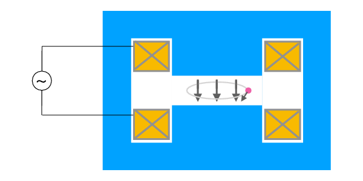

##############################################################
ベータトロンとベータトロン振動
##############################################################

=========================================================
ベータトロンの平衡
=========================================================

ベータトロンは，唯一高周波を用いない円形加速器である．
粒子の加速には電場が必要であるが，ベータトロンの加速電場は誘導電場が担う． *Faraday-Maxwell* から

.. math::
   \nabla \times E = - \dfrac{ \partial B }{ \partial t }

を用いて，周方向電場は，

.. math::
   E_{\theta} = - \dfrac{1}{2 \pi r_0} \dfrac{ \partial \Phi }{ \partial t }

である．Newtonの運動方程式と合わせて，

.. math::
   \dfrac{ dp }{ dt } = q E_\theta

これを積分して，

.. math::
   p (t) = - \dfrac{ q \Phi(t) }{ 2 \pi r_0 }

平衡軌道では，

.. math::
   p = q r_0 B_0

であるから，ベータトロンの平衡を得るためには，

.. math::
   \Phi (t) = 2 \pi r_0^2 B_0

が必要である．軌道半径 :math:`r_0` を一定に保とうとすると，上式で示される磁束変化を与えれば良い．

=========================================================
ベータトロンの基本構成
=========================================================

基本構成を以下に示す．

磁極・ヨークで囲まれたH型電磁石が基本構成となる．
交流電源もしくはパルス電源でギャップ中の磁束を変化させることにより，周方向電場を発生させる．
核融合実験でいう，Ohmic Heatingコイルである．

=========================================================
ベータトロン振動
=========================================================

軌道について，用語を説明する．

* 平衡軌道： *Newton-Lorentz* 方程式において，平衡解となる軌道．遠心力と *Lorentz* 力が釣り合う．
* 閉軌道： 磁場分布と粒子のエネルギーから得られる閉じた軌道．閉軌道の存在は一般に自明ではない．
* 中心軌道： 加速器の設計軌道として選ばれる閉軌道．
  
中心軌道から外れた粒子は，中心軌道の周りに沿って振動する．これをベータトロン振動という．
ベータトロン振動が安定した振動となるか，発散するかは，磁場分布によって定まる．

=========================================================
ベータトロン振動の断熱減衰
=========================================================
ベータトロン振動の方程式

.. math::
   \ddot{ y } + \omega_y ^2 y = 0

単振動の *Hamiltonian* は

.. math::
   H = \dfrac{ p_y^2 }{ 2m } + \dfrac{ m \omega_y^2 }{ 2 } y^2

である．これを用いて，位相空間上の楕円の式は，

.. math::
   \dfrac{ y^2 }{ J / \pi m \omega_y } + \dfrac{ p_y^2 }{ J / \pi \omega_y } = 1

である．これから

.. math::
   y_max \propto \dfrac{1}{ \sqrt{p} }

と変化することがわかり，ベータトロン振動がエネルギーと共に減衰することがわかる．
つまり，粒子が制動放射等によってエネルギーを失えば，ベータトロン振動も共に減衰することを意味しており，ベータトロン振動は加速器内で周回する毎に小さくすることができる．
