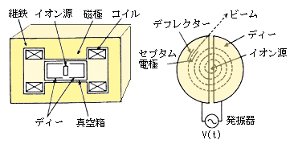

##############################################################
サイクロトロンについて
##############################################################

=========================================================
サイクロトロンの原理
=========================================================

荷電粒子を磁場によって閉じ込める．
*Newton-Lorentz* 方程式の定常状態から平衡軌道は

.. math::
   m \dfrac{dv}{dt} = q [ E + v \times B ] = 0

このうち， :math:`E=0` , :math:`B=B_z \hat{z}` における径方向成分は

.. math::
   m \dfrac{v_{\theta}^2}{r} = q v_{\theta} B_z

.. math::
   \rho = \dfrac{ m v_{\theta} }{ q B_z }
   
   
粒子は半径 :math:`\rho` の円でサイクロトロン運動する．
この時の周方向の運動量は

.. math::
   p = m v_\theta = q B_z \rho

qは電荷(定数)であるので，平衡起動中の :math:`B_z \rho` は運動量に比例した量となる．これを磁気剛性率 ( magnetic rigidity ) という．
直感的には，運動量の大きな粒子は慣性が大きく，磁場によって曲げにくい( cf. 高速道路におけるカーブでのハンドル操作 )．
なので，運動量の大きな粒子を曲げるためには，高い磁場，もしくは大きな曲率半径が必要になる．粒子の曲げにくさを示す指標が磁気剛性率である．

=========================================================
サイクロトロンの構成要素
=========================================================

サイクロトロンは次の要素からなる．

* 磁極 ( pole )
* 継鉄 ( yoke )
* 加速電極 ( Dee )
* 粒子源 ( ion source / electron gun )
* デフレクター ( Deflector )
* セプタム電極 ( Septum )

