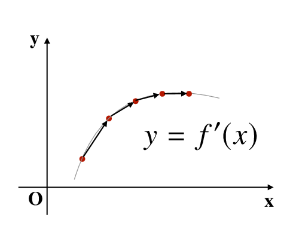
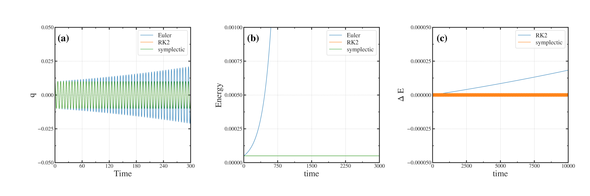

=========================================================
シンプレクティック数値積分法
=========================================================

シンプレクティック条件
======================================

ある変換がシンプレクティックであるとは，次の  :red:`シンプレクティック条件` を満たす変換であることを意味する．

.. math::
   \bm{M} \bm{J} \bm{M}^T = \bm{J}
   \ \ \ \ \ \ where \ \ \ \ \ 
   \bm{J} = \left[ \begin{array}{cc}
   \bm{0} & \bm{1} \\ - \bm{1} & \bm{0} \end{array} \right]
   , \ \ \ \ 
   M_{ij} = \dfrac{ \partial R_i }{ \partial r_j }

このとき，座標系 :math:`\bm{r}` から :math:`\bm{R}` への写像( 座標変換，質点の移動 etc. )は，  :red:`正準変換` である．

シンプレクティック数値積分法
======================================

力学的運動は， **無限小の連続的な座標変換の集合である** とみなすことができる．
ここで解析力学の帰結から，これらの微小かつ連続な座標変換は，  :red:`正準変換` となることが知られている．

ところで数値積分は，連続な微分方程式を差分近似のもとで求解する数値解析手法の一種である．
数値積分では，差分化した方程式に従い，変数のある初期状態から，別の状態への遷移を取り扱う．
力学系を例とすると，運動方程式に従って，順々に質点位置を数値積分により更新していく操作は，微小な位置座標の変換に相当する．つまり数値積分も，ある座標空間から，別の座標空間への座標変換と見ることができる．

力学的運動を数値積分する際，数値積分によって得られる **座標変換群** は，力学的運動の基本的性質である **正準性(シンプレクティック性)** をもつことが望ましい．しかし，  :blue:`一般の数値積分法は，正準変換ではない` ．そこで，力学的運動を記述するには，微小な各座標変換が，  :red:`シンプレクティック条件を満たすような数値積分法` が望まれる．

一次陽的シンプレクティック積分
======================================

ハミルトン方程式を数値積分することを考える． 1次元 *Hamilton Eqs.* を再掲すると，

.. math::
   \dfrac{ \partial q }{ \partial t } &= + \dfrac{ \partial H }{ \partial p } \\
   \dfrac{ \partial p }{ \partial t } &= - \dfrac{ \partial H }{ \partial q }

一次精度のハミルトン方程式におけるシンプレクティック積分スキームを以下に示す．

.. math::
   q^{k+1} &= q^{k} + \Delta t \dfrac{ \partial H }{ \partial p^{k  } } \\
   p^{k+1} &= p^{k} - \Delta t \dfrac{ \partial H }{ \partial q^{k+1} }

ここで，両式を単純に数値積分したり，q,p の数値積分順を変更したりするとシンプレクティック積分とはならないことに注意する．単なる差分化とは違うのだ．

一次陽的シンプレクティック積分の例
======================================

シンプレクティック積分法の例として，一次陽的シンプレクティック積分のコードと結果を以下に示す．

一次陽的シンプレクティック積分のサンプルコード
-------------------------------------------------------

一次陽的シンプレクティック積分のみのサンプルは， :doc:`symplectic1st_code` に記載している．
ここでは，1次陽的 *Euler* 法，及び，２次精度 *Runge-Kutta* 法 ( *Heun* 法 ) による数値積分と，一次陽的シンプレクティック積分を比較したコードを掲載する．対象とする問題は1次元調和振動子とした．ばね定数 *k* ，質量 *m* の1次元調和振動子における *Hamiltonian H(q,p)* は，一般化座標 *q* と共役な運動量 *p* を用いて，次式となる．

.. math::
   H(q,p) = \dfrac{p^2}{2m} + \dfrac{1}{2} k q^2

   
今回は， *C++* を用いてコードを記述している．全体構成は，以下の通りである．

* 質点(粒子)の一般化座標 *q* 及び，共役な運動量 *p* は構造体 *particleType* を用いて記述する．
* 関数 *initialize_particle* は，引数とした粒子を初期化する．初期位置変位は適当 (0.01)と設定する．
* 関数 *calcEnergy* は，粒子の全エネルギーを返却する．
* 関数 *dHdq_HO* は *Hamiltonian H* の一般化座標に対する一回微分を解析的に返却する．
* 関数 *dHdp_HO* は *Hamiltonian H* の運動量に対する一回微分を解析的に返却する．
* 関数 *classical__euler* は 一次精度 *Euler* 法による数値積分によって粒子位置を1ステップ分だけ更新する．
* 関数 *runge_kutta__2nd* は 二次精度 *Runge-Kutta* 法による数値積分によって粒子位置を1ステップ分だけ更新する．
* 関数 *symplectic_euler* は 一次精度シンプレクティック数値積分法によって粒子位置を1ステップ分だけ更新する．
* *main* 関数内では，出力ファイルの準備を行い，粒子を初期化し，for文内のループで粒子位置更新と出力を適宜実行する．
  
.. literalinclude:: code/symplectic_eval.cpp
   :language: c++

サンプルコードの実行結果
-------------------------------------------------------

一次元調和振動子問題を *Hamilton Eqs.* によって定式化し，数値的に解析した．
各数値積分法による比較をしている．下図(a) では，調和振動子が振幅 0.01 で振動している様子が描かれている．時間刻みは *dt=0.005* を用いている．１次陽的 *Euler* 法は， **不安定な解法** なので時間経過に従い，振幅が増大している．一方， 2次精度 *Runge-Kutta* 法，及び，１次精度シンプレクティック積分法は， **安定な数値スキームであり** 振動子の振幅 0.01 を維持したまま，安定に振動している．(b)には調和振動子が有する全エネルギーを各数値スキーム毎にプロットしている．ここで，１次 *Euler* 法は，数値不安定性の影響でエネルギーが発散しているのに対し，他２つの数値スキームはおよそ :math:`5 \times 10^{-5}` の全エネルギーを保つ(厳密ではない)．

ここで，  :blue:`シンプレクティック積分法の長所を強調するために` ，時間刻みを *dt=0.05* と大きくとってみる．下図(c)にはエネルギーの初期状態からのずれの時間発展を示している．2次精度 *Runge-Kutta* 法では， **徐々に誤差が蓄積** してしまっている．一方， **一次精度シンプレクティック積分法** では，（一次精度であるため大きく，）振動こそすれ，  :red:`時間経過による系統的エネルギー誤差は生じていない` ．シンプレクティック積分法は，数値積分した結果が  :red:`正準変換` となっているため， *Hamiltonian H* は **数値誤差の範囲内で陽に保たれる** ．つまり，  :blue:`数値積分を繰り返しても，全エネルギーが上昇しない` ．この特性から，例えば， :blue:`長時間にわたって粒子を追跡するような誤差の蓄積が問題となるような問題の数値解析に向いている` ．

