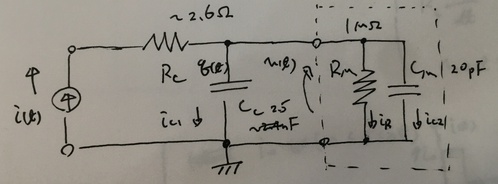
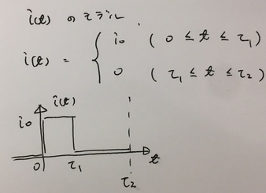
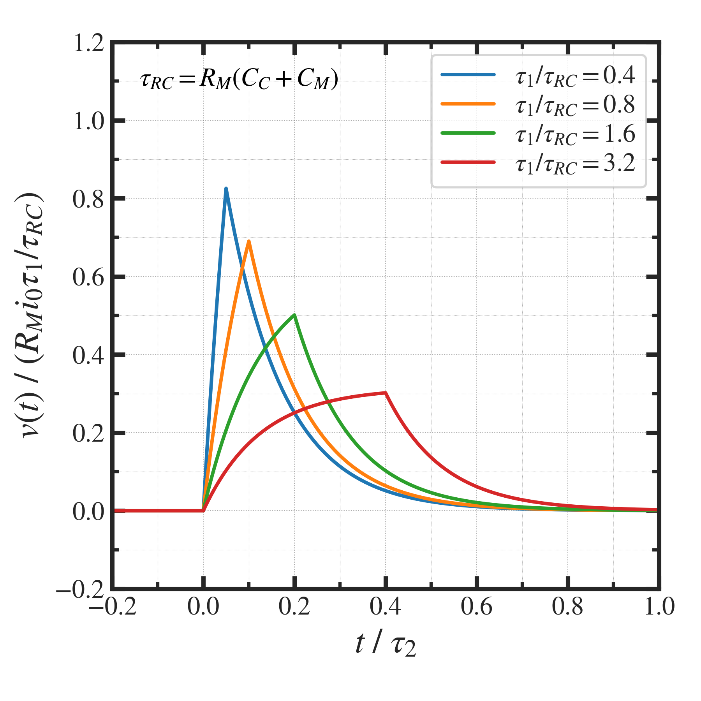
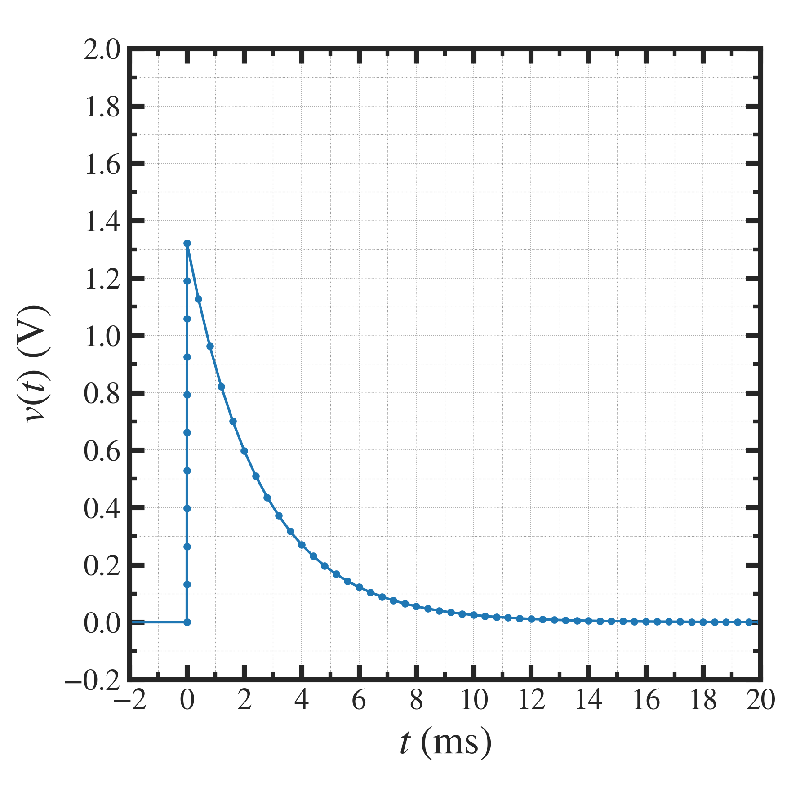

##############################################################
二次電子モニタ測定系の等価回路解析 (1)
##############################################################

=========================================================
背景
=========================================================

* 金属片を用いた二次電子モニタを作成
* 電流源として動作する二次電子モニタに対し、同軸ケーブルでオシロスコープへ接続した場合の観測波形について考えたい．
* 同軸ケーブル・オシロスコープの等価回路を考えて、観測波形が説明したい．

  
---------------------------------------------------------
ポイント
---------------------------------------------------------

(1) 等価回路から導出される一般解は、得られる波形を説明できるか？
(2) 等価回路の回路定数を用いて、得られる波形を説明できるか？

    i. 振幅
    ii. 時間構造 ( 周期、時定数 )
    iii. オフセット

         
=========================================================
等価回路
=========================================================

* 二次電子モニタ（電流源として動作）に対して、同軸ケーブル及び、オシロスコープの入力容量と入力抵抗を接続した回路図となることを想定している．

            

=========================================================
回路方程式 と典型的な回路パラメータ
=========================================================

---------------------------------------------------------
回路方程式
---------------------------------------------------------

.. math::

   C_{eff} &= C_C // C_M \\
   i_c (t) &= i_{c1} (t) + i_{c2} (t) \\
   v(t)    &= \dfrac{1}{C_{eff}} \int i_c (t) dt = \dfrac{i_R}{R_M} \\
   i(t)    &= i_{c1} + i_R  + i_{c2} \\
   i_{c1} (t) &= \dfrac{ dq(t) }{ dt }

---------------------------------------------------------
典型的な回路パラメータ
---------------------------------------------------------

.. csv-table:: **典型的な回路パラメータ**
   :header: "記号", "説明", "典型的な値", "備考"
   :widths: 5, 15, 15, 15
   :width:  800px
   
   "RC", "同軸ケーブルの抵抗値", "2.5Ω", "110Ω/km, 24m"
   "CC", "同軸ケーブルの静電容量", "2.5nF", "104nF/km, 24m"
   "RM", "オシロスコープの入力抵抗", "1MΩ", ""
   "CM", "オシロスコープの入力容量", "20pF", ""

=========================================================
信号モデル
=========================================================

測定信号のモデルとしては、下記の矩形波を用いる

* ビームパルスは、上記のようなusオーダの短パルス波形．
* ビームモニタ信号も同等の信号であることが類推される．
  
   
=========================================================
一般解
=========================================================

---------------------------------------------------------
ビームパルスあり時間帯 ( 0 < t < τ1 )
---------------------------------------------------------

.. math::

   v(t) &= R_M i_0 \left[ 1 - e^{ - \dfrac{t} {R_M C_{eff}} } \right] \\
   i_{c}(t) &=     i_0        e^{ - \dfrac{t} {R_M C_{eff}} } \\
   q(t) &= R_M C_{eff} i_0 \left[ 1 - e^{ - \dfrac{t} {R_M C_{eff}} } \right] \\

   
---------------------------------------------------------
ビームパルスなし時間帯 ( τ1 < t < τ2 )
---------------------------------------------------------

.. math::

   v(t) &= R_M i_0 \left[ 1 - e^{ - \dfrac{\tau_1 }{ R_M C_{eff} } } \right] e^{ - \dfrac{t-\tau_1} {R_M C_{eff}} }  \\
   i_{c}(t) &=     i_0 \left[ 1 - e^{ - \dfrac{\tau_1 }{ R_M C_{eff} } } \right] e^{ - \dfrac{t-\tau_1} {R_M C_{eff}} } \\
   q(t) &= R_M C_{eff} i_0 \left[ 1 - e^{ - \dfrac{\tau_1 }{ R_M C_{eff} } } \right] e^{ - \dfrac{t-\tau_1} {R_M C_{eff}} } \\
   

=========================================================
信号波形（解析値）
=========================================================

|

---------------------------------------------------------
理論信号波形プロット (一般解)
---------------------------------------------------------

|

* ビームパルス( :math:`\tau_1`  )が、回路の時定数( :math:`\tau_{RC}=R_MC_C` )よりも、十分、短時間であれば、パルス状に瞬時に立ち上がり、そのあと、減衰していく波形となる．（実際に観測されたデータはそのような波形）

---------------------------------------------------------
理論信号波形プロット（実データ予測）
---------------------------------------------------------

|

  
---------------------------------------------------------
図示プログラム
---------------------------------------------------------

.. literalinclude:: ../analysis/pyt/SEEmonitor_model_graph.py
                    :language: python

