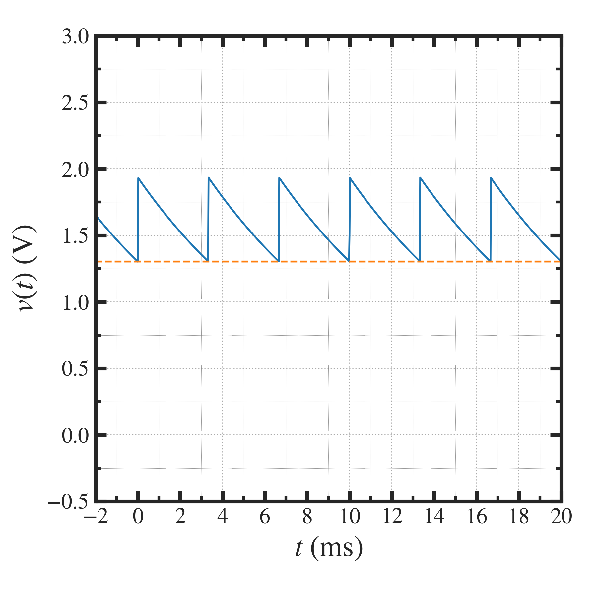

##############################################################
二次電子モニタ測定系の等価回路解析 (2)
##############################################################

=========================================================
パラメータからみた波形の妥当性
=========================================================

.. csv-table:: **観測波形と回路定数から推定される理論値の比較**
   :header: "項目", "観測波形", "回路定数より推定した理論値"
   :widths: 10, 10, 10
   :width:  800px

   "振幅 :math:`V_{p-p}` (V)", "0.8-1.2", "1.0"
   "時定数 :math:`\tau_{RC}` (ms)", "1.0-2.5", ""
   "オフセット :math:`V_{O}` (V)", "0.4", "0.4" 
   

=========================================================
理論値の計算 (1)  （振幅と時定数）
=========================================================

* 入力信号の平均電流値は :math:`I_0=1 (\mu A)` を考える．

  + PHITSを用いた出力信号のシミュレーション値（金属板を 200 uA ビームで撃った際の二次電子放出量）
  + 出力信号の波高値としては、ビームデューティ 0.13 ％で割って、 :math:`i_0=0.77 (mA)` とする．  

* 入力容量 20 (pF) とケーブル容量 2.5 (nF) の合成キャパシタンスは、ケーブル容量が支配的と考えられるので、ほぼケーブル容量 ( 2.5 (nF) )としてよい．
* ビームパルスの出力時間 ( :math:`\tau_1` )は、3 (us) とする．

  + 式中の :math:`x=\tau_1 / R_M C_{eff} << 1` であるため、 Taylor 展開より :math:`exp(x) \sim 1+x` が使用できる．
  + ここで、 :math:`x=\tau_1 / R_M C_{eff} = 3 us / 2.5 ms = 1.2 \times 10^{-3}` である．

    
---------------------------------------------------------
振幅
---------------------------------------------------------

.. math::

   V_{p-p} &= i_0 R_M  \left[ 1 - e^{ - \dfrac{\tau_1} {R_M C_{eff}} } \right] \\
   & \sim i_0 R_M  \dfrac{\tau_1} {R_M C_{eff}} \\
   & \sim ( 0.77 \times 10^{-3} ) \times  ( 1 \times 10^6 ) \times (1.2 \times 10^{-3}) \\
   & \sim 0.92 (V)
   
* 信号出力が 0.8-1.2 (V) 程度であることが説明できる．

   
---------------------------------------------------------
時定数
---------------------------------------------------------

.. math::

   \tau_{RC} = R_M C_{eff} = ( 1 \times 10^{6} ) \times  ( 2.5 \times 10^{-9} ) = 2.5 \times 10^{-3} (s) = 2.5 (ms)

   
* 時定数が 1.0-2.5 (ms) 程度であることが説明できる．

=========================================================
理論値の計算 (2)  （オフセット）
=========================================================

* オフセットは、繰り返し周波数を上昇させたときのみ、発生．
* 300 pps での典型値は 0.4 (V) 程度．
* インパルス応答ではなく、周期的なパルス列に対する応答を考えれば、expが有限時間内に減衰しきらない分だけオフセットが生じる．

  
---------------------------------------------------------
インパルス列に対する応答の式
---------------------------------------------------------

.. math::
   
   v_{pulse} (t) =
   \begin{cases}
   R i_0 \left[ 1 - e^{ -\dfrac{t}{RC} } \right] \ \ &( t < \tau_1 ) \\
   R i_0 \left[ 1 - e^{ -\dfrac{\tau_1}{RC} } \right] e^{ \dfrac{t-\tau_1}{RC} }  \ \ &( t > \tau_1 )
   \end{cases}

上記の、t=0 まわりに着目したインパルス応答が、 k=1,2,3,...,n のパルス列が過去に入っていた．これは、時刻、 :math:`t_0^{(k)}=-1 \times \Delta T, -2 \times \Delta T,..., -n \Delta T` に発火したパルスである．発火の周期が :math:`\tau_1` より長いとして２式に着目し、統一した時間の関数として各インパルス応答を記述すると、

.. math::
   
   v_{pulse} (t-t_0^{(k)}) &= R i_0 \left[ 1 - e^{ -\dfrac{\tau_1}{RC} } \right] e^{ \dfrac{t-t_0^{(k)}-\tau_1}{RC} } \\
   &= R i_0 \left[ 1 - e^{ -\dfrac{\tau_1}{RC} } \right] e^{ \dfrac{t- k\Delta T-\tau_1}{RC} } \\
   &= v_{pulse}(t) e ^{ - \dfrac{k \Delta T}{RC} }

k=1,2,...,n まで足し合わせて、 :math:`n\rightarrow \infty` とすれば、

.. math::

   v_{offset} &= \lim_{n \rightarrow \infty } \sum _{k=1}^{n} v_{pulse}(t) e^{ - \dfrac{k \Delta T}{ RC } } \\
   &= v_{pulse} (t) \sum_{k=1}^{\infty} e^{ - \dfrac{k \Delta T}{ RC } }

ここで、初項 :math:`a_1=e^{- \Delta T / RC }`, 公比 :math:`r=e^{- \Delta T / RC } ( |r| < 1 )` の無限等比級数の和は、

.. math::

   S_\infty = \lim_{N\rightarrow \infty} S_N = \lim_{N\rightarrow \infty} a_1 \dfrac{1-r^N}{1-r} = \dfrac{a_1}{1-r}

であるから、

.. math::

   \sum_{k=1}^{\infty} e^{ - \dfrac{k \Delta T}{ RC } } = \dfrac{ e^{- \Delta T / RC } }{ 1 - e^{- \Delta T / RC }  }

より、 :math:`t=\tau_1` における オフセットは

.. math::

   v_{offset} &= v_{pulse}(\tau_1) \dfrac{ e^{- \Delta T / RC } }{ 1 - e^{- \Delta T / RC } } \\
   &= R i_0 \left[ 1 - e^{ - \dfrac{\tau_1}{RC}} \right] \dfrac{ e^{- \Delta T / RC } }{ 1 - e^{- \Delta T / RC } }

例えば、 :math:`R=1 (M\Omega) , C=2.5 (nF), \Delta T=3.3 (ms), i_0=0.77 (mA), \tau_1=3 (us)` を使用すれば、

.. math::
   v_{offset} &= 10^6 \times 0.77 \times 10^{-3} \left[ 1 - e^{ - \dfrac{ 3 \times 10^{-6} }{ 2.5 \times 10^{-3} } } \right] \dfrac{ e^{- 3.3 / 2.5 } }{ 1 - e^{- 3.3 / 2.5 } } \\
   &= 0.92 \times 0.365 \\
   &= 0.335 (V)

となる．これは、実験的に観測した値 0.4 (V) を説明できると考えられる．

=========================================================
数値的に模擬
=========================================================

* 出力信号を、解析的にではなく、数値的に模擬してみた．

.. literalinclude:: ../analysis/pyt/SEEmonitor_multiPulseSignal.py
   		    :language: python

            
=========================================================
計算過程
=========================================================

:download:`eqn_note.pdf<../png/eqn_note.pdf>`

   
   
=========================================================
出力信号の結論
=========================================================

* 上記、回路定数から予想される出力信号と、同等な信号が実験により得られていることから、検討した等価回路モデルが良く実験を表していると考えられる．
