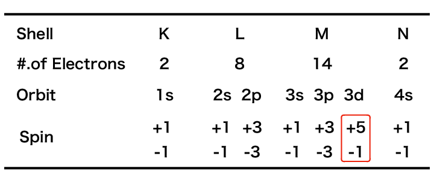

##############################################################
磁性材料について
##############################################################

物質は，電子・陽子などの :red:`荷電粒子の集合体` である．勿論，全体としては電気的にほぼ中性であるが， **微小な空間スケールとして見れば，電気的中性は破れており，電磁場をかければ各荷電粒子は応答を示す．** ここで，電場に対応する応答が **誘電性(=絶縁性)** もしくは **導電性** ， **磁場に対する応答が**  :red:`磁性` である．荷電粒子単体(電子もしくはイオン)は， **反磁性** （粒子は磁場を打ち消すように動く）として働くが，原子を構成し電気的にほぼ中性となっている物質は，他粒子との相互作用が働き，単純な単粒子とは異なった応答を示す．

=========================================================
磁性材料の分類について
=========================================================

磁性体は，磁場に対する応答から次の **３つ** に分類することができる．

* **強磁性体** ( Ni, Co, Fe, 磁性酸化鉄 etc. )
* **反磁性体** ( Al, O, Sn, Pt, Mn etc. )
* **常磁性体** ( Zn, Sb, Au, Hg, H, S, Cl, Bi, Cu, Pb, He etc. )

  
強磁性体 / 常磁性体は，磁場を **強める向き** に，反磁性体は **磁場を弱める向き** に磁場を生成する．

このうち，強磁性体は，

* フェロ磁性体 ( Ni, Co, Fe )
* フェリ磁性体 ( 磁性酸化鉄 )
* 反強磁性体 ( Mn )

に分類される．

原子内部に作る磁気モーメント
=========================================================

物質が磁性を有する原因は，物質内部の荷電粒子が外場 B に応答して運動が変更されることにある．
荷電粒子が運動すれば電流が流れ， **微小電流ループ** ，即ち， **磁気モーメント** を形成し得ることから，何らかの磁気応答を示すことは必然に考えられる．実際のところ，微小電流ループよりも電子が有する :red:`スピン` が，磁性に大きく寄与する．これは古典的な記述は不可能な現象であり，説明には量子力学と相対性理論が必要となる( *ボーア・ファン・リューエンの定理* )． 定性的な説明によれば， **スピンが磁気モーメントを有するので，スピンの配向が磁場によって揃えられることによって生じる正味非零の磁気モーメントが磁性の原因となる．**

以上，磁性の原因として，

* **軌道磁気モーメント**
* **スピン磁気モーメント**

が存在し， **スピン磁気モーメントが及ぼす影響が概して大きい．** 

遷移金属元素
=========================================================

磁性を持ちやすい元素として， **遷移金属元素** が挙げられる．遷移金属元素はd軌道，f軌道が閉殻となっておらず，主量子数のより大きなs軌道が埋まった状態で，内側のd軌道，f軌道電子が空席となっている．そのため，電子数の増加に伴い，内殻の3d, 3f準位に電子が詰まっていく．遷移金属元素は最外殻に余剰電子を持ち易いために **金属結合** によって結合し，内殻のd軌道に :red:`安定な不対電子を持つことが可能` であるため，  :red:`スピンの対称性が崩れた電子配置を持つ` ことができる．そのため，遷移金属元素の多くが常磁性または強磁性となりやすい．一方で，共有結合する元素 ( **典型元素** )は，逆符号のスピンを持った電子を共有することによって結合するため，スピンが正味の磁気モーメントを持たず，反磁性となりやすい．さらに遷移金属元素は，内殻を空席にしていることから錯体や結晶構造に複雑性をとり易いため，正味非零の磁気モーメントとなりやすいことから，磁性を持ちやすい．

電子軌道と交換相互作用，自発磁化
=========================================================

原子の各エネルギー準位は，スピンが正負異なる２個の電子が占有することを許容している．
閉殻となるような軌道中の電子や隣接原子と共有結合により共有されている電子は，エネルギー準位において正負のスピンが打ち消し合うため，正味の磁性を発生しない．

遷移金属元素 ( Mn, Fe, Co, Ni etc. ) のうち，例えば **鉄( Fe )** を考える．
鉄の電子配置を表に示している．

表によれば，一つの鉄原子が有する電子は総数26であり，1s, 2s, 2p, 3s, 3p, 3d, 4s の７つの電子軌道を持っている．このうち，1s, 2s, 2p, 3s, 3p, 4s は閉殻となっており，正負逆のスピンを持った電子が対となって同一軌道中に存在することから，これらは磁性に寄与しない．ここで，最外殻のN殻に存在する4s軌道電子は，隣接鉄原子間の金属結合に寄与することを付記しておく．上述の閉殻軌道電子とは異なり，内殻の3d軌道は， **正のスピンに偏った電子配置 (+4の不対電子)を有する** ため， **非零のスピン(＝磁気モーメント)** によって，磁場に対する大きな相互作用，つまりは :red:`強磁性` を示す．ここで，隣接する原子間の結合は正味の磁気モーメントを持たない4s軌道電子によってなされるが，3d軌道電子間が非零の磁気モーメントを有することから，隣接原子間の3d軌道電子に相互作用を及ぼしあうことができる( **交換相互作用** )．交換相互作用が十分強い場合には，一度外場によって配向された3d軌道準位中の電子スピンは互いの磁気モーメントによって束縛しあい，一定の磁気モーメントを同一方向に有したままの状態を保つことができる．これを  :red:`自発磁化` という．

フェロ，フェリ，アンチフェロ磁性体
=========================================================

遷移金属の中でも，不対電子が多く交換相互作用が強い原子 ( Mn, Fe, Ni, Co )は強磁性を示すが，この中でも不対電子の磁気モーメントが互いに同方向(平行方向)を持つような原子 ( Fe, Ni, Co )は強い自発磁化を有する．これらを  :red:`フェロ磁性体` ( ferromagnetizm )という ．ferro- は鉄の意味であり，「 **鉄みたいな磁性体** 」 を意味している．一方で，Mnは同様な強磁性体であっても，隣接原子間の不対電子のスピンが正負打ち消しあうように配向してしまうために，フェロ磁性体のような自発磁化を持たない．これを :red:`アンチフェロ磁性体` ( 反強磁性体 ) という．これによって，Mn原子が多くの不対電子を有しながらも，強く磁化されないことが説明される．アンチフェロ磁性体のように隣接スピンが逆平行となる場合であっても，それらの大きさが異なる場合，強い磁性を示す場合がある．これを  :red:`フェリ磁性体` といい， **磁性酸化鉄** ( マグネタイト=磁鉄鉱= :math:`FeFe^{3+}_{2}O_{4}` )， **フェライト** ( 酸化鉄を主成分とするセラミックス :math:`AFe_2O_4` ( Aには Mn,Co,Ni,Cu,Zn etc. が入る )  )などの **化合物** にみられる．

