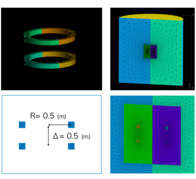
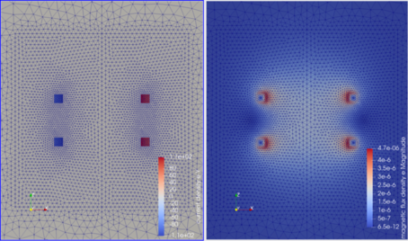
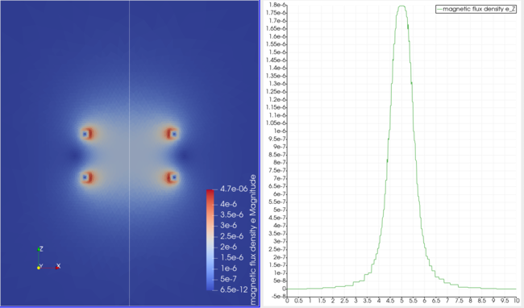
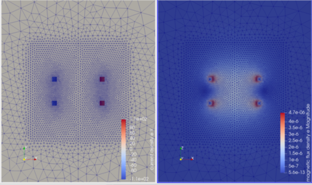
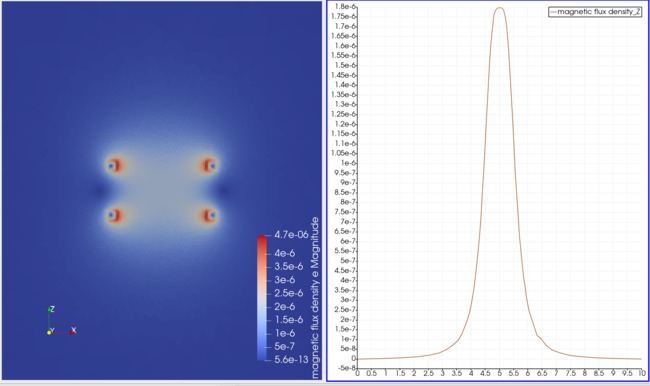

=========================================================
円環コイル電流が作る磁場
=========================================================

円環コイル電流が作る磁場の解析結果を以下に示す．
問題設定、及び、Elmer入力ファイルは、Elmer のテスト問題、及び、Elmer Discussion Forum のファイルを参考にしている．

問題設定 / メッシュ
=========================================================

* 半径 :math:`R=R_c` の円環状のコイルを考え、内部を一様に流れる直流電流が作る磁場を考える．
* 計算領域は、円筒の計算空間を考え、とある半径 :math:`R=R_A` で電磁ポテンシャルは Dirichlet 条件を課す．
* 電流として、片側 1.0 A の電流を与える．半径 0.5 m のコイルを距離 0.5 m だけ離して設置する．いわゆる *Helmhortz* コイルである．

  

円環コイル電流モデル ( 1/2モデル ver. )のメッシュ生成 プログラム
===========================================================================================

まずは、円筒の空気領域のうち半分の領域を考え、対称条件を課して計算する．

gmsh-API pythonを利用した円環コイル電流用メッシュの生成プログラム．
自分で作成した円筒形状生成用関数を内部で利用している．

.. literalinclude:: ../wrk/circular_coil/msh_half/main.py
   :caption: 1/2 円環コイル電流モデルのメッシュ生成用 gmsh-API python プログラム
   :linenos:
   :language: python
      
生成用プログラムの実行は、以下の通り．

.. code-block::
   :caption: モデル生成

   $ cd msh_half/
   $ python main.py
   $ ElmerGrid 14 2 model.msh
   $ cd ../
   $ mv msh_half/model ./

ElmerGridによって、( 14 : gmshの.mshファイル、 2 : ElmerMeshファイル4つを含んだディレクトリ )へと変換している．model.header / model.element / model.node / model.boundary が生成される．

円環コイル電流が作る磁場のElmer入力ファイル
=========================================================

以下にElmer入力ファイルのサンプルを示す．

.. literalinclude:: ../wrk/circular_coil/circular_coil_half.sif
   :caption: 円環コイル電流がつくる磁場の Elmer 入力ファイル ( circular_coil_half.sif )
   :linenos:
   :emphasize-lines: 85-87,98-99,144-147,163-164,170-171

円環コイルがつくる磁場計算（1/2モデル）の入力ファイルの要点は以下である．

* 解いた電磁ポテンシャルから電磁場を計算するために、 *MagnetoDynamicsCalcFields* を使用する．
* 磁場計算には *WhitneyAVSolver* を用いる． これは、電磁ポテンシャルを統一的に解くソルバ．
* コイル電流は *CoilSolver* を使用して計算する． *CoilSolver* は、要素内部の電流連続の式を解くソルバ．コイル電流はある境界から流入し、別の境界から流出していくことになる．簡易的にコイル電流を生成するために、以下の設定を用いる．
  
  + コイル電流の値は、ソルバ内の *Desired Coil Current* により指定する．電流逆向きにするためには、Coil の Start/End を逆にするか、電流を負として設定する．
  + *Body Force* にて、電流源を設定する． *Electric Potential* として、"CoilPot" を指定する．
  + Boundary Condition として、 *Coil Start / Coil End* を指定する．

                     
      
円環コイル電流がつくる磁場の解析結果
=========================================================

解析実行結果は以下に示す．以下に電流密度分布と軸方向の磁束密度を示す．

軸方向の磁束密度、及び、 z 軸方向の1次元分布を示す．

*Helmhortz* コイルが中心位置につくる磁場は、次のように計算される．

.. math::

   B &= ( \dfrac{4}{5} )^{3/2} \dfrac{ \mu_0 n I }{ R } \\
   &=   ( \dfrac{4}{5} )^{3/2} \times \dfrac{ 4 \pi \times 10^{-7} \times 1 }{ 0.5 } \\
   &=   1.7983 \times 10^{-6}

この値は、上記した z 軸方向の1次元分布の値と一致している．
   
           
円環コイル電流モデル ( フルモデル ver. )のメッシュ生成 プログラム
===========================================================================================

次に、円筒の空気領域の全領域を考えたフルモデルの生成プログラムを以下に示す．

.. literalinclude:: ../wrk/circular_coil/msh_full/main.py
   :caption: 円環コイル電流モデル（フルモデル）のメッシュ生成用 gmsh-API python プログラム
   :linenos:
   :language: python
      

円環コイル電流が作る磁場のElmer入力ファイル (フルモデル用)
===========================================================================================

以下にフルモデル用のElmer入力ファイルのサンプルを示す．

.. literalinclude:: ../wrk/circular_coil/circular_coil_full.sif
   :caption: 円環コイル電流がつくる磁場の Elmer 入力ファイル ( circular_coil_full.sif )
   :linenos:
   :emphasize-lines: 81-87,89-95,127-128,131-133,178-183

                     
円環コイルがつくる磁場計算（フルモデル）の入力ファイルの要点は以下である．

* 1/2モデルと同様に、"WhitneyAVSolver", "MagnetoDynamicsCalcFields", "CoilSolver" を解く．
* 1/2モデルと異なり、フルモデルではループ電流となるため、 *CoilSolver* における電流の流出入がない．そこで、電流路に２枚の微小距離を離しておいた仮想的な境界面を用意し、２枚の境界面の間にポテンシャルを設定する．微小距離空隙以外の領域（長い流路側）で電流を流す．これを2つ用意してやることでループ電流をつくるらしい．これを用いるために次の設定を用いる．

  + Body 1 / Body 2 とコイル毎にBody指定を分け、さらに 0次元量としての電源を定義するために、 *Component* を各 Body に紐付けて定義する．Component 毎に *Desired Coil Current* を指定しておく．
  + *CoilSolver* 内に、 *Coil Closed* 及び、 *Calculate Elemental Fields* を True とする．
  + 他、 上の戦略で電流計算するためには、 *Narrow Interface* を True とする、 コイル情報を示すために、 *Set Coil Index* ,  *Set Coil Set* を True とする． ( False でも構わない )．
  + Body Force として、Current Density 1,2,3 を定義する．

上記により、ループ電流を定義し、磁場を計算する．
  

円環コイル電流がつくる磁場の解析結果 ( フルモデル ver. )
===========================================================================================

解析実行結果は以下に示す．以下に電流密度分布と軸方向の磁束密度を示す．

軸方向の磁束密度、及び、 z 軸方向の1次元分布を示す．

フルモデルでも、 *Helmhortz* コイルのつくる磁場の理論値と一致する．
