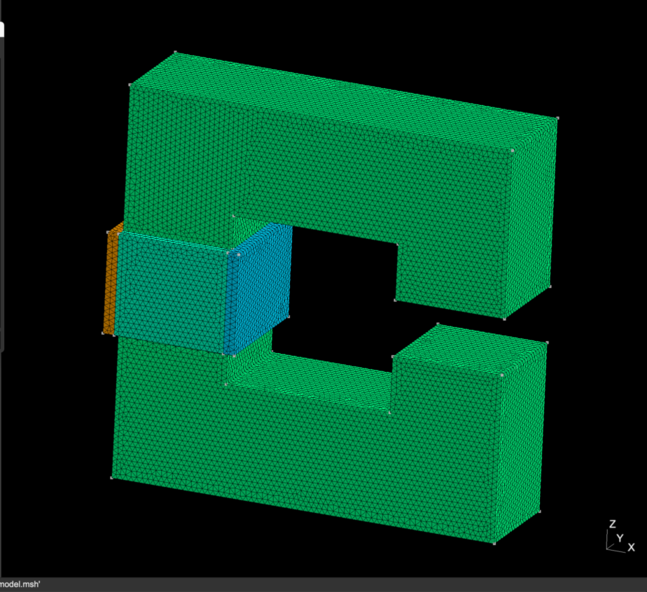
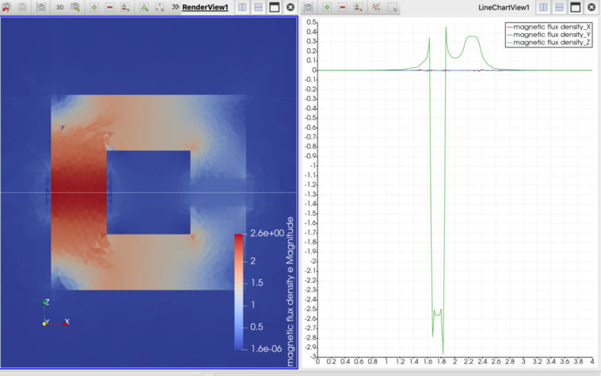
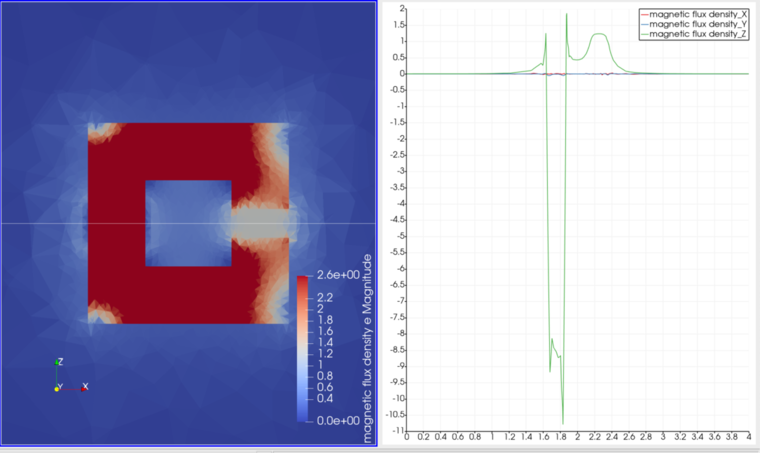

=========================================================
C型電磁石がつくる磁場
=========================================================

C型電磁石が作る磁場の解析結果を以下に示す．

問題設定 / メッシュ
=========================================================

* C型の鉄芯を考える．鉄芯の断面は長さ 0.2 (m) の正方形とし、鉄芯の中心経路は一辺 0.5 (m) とする（つまり、C型電磁石の一辺の合計長さは 0.1+0.5+0.1 = 0.7 (m) となる）．
* 中心経路をつくる正方形のうち、ギャップと反対側の辺にコイルを設置する．コイルはコーナー部を除いた鉄芯直線部分のうち、60 (%) の領域に巻きつける．直線部分は長さ 0.5-0.1-0.1 = 0.3 であるからコイルの巻きつけ長さは 0.3*0.6 = 0.18 であり、コイル幅は 0.02 (m) と設定する．コイル電流は 100 kA とする．
* 計算領域は、1辺 2.0 (m) の立方体の計算空間を考え、境界で電磁ポテンシャルは Dirichlet 条件 :math:`A_\phi=0` を課す．

  

C型電磁石のメッシュ生成 プログラム
===========================================================================================

メッシュ生成用プログラムを以下に示す．

.. literalinclude:: ../wrk/Cshape_magnet/msh/model.py
   :caption: C型電磁石モデルのメッシュ生成用 gmsh-API python プログラム
   :linenos:
   :language: python

C型電磁石の磁場解析用 Elmer入力ファイル
=========================================================

以下にElmer入力ファイルのサンプルを示す．

.. literalinclude:: ../wrk/Cshape_magnet/Cshape_magnet.sif
   :caption: C型電磁石がつくる磁場の Elmer 入力ファイル ( Cshape_magnet.sif )
   :linenos:
   :emphasize-lines: 78-79, 90-95, 113, 126, 182-187

C型電磁石の入力ファイルの要点は以下である．

* H-B Curveにより H-B 曲線をデータとして与えている．
* Body 1 に付随する component を定義し、無次元量として理想電流 100 (kA) を与えている．
* Body Force を定義し、componentが作っている電流を体積力として定義している．
* Coil Closed を True としている．
  
      
円環コイル電流がつくる磁場の解析結果
=========================================================

解析実行結果は以下に示す．以下に電流密度分布と軸方向の磁束密度を示す．

C型電磁石 がギャップ間につくる磁場は、アンペールの法則より、

.. math::

   \int_C H \cdot dl &= \int_S J \cdot n dS \\
   NI &= H_c l_c + H_g l_g = \dfrac{B}{\mu_c} l_c + \dfrac{B}{\mu_g} l_g \\
   B  &= \dfrac{ NI }{ \dfrac{l_c}{\mu_c} + \dfrac{l_g}{\mu_g} }

もし、C型電磁石のように鉄芯の透磁率が真空の透磁率に比べて十分大きい場合( :math:`l_c/l_g << \mu_c /\mu_g` )、磁場は、

.. math::

   B = \dfrac{ \mu_g NI }{ l_g }

と計算できる．これは、磁気回路において、導線に相当する鉄芯において起磁力降下が生じないことを意味している．つまり、全ての起磁力はギャップ間での磁場の発生のために使われていることになる．上式を用いて、ギャップ間の磁場を計算すると、

.. math::

   B = \dfrac{ 4 \pi \times 10^-7 \times 100 \times 10^3 }{ 0.10 } = 1.2 (T)
     
である．

一方、FEMにより磁場解析の結果ではギャップ近辺での磁場は 0.36 (T) であり、1/4程度となっている．
これは、定義した H-B 曲線による比透磁率が 100 程度であるため、磁気抵抗が大きく、有限の起磁力降下が鉄芯内で生じたことにより、磁場が小さくなっていると考えられる．

参考例として、以下に、H-B 曲線をコメントアウトし、非透磁率 5000 一定で線形計算した場合の磁場分布を示す．

こちらでは、上記の過程が概ね成立し、ギャップ間において、1.2 (T) 磁場強度が得られている．
