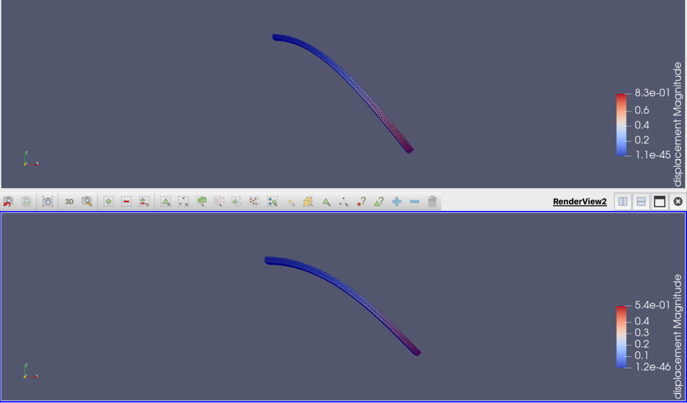

=========================================================
非線形応力解析 ( Elastic Solver )
=========================================================

非線形の応力解析の例を以下に示す．

* 非線形問題は、応力によって構造変形が生じた際に、その変形した形状を用いて応力解析する．応力解析による変形量算出、変形形状における方程式再組み立てを繰り返すことにより非線形効果を含むことができるイメージ．実際には非線形項が入った方程式を解いている．
* 有限(大振幅)の変形量を評価することができる．

  
問題設定 / メッシュ
=========================================================

問題設定・メッシュは線形応力解析と同様とする．荷重は、奥側の境界面に z負方向に 100 (tF) とする．

非線形応力解析のElmer入力ファイル ( .sif ファイル )
=========================================================

以下にElmer入力ファイルのサンプルを示す．

.. literalinclude:: ../code/elastic_nonlinear.sif
   :caption: Elmer 非線形応力解析 ( elastic_nonlinear.sif )
   :emphasize-lines: 48

* 最も重要な設定箇所は、 Solver Section における Procedure = "ElasticSolve" "ElasticSolver"の箇所．

線形応力解析の結果
=========================================================

結果は次のようになった．

線形解析の結果と違いがわからないので、境界条件に指定している荷重を 100 (tF) から 5000 (tF) へ変更してみる．

線形と非線形解析を並べて表示している．上側が線形解析、下側が非線形解析である．
変形量が非線形飽和し、2つの形状が大きく異なっている．
