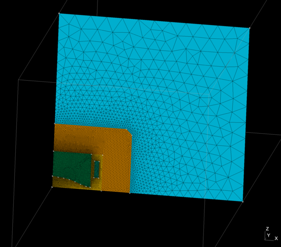
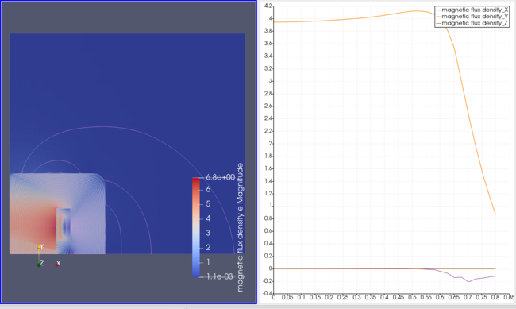
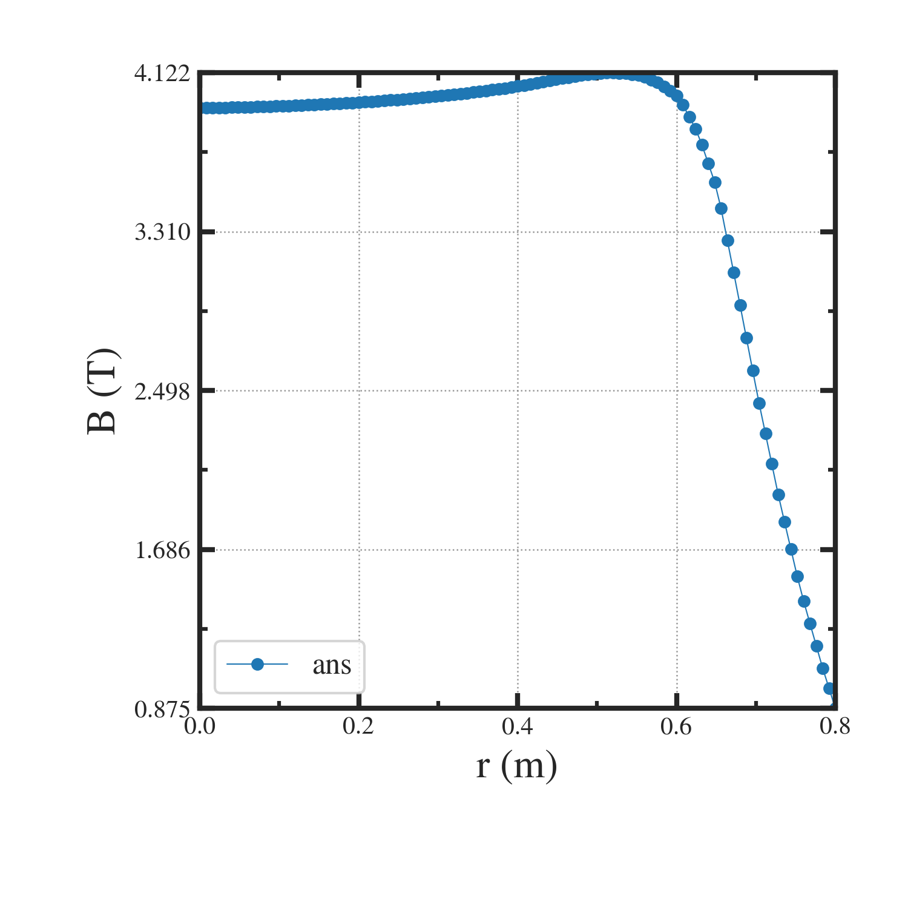

=========================================================
H型電磁石がつくる磁場
=========================================================

H型電磁石が作る磁場の解析結果を以下に示す．

問題設定 / メッシュ
=========================================================

* 座標系として軸対称の円筒座標系を考える．計算平面は x-z座標とする． 
* H型の鉄芯を考える．磁極半径は 0.670 (m) とし、鉄芯の各部寸法は適宜与えるものとする．
* H型鉄芯のコイルスロット部にコイルを設定する．コイル電流としては、1.76 (MAT) を与えるものとする．
* 計算領域は、磁極モデルに加えて厚さ 2.0 (m) の空気層を追加した領域を対象とする．

  

H型電磁石のメッシュ生成 プログラム
===========================================================================================

メッシュ生成用プログラムを以下に示す．

.. literalinclude:: ../../wrk/Hshape_magnet/msh/pyt/generate__magnetModel_2d.py
   :caption: H型電磁石モデルのメッシュ生成用 gmsh-API python プログラム
   :linenos:
   :language: python

H型電磁石の磁場解析用 Elmer入力ファイル
=========================================================

以下にElmer入力ファイルのサンプルを示す．

.. literalinclude:: ../../wrk/Hshape_magnet/Hshape_magnet.sif
   :caption: H型電磁石がつくる磁場の Elmer 入力ファイル ( Hshape_magnet.sif )
   :linenos:
   :emphasize-lines: 52, 70-71, 101, 139-146, 152-155, 165

H型電磁石の入力ファイルの要点は以下である．

* 軸対称計算であることを、 ( "Axi Symmetric" ) にて記載． 今回は、x-z平面を使用するので、 Coordinate Mapping は 1 3 2 として指定する．
* Body 2 (コイル) に体積力を定義． Body Force 1 には、面を通り抜ける(2次元なので)、電流密度を与える．
* Material 1 (コア) に、H-B Curveにより H-B 曲線をデータとして与えている．
* 2次元磁場計算用の関数 ( "MagnetoDynamics2D" "MagnetoDynamics2D" ) を使用する．
* データ保存用に (  "SaveData" "SaveLine" ) を呼び出す( シミュレーション終了前に実行 )．
  + polyCoordinates(2,3) で、ある地点からある地点までの直線を定義
  + polyLine Divisions(1) で、内分する点数を指定．( Model Manual は、要素数が2となっており誤っている．1個で十分． )
* 無限境界条件が使用可能．
* z=0の境界条件は, :math:`B_n \neq 0, B_t=0` なので、x方向、及び、y方向の :math:`A_\phi` の勾配を0として設定．
      
磁場解析結果
=========================================================

解析実行結果は以下に示す．以下に磁束線及び磁場強度の2次元マップと磁場のr依存性を示す．

H 型電磁石の磁場強度は約 4 (T) であり、意図した程度の磁場強度が出力されている．

また、Elmer内部で内挿された磁場の軸方向成分を次に示す． paraviewにおけるプロットと一致している．

SaveLine を使用する際の注意点としては、あくまで、内部情報は線形内挿によって得られている点 ( 高精度ではない )と、Elmer からの出力時には、PolyLine として定義した線分に則ってデータが格納されてない点である．前者はそういう仕様なので我慢するしかなく（もしくは自作）、後者の問題はデータ出力後、プロット前にソートする必要がある．単純に、

.. code-block::

   index = np.argsort( xAxis )
   xAxis = xAxis[index]
   yAxis = yAxis[index]

でよい．

