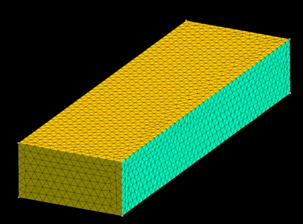
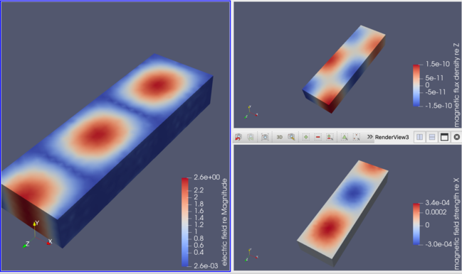

=========================================================
矩形導波管解析 ( Vectorial Helmholtz Equation )
=========================================================

矩形導波管を例として、電磁波のFEM解析手法について述べる．

* 電磁波解析には、時系列的な解析手法（FDTD）と周波数解析(単一周波数の振幅分布を求める)手法がある．
* 波動解析全般において、勿論、波動方程式が成立する． *Maxwell* 方程式も例外ではない．波動方程式の *Fourier* 変換は、*Helmholtz* 方程式となる．

.. math::

   \dfrac{1}{c^2} \dfrac{ \partial^2  \phi }{ \partial t^2 } &= \nabla^2 \phi \\
   \nabla^2 \phi + \dfrac{ \omega^2 }{ c^2 } \phi &= 0 \\
   \nabla^2 \phi + k^2 \phi &= 0
     
* 周波数空間における波動伝搬の解析は、*Helmholtz* 方程式を解けば良い． *Helmholtz* 方程式は、 *Poisson* 方程式の非線形解析型であるので、FEMを用いて解ける．
* 上記、スカラー関数での議論は、電磁波の3次元ベクトルの場合にも適用できる．電磁波の場合、前項で示したベクトル型 *Helmholtz* 方程式( *Vectorial Helmholtz Equation* )となる．

問題設定 / メッシュ / 境界条件
=========================================================

問題設定
---------------------------------------------------

* 矩形導波管( 矩形断面長さ： a ,b 、長さ L )内を伝搬する電磁波を考える．
* 電磁波の周波数は、 :math:`\omega` ．
* 解析対象は TE10 モード
* パラメータ設定

  + 矩形断面 :math:`a = 381 (mm), b = 190.5 (mm), L = 500 (mm)` を考えてみる． ( 典型例として、 :math:`a=2b` としている．)

    
メッシュ
---------------------------------------------------

メッシュ生成用スクリプトファイルを以下に示す．

.. literalinclude:: ../../wrk/waveguide__rectangular/msh/main.py
   :caption: 矩形断面導波管メッシュ生成用のpython スクリプト
   :linenos:
   :language: python

用いたメッシュを以下に示す．

境界条件
---------------------------------------------------

* 境界条件としては、電磁波の入射境界 ( -z 境界 )と出射境界 ( +z 境界 )、及び、導体境界からなる．

elmer 入力ファイル ( .sif ファイル )
=========================================================

elmer用の入力ファイルを以下に示す．

.. literalinclude:: ../../wrk/waveguide__rectangular/waveguide.sif
   :caption: 矩形断面導波管用の elmer 入力 .sif ファイル
   :linenos:
   :emphasize-lines: 33-37,64-85,91,127,171-180,187-204,207-245,248-286

      

重要命令は、以下の通りである．

* (l.33-37) constants 内で自然な真空の透磁率・誘電率を指定してはいけない．何故かはわからないが、バグが生じてしまい、正しく計算できなくなる．
* (l.64-85) パラメータ設定． $記号を用いて、elmer内部で変数を定義することができる．
* (l.91) 解析対象とする角周波数．
* (l.97,l.127) VectorHelmholtzソルバーを用いるという指示文．
* (l.171-180) 比較対象とする解析解を initial condition として定義．内部では変数が用いられないからこの変数は変化しない．
* (l.187-204) inport （風上側境界の電磁場指定）． :math:`\alpha=0` として、境界面での電場分布を与える．
* (l.207-245) outport ( 風下側境界の電磁場指定 )． :math:`\alpha=0, g=0` として、*Neumann* 境界条件を課す．
* (l.248-286) 導波管壁の境界条件指定． :math:`E_{\parallel}=0` として、 *Dirichlet* 境界条件を課す．

実行結果
=========================================================

以下に、振幅強度の解析結果を示す．

一端を、入力波の励振面、一端をNeumann境界条件とし、解析した結果となっている．
