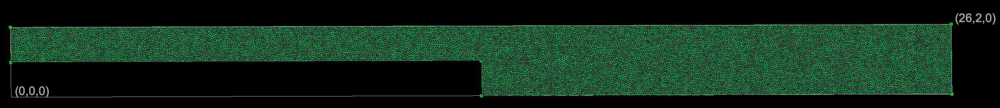
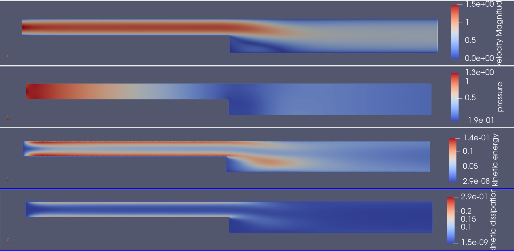

##############################################################
標準 k-ε モデルを用いたバックステップ流れ
##############################################################

* シミュレーション名 :: flow__backStep_keSolver_XY2D

=========================================================
シミュレーション体系
=========================================================

* 基本方程式は、 **Navier-Stokes方程式** と **標準k-ε方程式**

  + 流体は、 **非圧縮** , **標準k-εモデル** を取扱い、対象は空気とする．
  
* 計算対象は、いわゆるバックステップ流れと呼ばれるものである．

  + 2次元 長さ 13 [m], 幅 1 [m] の流路から、長さ 13 [m] 、幅 2 [m] の流路への切り替わる．
  + 流入境界は、ポワズイユ流れとし、流出境界は uy=0 とする．
  + 標準k-εモデル を用いて、壁境界は 滑りなし壁条件を課した．
  + 全領域の初期条件は、流速は0、k=0.00457, epsilon=1e-4 とおいている．

---------------------------------------------------------
物性条件
---------------------------------------------------------

.. csv-table:: **Materials Settings**
   :header: "Target", "Parameters", "Value", "Unit", "Description"
   :widths: 20, 20, 15, 10, 35
   :width:  800px
   
   "空気", "Density", "1.2e+0", "kg/m3", "密度"
   "", "viscosity", "1.0e-5", "Pa.s", "粘度"
   "", "KE SigmaK", "1.0", "", ""
   "", "KE SigmaE", "1.3", "", ""
   "", "KE C1", "1.44", "", "係数C1"
   "", "KE C2", "1.92", "", "係数C1"
   "", "KE Cmu", "0.09", "", "係数Cmu"
   "", "KE Clip", "1.0e-6", "", ""
   "", "Viscosity Model", "K-Epsilon", "", "使用するモデル"

  
=========================================================
メッシュ
=========================================================

* メッシュ生成スクリプト ( mesh.py )

.. literalinclude:: ../../code/fluid/flow__backStep_keSolver_XY2D/mesh.py
   		    :caption:  mesh.py ( flow__backStep_keSolver_XY2D )
   		    :language: python

                               
* geometry.conf

.. literalinclude:: ../../code/fluid/flow__backStep_keSolver_XY2D/geometry.conf
   		    :caption:  geometry.conf ( flow__backStep_keSolver_XY2D )

                               
* boundary.json

.. literalinclude:: ../../code/fluid/flow__backStep_keSolver_XY2D/boundary.json
   		    :caption:  boundary.json ( flow__backStep_keSolver_XY2D )

                               
* phys.conf

.. literalinclude:: ../../code/fluid/flow__backStep_keSolver_XY2D/phys.conf
   		    :caption:  phys.conf ( flow__backStep_keSolver_XY2D )

                               
* mesh.conf

.. literalinclude:: ../../code/fluid/flow__backStep_keSolver_XY2D/mesh.conf
   		    :caption:  mesh.conf ( flow__backStep_keSolver_XY2D )

                               
* 生成したメッシュを次に示す．

=========================================================
elmer シミュレーション設定
=========================================================

* elmer シミュレーション設定ファイルを以下に示す．

.. literalinclude:: ../../code/fluid/flow__backStep_keSolver_XY2D/steady_ke.sif
   		    :caption: steady_ke.sif ( flow__backStep_keSolver_XY2D )

            
=========================================================
バックステップ流れのシミュレーション
=========================================================

---------------------------------------------------------
バックステップ流れの定常解 ( 標準 k-ε モデル )
---------------------------------------------------------

* Steady State 定常解を求めると、80回程度の反復で閾値( 1e-5 )以下に収束した．
* 反復法を用いた場合、収束性が問題となり、最適な問題設定（閾値、前処理、その他、）ができず、行き詰まった．
* N-Sソルバ単体だとやはり、計算が爆発する．．． ( k-εモデルの必要性？ : uuの項が高波数モードをだす？ )

  + 線形解法に直接法 ( Direct, umfpack ) を用いると、収束した．
  + N-S全般で、収束性が問題となっているので、N-Sには直接法を用いるのがよいかもしれない．

---------------------------------------------------------
結果について
---------------------------------------------------------

* 配管中の速度はほぼ流入設定と同様のポワズイユ流れとなっている．
* 段差部分において、流れの剥離が生じる．
* 圧力は、細管部分で主に損失し、太管部分は変化に乏しい．
* kinetic energy ( 渦のエネルギー )は、配管壁付近（境界層付近）に集中する．
* dissipation も同様．散逸は、壁付近で生じる．
