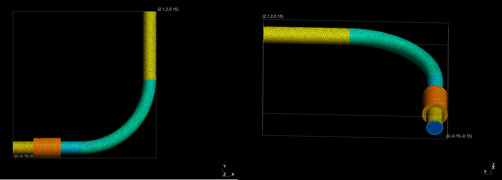
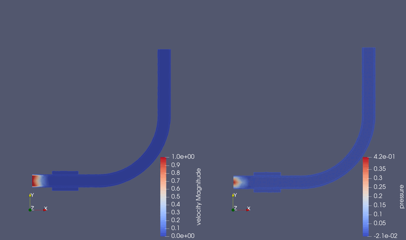

##############################################################
エルボ配管内の流れ （流れ）
##############################################################

* シミュレーション名： flow__in_a_curved_pipe_XYZ3D
  

=========================================================
シミュレーション体系
=========================================================

* Navier-Stokes方程式
* エルボの内径、外径はそれぞれ 160 mm, 200 mm ( 半径はそれぞれ 80 mm, 100 mm )．
* エルボは直角 ( 90 deg )に、曲率半径は 1.0 m で曲がる．
* 曲がり部分の両端に 1.0 m の直管部分がある．
* 流入側の配管外側には、外径 300mm のヒーターを取り付けている（本問題には無関係）．

=========================================================
メッシュ
=========================================================

* メッシュ生成スクリプト ( mesh.py )

.. literalinclude:: ../../code/fluid/flow__in_a_curved_pipe_XYZ3D/mesh.py
   		    :caption:  mesh.py ( flow__in_a_curved_pipe_XYZ3D )
   		    :language: python

* phys.conf

.. literalinclude:: ../../code/fluid/flow__in_a_curved_pipe_XYZ3D/phys.conf
   		    :caption:  phys.conf ( flow__in_a_curved_pipe_XYZ3D )

  
* mesh.conf

.. literalinclude:: ../../code/fluid/flow__in_a_curved_pipe_XYZ3D/mesh.conf
   		    :caption:  mesh.conf ( flow__in_a_curved_pipe_XYZ3D )

* 生成したメッシュを次に示す．

  

            
=========================================================
Elmer シミュレーションファイル
=========================================================

* シミュレーションファイル ( ns.sif )を以下に示す．

.. literalinclude:: ../../code/fluid/flow__in_a_curved_pipe_XYZ3D/ns.sif
   		    :caption:  ns.sif ( flow__in_acurved_pipe_XYZ3D )

                               
=========================================================
シミュレーション結果
=========================================================

結果は以下の通り．

流入速度が進行に従い、減速しながら、パイプ中を進行していく．

