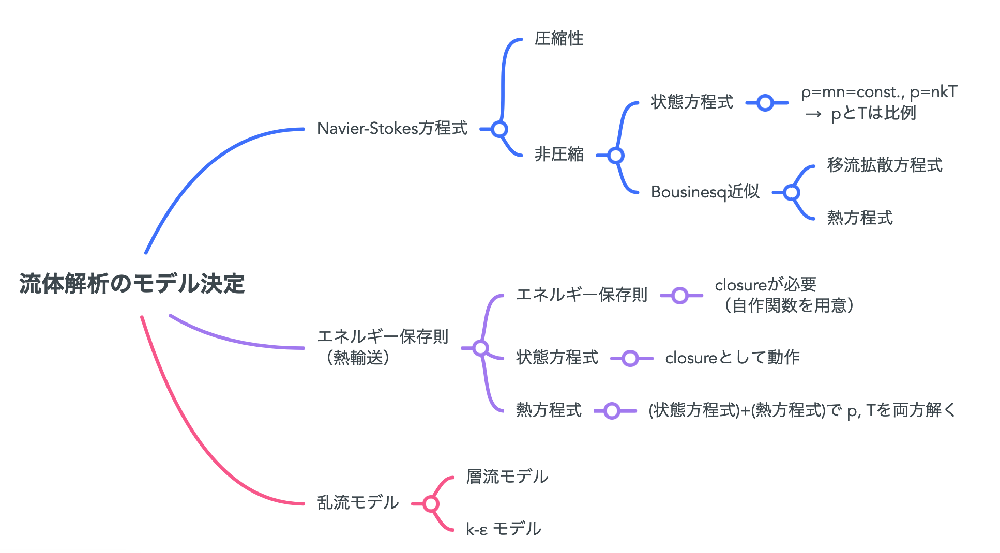

##############################################################
流体モデルの決定
##############################################################

=========================================================
解析モデルの大別
=========================================================

* Navier-Stokes方程式は、いくつかの式から成り立つ．

  + 質量保存則
  + 運動量保存則
  + エネルギー保存則 ( 熱輸送方程式 )
  + and others...,

* モデル選定の観点は以下

  + 圧縮性流体か、非圧縮流体か
  + エネルギー保存則（熱輸送方程式）として、何を用いるか？
  + 層流か、乱流か．また、乱流モデルは？

=========================================================
圧縮性流体と非圧縮流体について
=========================================================

---------------------------------------------------------
基礎方程式
---------------------------------------------------------

* 圧縮性流れ

  .. math::

     \dfrac{ \partial \rho }{ \partial t } + u \cdot \nabla \rho + \rho \nabla \cdot u &= 0 \\
     \rho \dfrac{ \partial u }{ \partial t } + \rho u \cdot \nabla u - \nabla \cdot \sigma &= \rho f \\
     p &= \rho RT

  
* 非圧縮流れ

  .. math::

     \nabla \cdot u &= 0 \\
     \rho \dfrac{ \partial u }{ \partial t } + \rho u \cdot \nabla u - \nabla \cdot ( 2 \mu \epsilon ) + \nabla p &= \rho f \\
     p &= \rho RT

---------------------------------------------------------
設定 
---------------------------------------------------------

*  :red:`Compressibility Model` 

.. csv-table:: **Compressibility Model @ Materials Section**
   :header: "parameter", "keyword", "description"
   :widths: 25, 25, 50
   :width: 800px

   "", "incompressible", "非圧縮．（ **デフォルト** ）"
   ":red:`Compressibility Model`", "perfect gas", "圧縮性流体(状態方程式：理想気体)、比熱比γ( specific Heat Ratio) と 基準圧力 p0 (比熱比の測定圧力条件) が必要になる．"
   "", "artificial compressibility", "ユーザ定義．流体-構造物の計算を効率的に解きたいときに使用．"

=========================================================
エネルギー保存則の選び方について
=========================================================

---------------------------------------------------------
基礎方程式
---------------------------------------------------------

* エネルギー保存則
* 状態方程式 ( 基本付随 )

.. math::

   p &= \rho RT

* 熱輸送方程式 ( + 状態方程式 )

.. math::

   \rho c_p \dfrac{ \partial T }{ \partial t } + \rho c_p u \cdot \nabla T - \nabla \cdot ( k \nabla T ) &= \tau : \epsilon + \rho h

* 移流拡散方程式 ( + 状態方程式 )

.. math::

   \rho \left( \dfrac{ \partial T }{ \partial t } + u \cdot \nabla T \right) = \rho \nabla \cdot ( D_i \nabla T ) + S_i

---------------------------------------------------------
設定
---------------------------------------------------------

* SolverをEquationに付加することによって指定．
* Bousinesq近似を適用する場合も、温度分布Tを解く必要がある．
  
.. csv-table:: **エネルギー則の設定**
   :header: "モデル", "付加するソルバ名", "Description"
   :widths: 30, 30, 40
   :width:  800px
   
   "エネルギー保存則", "", ""
   "状態方程式", "", "デフォルト"
   "熱輸送方程式 ( + 状態方程式 )", "HeatSolver", "熱拡散・熱対流・放射のモデル、内部発熱"
   "移流拡散方程式 ( + 状態方程式 )", "AdvectionDiffusionSolver", "熱対流、内部発熱"

* 熱輸送方程式 ( Heat Equation ) が最も一般的かつ包括的な模様．(熱拡散＝熱伝導や放射がない純粋な流体モデルでは移流拡散方程式でも問題ない（移流拡散のほうが速い？）．

  
  
=========================================================
乱流モデルの選び方について
=========================================================

---------------------------------------------------------
基礎方程式
---------------------------------------------------------

* 確認中

  
---------------------------------------------------------
設定
---------------------------------------------------------

* 確認中
