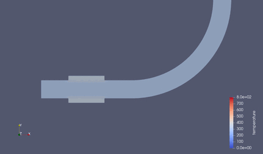

##############################################################
エルボ配管内の流れ （熱伝導）
##############################################################

* シミュレーション名： flow__in_a_curved_pipe_XYZ3D
  

=========================================================
シミュレーション体系
=========================================================

* エルボ配管内の流れを参考に
* 流入側の配管外側には、外径 300mm のヒーターを取り付けていた．
* ヒータを 5 kW で加熱し、ヒータ→パイプ、及び、パイプ→水（静止）への熱伝導をみる．

  + パイプ、及び、水の初期温度は20℃ = 293.15 Kとした．
  + 熱源としては、"Heat Source" keywordを用いて、重量密度あたりの熱源( 5.0e3 / 8.96e3 )を設定．
  + 時間としては、10 (s) 毎に 50回の書き出しを実行する． ( Total = 500 (s) )

* ヒータが熱が他に逃げる場所がないので、無限大に温度が上がっていってしまうが、ここでは無視する．
  
=========================================================
Elmer シミュレーションファイル
=========================================================

* シミュレーションファイル ( heat.sif )を以下に示す．

.. literalinclude:: ../../code/fluid/flow__in_a_curved_pipe_XYZ3D/heat.sif
   		    :caption:  heat.sif ( flow__in_acurved_pipe_XYZ3D )

                               
=========================================================
シミュレーション結果
=========================================================

結果は以下の通り．

* ヒータの熱が時間経過に伴い、パイプ内を伝導していく．
* 水へはほぼ熱伝導しない．（銅の熱伝導率：398 [W/mk] ⇔ 水の熱伝導率：0.6 [W/mK]）
* 水と銅の比熱差も関係あり． ( 銅の定圧比熱： 379 [J/kgK] ⇔ 水の定圧比熱：4180 [J/kgK] )
* 実際は、水と銅は比重が10倍弱異なるので、熱容量としてはそこまで大きな差はないが．

