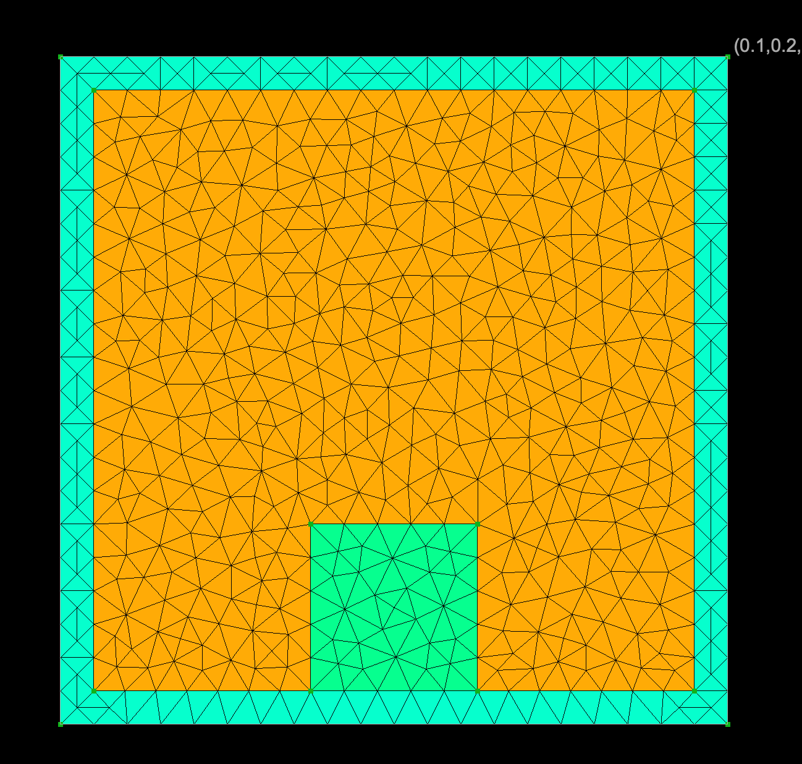
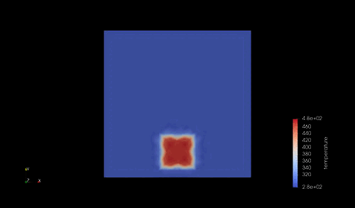
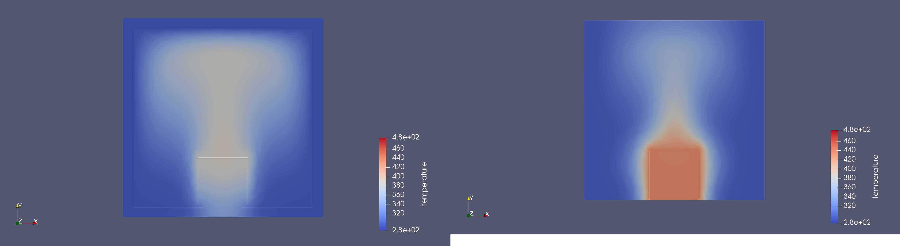

##############################################################
物体から流体への熱伝達（自然対流冷却）
##############################################################

* シミュレーション名 :: heatTransfer__box_in_water_XY2D

=========================================================
シミュレーション体系
=========================================================

* 基本方程式は、 **Navier-Stokes方程式** と **標準k-ε方程式** と **熱輸送方程式** 

  + 流体は、 **非圧縮** , **標準k-εモデル** を取扱い、対象は空気とする．
  
* 計算対象は、２次元の閉じた立方体の箱の中にバルク鉄塊をおいた際の熱伝達をみる．

  + 2次元 長さ 200 [mm], 幅 200 [mm]、高さ 200 [mm]、厚み 10 [mm] の中空の箱の中央下部に、長さ 50 [mm] 、幅 50 [mm]、高さ 50 [mm] の鉄塊（SS400）を置く．
  + 標準k-εモデル を用いて、壁境界は 垂直方向流速にゼロを課した (Normal-Tangential)．
  + 全領域の初期条件は、流速は0、k=0.00457, epsilon=1e-4 とおいている．

---------------------------------------------------------
物性条件
---------------------------------------------------------

.. csv-table:: **Materials Settings**
   :header: "Target", "Parameters", "Value", "Unit", "Description"
   :widths: 20, 20, 15, 10, 35
   :width:  800px
   
   "空気", "Density", "1.2e+0", "kg/m3", "密度"
   "", "viscosity", "1.0e-5", "Pa.s", "粘度"
   "", "KE SigmaK", "1.0", "", ""
   "", "KE SigmaE", "1.3", "", ""
   "", "KE C1", "1.44", "", "係数C1"
   "", "KE C2", "1.92", "", "係数C1"
   "", "KE Cmu", "0.09", "", "係数Cmu"
   "", "KE Clip", "1.0e-6", "", ""
   "", "Viscosity Model", "K-Epsilon", "", "使用するモデル"
   "", "Heat Conductivity", "0.0257", "W/m.K", "熱伝導度"
   "", "Heat Capacity", "1.005e+3", "J/kg.K", "比熱"
   "", "Density", "1.166e+0", "kg/m3", "密度"
   "SS400", "Heat Conductivity",     "51.6", "W/m.K", "熱伝導率"
   "",      "Heat Capacity",         "473.0", "J/kg.K", "比熱"
   "",      "Density",               "7.85e+3", "kg/m3", "密度"

  
=========================================================
メッシュ
=========================================================

* メッシュ生成スクリプト ( mesh.py )

.. literalinclude:: ../../code/fluid/heatTransfer__box_in_water_XY2D/mesh.py
   		    :caption:  mesh.py ( heatTransfer__box_in_water_XY2D )
   		    :language: python

                               
* geometry.conf

.. literalinclude:: ../../code/fluid/heatTransfer__box_in_water_XY2D/geometry.conf
   		    :caption:  geometry.conf ( heatTransfer__box_in_water_XY2D )

                               
* boundary.json

.. literalinclude:: ../../code/fluid/heatTransfer__box_in_water_XY2D/boundary.json
   		    :caption:  boundary.json ( heatTransfer__box_in_water_XY2D )

                               
* phys.conf

.. literalinclude:: ../../code/fluid/heatTransfer__box_in_water_XY2D/phys.conf
   		    :caption:  phys.conf ( heatTransfer__box_in_water_XY2D )

                               
* mesh.conf

.. literalinclude:: ../../code/fluid/heatTransfer__box_in_water_XY2D/mesh.conf
   		    :caption:  mesh.conf ( heatTransfer__box_in_water_XY2D )

                               
* 生成したメッシュを次に示す．

 

=========================================================
elmer シミュレーション設定
=========================================================

* elmer シミュレーション設定ファイルを以下に示す．

.. literalinclude:: ../../code/fluid/heatTransfer__box_in_water_XY2D/heatTransfer.sif
   		    :caption: steady_ke.sif ( heatTransfer__box_in_water_XY2D )

            
=========================================================
自然対流冷却のシミュレーション結果
=========================================================

---------------------------------------------------------
温度の時間発展
---------------------------------------------------------

---------------------------------------------------------
結果について
---------------------------------------------------------

* 鉄塊内部の温度差が顕著．
* 容器側へ、熱伝導で大部分の熱が逃げている可能性が高い．
* 容器なしでシミュレーションして比較検討してみる．

=========================================================
容器なしの場合との比較
=========================================================

---------------------------------------------------------
メッシュ
---------------------------------------------------------

* メッシュ生成スクリプト ( mesh.py )

.. literalinclude:: ../../code/fluid/heatTransfer__box_in_water_XY2D/woContainer/mesh_woContainer.py
   		    :caption:  mesh.py ( heatTransfer__box_in_water_XY2D )
   		    :language: python

                               
* geometry.conf

.. literalinclude:: ../../code/fluid/heatTransfer__box_in_water_XY2D/woContainer/geometry.conf
   		    :caption:  geometry.conf ( heatTransfer__box_in_water_XY2D )

                               
* boundary.json

.. literalinclude:: ../../code/fluid/heatTransfer__box_in_water_XY2D/woContainer/boundary.json
   		    :caption:  boundary.json ( heatTransfer__box_in_water_XY2D )

                               
* phys.conf

.. literalinclude:: ../../code/fluid/heatTransfer__box_in_water_XY2D/woContainer/phys.conf
   		    :caption:  phys.conf ( heatTransfer__box_in_water_XY2D )

                               
* mesh.conf

.. literalinclude:: ../../code/fluid/heatTransfer__box_in_water_XY2D/woContainer/mesh.conf
   		    :caption:  mesh.conf ( heatTransfer__box_in_water_XY2D )
                               

---------------------------------------------------------
容器なしの場合のシミュレーション設定
---------------------------------------------------------

* elmer シミュレーション設定ファイルを以下に示す．

.. literalinclude:: ../../code/fluid/heatTransfer__box_in_water_XY2D/woContainer/woContainer.sif
   		    :caption: steady_ke.sif ( heatTransfer__box_in_water_XY2D )

            
---------------------------------------------------------
容器の有無による温度分布の差異 ( t=25 (s) 経過後 )
---------------------------------------------------------

---------------------------------------------------------
比較した結果について
---------------------------------------------------------

* 明らかに容器を伝って熱伝導により、熱が逃げているのがわかる．
