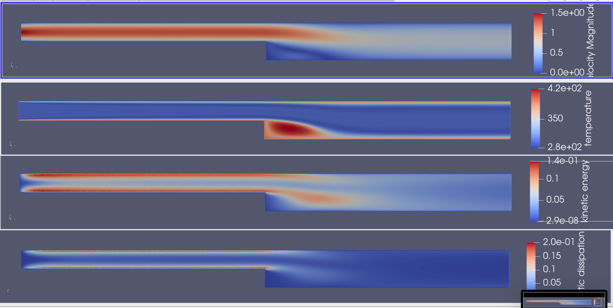

##############################################################
バックステップ流れでの壁面からの熱輸送
##############################################################

* シミュレーション名 :: thermalFluid__backStep_XY2D

=========================================================
シミュレーション体系
=========================================================

* 基本方程式は、 **Navier-Stokes方程式** と **標準k-ε方程式** と **熱輸送方程式** 

  + 流体は、 **非圧縮** , **標準k-εモデル** を取扱い、対象は空気とする．
  
* 計算対象は、いわゆるバックステップ流れと呼ばれるものである．

  + 2次元 長さ 13 [m], 幅 1 [m] の流路から、長さ 13 [m] 、幅 2 [m] の流路への切り替わる．
  + 流入境界は、ポワズイユ流れとし、流出境界は uy=0 とする．
  + 標準k-εモデル を用いて、壁境界は 滑りなし壁条件を課した．
  + 全領域の初期条件は、流速は0、k=0.00457, epsilon=1e-4 とおいている．

* 別計算( flow__backStep_keSolver_XY2D ) に熱輸送方程式をカップルしている

---------------------------------------------------------
物性条件
---------------------------------------------------------

.. csv-table:: **Materials Settings**
   :header: "Target", "Parameters", "Value", "Unit", "Description"
   :widths: 20, 20, 15, 10, 35
   :width:  800px
   
   "空気", "Density", "1.2e+0", "kg/m3", "密度"
   "", "viscosity", "1.0e-5", "Pa.s", "粘度"
   "", "KE SigmaK", "1.0", "", ""
   "", "KE SigmaE", "1.3", "", ""
   "", "KE C1", "1.44", "", "係数C1"
   "", "KE C2", "1.92", "", "係数C1"
   "", "KE Cmu", "0.09", "", "係数Cmu"
   "", "KE Clip", "1.0e-6", "", ""
   "", "Viscosity Model", "K-Epsilon", "", "使用するモデル"
   "", "Heat Conductivity", "0.0257", "W/m.K", "熱伝導度"
   "", "Heat Capacity", "1.005e+3", "J/kg.K", "比熱"
   "", "Density", "1.166e+0", "kg/m3", "密度"

  
=========================================================
メッシュ
=========================================================

* メッシュについては、熱輸送なしのバックステップ流れと同様．
  

=========================================================
elmer シミュレーション設定
=========================================================

* elmer シミュレーション設定ファイルを以下に示す．

.. literalinclude:: ../../code/fluid/thermalFluid__backStep_XY2D/steady_ke.sif
   		    :caption: steady_ke.sif ( thermalFluid__backStep_XY2D )

            
=========================================================
バックステップ流れのシミュレーション
=========================================================

---------------------------------------------------------
バックステップ流れの定常解 ( 標準 k-ε モデル )
---------------------------------------------------------

* Steady State 定常解を求めると、80回程度の反復で閾値( 1e-5 )以下に収束した．

---------------------------------------------------------
結果について
---------------------------------------------------------

* バックステップ流れと同様の速度分布となっている．
* 温度は、壁面からの対流・熱伝導で速度分布と同様な分布になっている．
* 剥離が生じるバックステップ付近で、流れに滞留が生じ、この近辺で温度が高く（対流されずにとどまっている）なっている．
