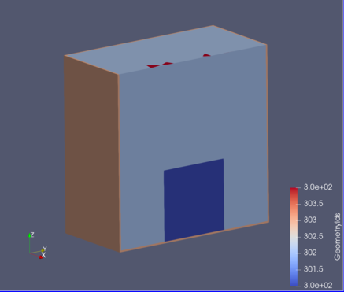
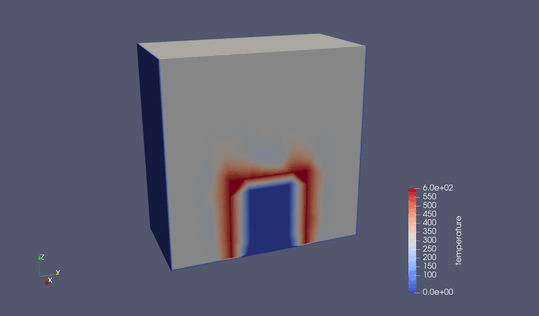

##############################################################
水中に沈めた鉄塊からの自然対流冷却
##############################################################

* シミュレーション名 :: heatConduction__box_in_water_XYZ3D

=========================================================
シミュレーション体系
=========================================================

* 基本方程式は、 **熱輸送方程式( Heat Equation )** と **Navier-Stokes方程式**

  + 流体は、 **非圧縮** , **Boussinesq近似**
  + 熱輸送は、 熱伝導、熱対流、輻射を取り扱う．
  
* シミュレーション対象は直方体 ( 50 [cm] x 50 [cm] x 50 [cm]  )の箱のなかに、直方体の鉄塊が ( 20 [cm] x 20 [cm] x 20 [cm]  ) が安置してあり、周囲を水が満たしている．
* 初期温度、 20 [℃] の水が鉄塊に触れて、自然対流し、鉄塊が冷却される．
* 流体は、すべり境界条件とする．

---------------------------------------------------------
物性条件
---------------------------------------------------------

.. csv-table:: **Materials Settings**
   :header: "Target", "Parameters", "Value", "Unit", "Description"
   :widths: 20, 20, 15, 10, 35
   :width:  800px
   
   "空気", "Heat Conductivity", "0.0257", "W/m.K", "熱伝導度"
   "", "Heat Capacity", "1.005e+3", "J/kg.K", "比熱"
   "", "Density", "1.166e+0", "kg/m3", "密度"
   "", "Heat Expansion Coefficient", "3.665e-3", "1e-6", "体積膨張率(1K毎に(0.29e-3)分の体積増加(線形近似))"
   "", "Reference Temperature", "293.15", "K", "参照温度 (体積膨張率の測定温度：Boussinesq近似)"
   "", "viscosity", "1.512e-5", "Pa.s", "粘度"
   "水", "Heat Conductivity", "0.602", "W/mK", "熱伝導度"
   "",   "Heat Capacity", "4.18e3", "J/kg K", "比熱"
   "",   "Density", "9.97e3", "J/kg K", "密度"
   "",   "Reference Temperature", "293.15", "K", "参照温度"
   "",   "Heat Expansion Coefficient", "0.29e-3", "1/K", "体積膨張率 (体積膨張率の測定温度：Boussinesq近似)"
   "",   "viscosity", "1.18e-3", "Pa s", "粘度"
   "SS400", "Heat Conductivity", "51.6", "W/m.K", "熱伝導度"
   "", "Heat Capacity", "473.0","J/kg.K", "比熱"
   "", "Density", "7.85e+3", "kg/m3", "密度"
   "定数", "gravity", "0,0,-1,9.8", "m/s2", "重力加速度"
   "", "Stefan Boltzmann", "5.68e-8", "W/m2K4", "Stefan-Boltzmann係数"
   
  
=========================================================
メッシュ
=========================================================

* メッシュ生成スクリプト ( mesh.py )

.. literalinclude:: ../../code/heat/heatConduction__box_in_water_XYZ3D/mesh.py
   		    :caption:  mesh.py ( heatConduction__box_in_water_XYZ3D )
   		    :language: python

* geometry.conf

.. literalinclude:: ../../code/heat/heatConduction__box_in_water_XYZ3D/geometry.conf
   		    :caption:  geometry.conf ( heatConduction__box_in_water_XYZ3D )
  
* boundary.json

.. literalinclude:: ../../code/heat/heatConduction__box_in_water_XYZ3D/boundary.json
   		    :caption:  boundary.json ( heatConduction__box_in_water_XYZ3D )
  
* phys.conf

.. literalinclude:: ../../code/heat/heatConduction__box_in_water_XYZ3D/phys.conf
   		    :caption:  phys.conf ( heatConduction__box_in_water_XYZ3D )

  
* mesh.conf

.. literalinclude:: ../../code/heat/heatConduction__box_in_water_XYZ3D/mesh.conf
   		    :caption:  mesh.conf ( heatConduction__box_in_water_XYZ3D )

* 生成したメッシュを次に示す．

            
=========================================================
Boussinesq近似の確認
=========================================================

---------------------------------------------------------
シミュレーション設定
---------------------------------------------------------

* 流体境界を (i) 鉄塊境界,  (ii) 容器境界 の２つに分ける．
* (i) 鉄塊境界に温度のDirichlet境界条件 T= 600 [K] = 330 [℃] を課す．
* 流体としては、 "Normal-Tangential velocity = True" を指定し、滑り壁条件 ( :math:`v_\perp=0`  ) を課した．
* Boussinesq近似の挙動を確認する．

.. literalinclude:: ../../code/heat/heatConduction__box_in_water_XYZ3D/boussinesq.sif
   		    :caption:  boussinesq.sif ( heatConduction__box_in_water_XYZ3D )

                               
---------------------------------------------------------
確認結果
---------------------------------------------------------

* 自然対流が生じている．

                               
=========================================================
水中の鉄塊における自然対流冷却
=========================================================

---------------------------------------------------------
シミュレーション設定
---------------------------------------------------------

* Dirichlet条件の場合、空気の動きは見えても、鉄塊内部の冷却の様子はわからない．
* 解析対象を鉄塊部分の熱伝導も含めて解く．
* 空気→水へ変更する．

.. literalinclude:: ../../code/heat/heatConduction__box_in_water_XYZ3D/heat.sif
                    :caption:  heat.sif ( heatConduction__box_in_water_XYZ3D )

---------------------------------------------------------
シミュレーション結果
---------------------------------------------------------

* 結果は以下の通り．
