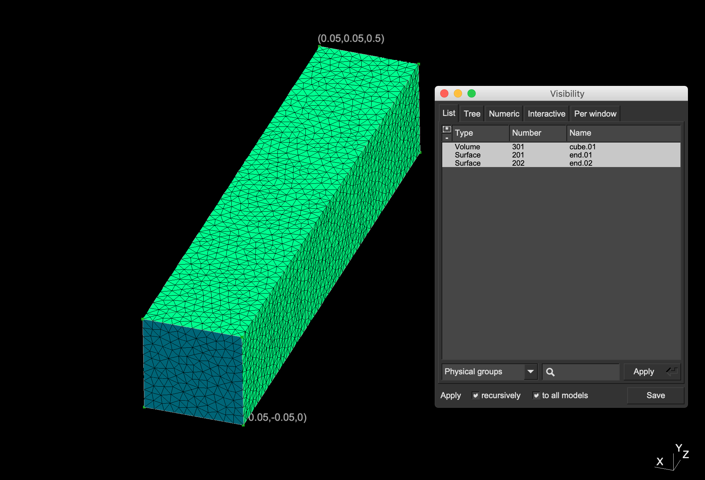
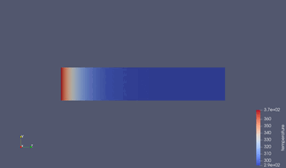
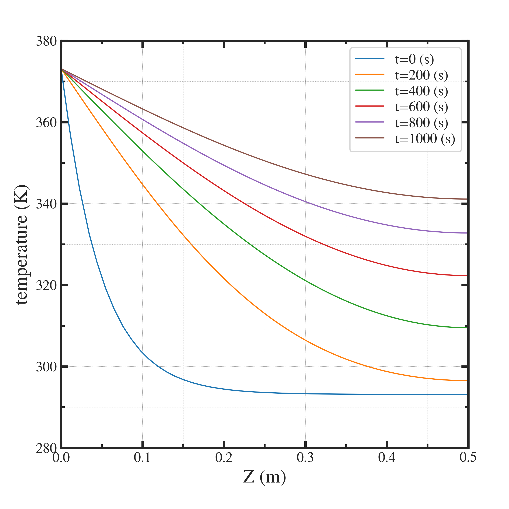

##############################################################
直方体中の熱伝導
##############################################################

* シミュレーション名 :: heatConduction__in_a_bar_XYZ3D

=========================================================
シミュレーション体系
=========================================================

* 基本方程式は熱輸送方程式 ( Heat Equation )
* シミュレーション対象は直方体 ( 10 [cm] x 10 [cm] x 100 [cm]  )
* 一端を固定温度条件( 373.15 [K] = 100[℃] )、もう一端は自由境界条件（指定なし）
* 材質は銅 ( 熱伝導率：398 [W/mK]、 比熱：379 [J/KgK]、8960 [kg/m3] )

  
=========================================================
メッシュ
=========================================================

* メッシュ生成スクリプト ( mesh.py )

.. literalinclude:: ../../code/heat/heatConduction__in_a_bar_XYZ3D/mesh.py
   		    :caption:  mesh.py ( heatConduction__in_a_bar_XYZ3D )
   		    :language: python

* geometry.conf

.. literalinclude:: ../../code/heat/heatConduction__in_a_bar_XYZ3D/geometry.conf
   		    :caption:  geometry.conf ( heatConduction__in_a_bar_XYZ3D )
  
* boundary.json

.. literalinclude:: ../../code/heat/heatConduction__in_a_bar_XYZ3D/boundary.json
   		    :caption:  boundary.json ( heatConduction__in_a_bar_XYZ3D )
  
* phys.conf

.. literalinclude:: ../../code/heat/heatConduction__in_a_bar_XYZ3D/phys.conf
   		    :caption:  phys.conf ( heatConduction__in_a_bar_XYZ3D )

  
* mesh.conf

.. literalinclude:: ../../code/heat/heatConduction__in_a_bar_XYZ3D/mesh.conf
   		    :caption:  mesh.conf ( heatConduction__in_a_bar_XYZ3D )

* 生成したメッシュを次に示す．

            
=========================================================
Elmer シミュレーションファイル
=========================================================

* シミュレーションファイル ( ns.sif )を以下に示す．

.. literalinclude:: ../../code/heat/heatConduction__in_a_bar_XYZ3D/heat.sif
   		    :caption:  heat.sif ( heatConduction__in_a_bar_XYZ3D )

                               
=========================================================
シミュレーション結果
=========================================================

結果は以下の通り．

                    
---------------------------------------------------------
シミュレーションの定量的妥当性
---------------------------------------------------------

シミュレーションで計算した時間は 1000 [s] であり、この間に、自由境界側の一端は 47-48 [K] 程度の温度が上昇している．これが定量的に妥当かどうかを確かめておく．

|

1. 物性値を以下に示す．

   .. csv-table:: **シミュレーションの物性値**
      :header: "物性値", "記号", "値", "単位"
      :widths: 20, 20, 20, 20
      :width:  800px
      
      "長さ", "L", "0.5", "m"
      "断面積", "A", "0.01", "m2"
      "体積", "V", "0.005", "m3"
      "密度 (銅)", "ρ","8960", "kg/m3"
      "熱伝導率 (銅)", "λ", "398", "W/mK"
      "定圧比熱 (銅)", "cp", "379", "J/kgK"

|
      
2. 熱伝達の基本式

   熱伝導のFourier則は、

   .. math::

      d \dot{Q} = - \lambda \nabla T \Delta A

   
   である．これを用いて、熱伝達量は、

   .. math::

      d \dot{Q} = - 398 [W/mK] \times ( 80 [K] / 0.5 [m] ) \times ( 0.1 [m] )^2 = 6.4 \times 10^2 [W/m^2]

   である． 100 ℃ のお湯に一端をつけた上記寸法の銅ロッドは、オーブントースター半分程度の熱流束を伝えてくる様子．

|
   
3. シミュレーション時間 1000 [s] 中に伝わる熱量 :math:`Q=640 [W] \times 1000 [s] = 6.4 \times 10^5` が、上昇させる銅の温度 :math:`\Delta T` を比熱の式より求めると、

   .. math::

      \Delta T &= \dfrac{ \Delta U }{ \rho V c_p } = \dfrac{ 6.4 \times 10^5 }{ 8960 \times 0.005 379 } \\
      &= 37.69 [K]

      
   となる． 温度勾配を全領域で平均としているなど、かなり大雑把な見積もりであるためか、47-48 ℃ よりも小さい値となっている．実際は、温度勾配は局所的で急峻であり、37.69 [K] よりも高い温度になることが予想される．

   
|
   
---------------------------------------------------------
概算値とシミュレーションの乖離について
---------------------------------------------------------

* 例えば、t=0 では、z=0-0.1 [m] の領域において、dT/dz = 700 [K/m] で、計算で用いた 160 [K/m] よりも大きい．
* 例えば、t=1000 では、 z=0-0.5 [m] の領域において、150 [K/m] 程度である．計算で用いた 160 [K/m] と同程度である．
* 実際は、時々刻々と変化する温度分布のもとで、温度勾配から熱流束を評価する必要がある(FEM計算の中身)．
