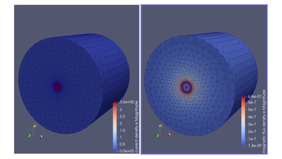
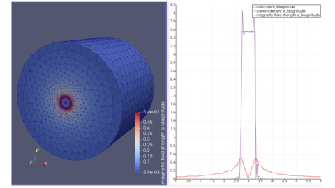

=========================================================
線電流が作る磁場
=========================================================

直線電流が作る磁場の解析結果を以下に示す．
問題設定、及び、Elmer入力ファイルは、Elmer のテスト問題を参考にしている．

問題設定 / メッシュ
=========================================================

* 半径 :math:`R=R_a` の円筒状導線を一様に流れる直流電流が作る磁場を考える．
* 計算領域は、円筒の計算空間を考え、とある半径 :math:`R=R_A` で電磁ポテンシャルは Dirichlet 条件を課す．
* 電流として、理想電流 1.0 A を与える．

  

線電流モデルのメッシュ生成用 gmsh-API python プログラム
=========================================================

gmsh-API pythonを利用した片持ち梁モデルの生成プログラム．
自分で作成した箱生成用関数を内部で利用している．

.. literalinclude:: ../code/line_current_BField/msh/model.py
   :caption: 線電流モデルのメッシュ生成用 gmsh-API python プログラム
   :linenos:
   :language: python
      
生成用プログラムの実行は、以下の通り．

.. code-block::
   :caption: モデル生成

   $ cd msh/
   $ python model.py
   $ ElmerGrid 14 2 model.msh
   $ cd ../
   $ mv msh/model ./

ElmerGridによって、( 14 : gmshの.mshファイル、 2 : ElmerMeshファイル4つを含んだディレクトリ )へと変換している．model.header / model.element / model.node / model.boundary が生成される．

線電流が作る磁場のElmer入力ファイル
=========================================================

以下にElmer入力ファイルのサンプルを示す．

.. literalinclude:: ../code/line_current_BField/line_current.sif
   :caption: 線電流がつくる磁場の Elmer 入力ファイル ( line_current.sif )
   :linenos:

線電流がつくる磁場の解析結果
=========================================================

解析実行結果は以下に示す．以下に電流密度分布と磁界強度を示す．

以下に磁束密度分布と磁場・電流の径方向1次元分布を示す．

線電流がつくる磁場は、Ampere則、

.. math::

   \int_S \nabla \times B \cdot dS = \int_C B \cdot ds = \mu_0 \int_S J \cdot dS

を用いて解析的に計算できる．まずは、導体中の磁束密度は、

.. math::

   2 \pi r B &= \mu_0 J \int_0^r 2 \pi r^{\prime} dr^{\prime} = 2 \pi \mu_0 J [ \dfrac{1}{2}r^{\prime 2 } ]^r_0 \\
   B(r) &= \dfrac{ \mu_0 J r }{ 2 }

   
   
導体外側空気領域の磁束密度は、

.. math::

   2 \pi r B &= \mu_0 J \int_0^a 2 \pi r^{\prime} dr^{\prime} = 2 \pi \mu_0 J [ \dfrac{1}{2}r^{\prime 2} ]^a_0 \\
   B(r) &= \dfrac{ \mu_0 J a^2 }{ 2 r } = \dfrac{ \mu_0 I }{ 2 \pi r }
   
           
一次元分布をみると、磁界強度は導体円筒中はrに対して線形に増加し、外側では 1/r で減少しているため、理論解と定性的に一致している．
