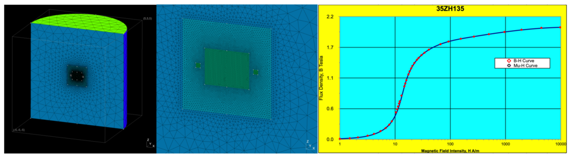
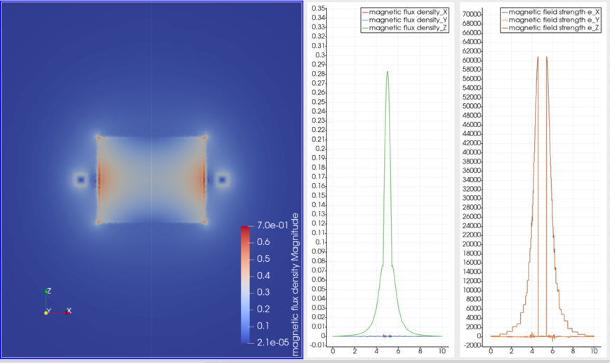
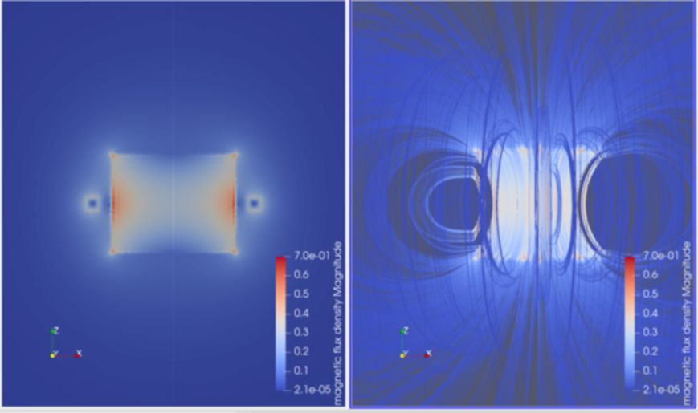

=========================================================
円環コイルと棒状鉄芯が作る磁場
=========================================================

円筒形の磁性体材料（鉄等）の周りに円環コイルを巻いた際の磁場分布を解析する．解析では、磁性体の磁化が非線形的に変化することを加味する．そこで、電磁場解析に用いるWhitneyAVSolverを非線形モードとし、磁性体材料に対してB-H曲線を与えている．円環コイル電流と棒状鉄芯が作る磁場の解析結果を以下に示す．

問題設定 / メッシュ
=========================================================

* 中心半径 0.65 (m) 厚さ 0.01 (m) の円環状のコイルを考え、内部を一様に直流電流 100 (kAT) が流れる．
* 半径 0.5 (m), 長さ 0.8 (m) の円筒形状の磁性体材料を用意する．B-H 曲線として、以下に示したデータを与える（電磁軟鉄材料）
* 半径 5.0 (m) 、長さ 10.0 (m) の円筒の計算空間を定義し、外周の電磁ポテンシャルに Dirichlet 条件 :math:`A_V=0` を課す．
* 対称性は用いずにフルモデルを解く．

  
メッシュ生成 プログラム
===========================================================================================

gmsh-API pythonを利用した円環コイル及び棒状鉄芯のメッシュ生成プログラムを以下に示す．
自分で作成した円筒形状生成用関数を内部で利用している．

.. literalinclude:: ../wrk/ring_and_core/msh/main.py
   :caption: 円環コイル及び棒状鉄芯モデルのメッシュ生成用 gmsh-API python プログラム
   :linenos:
   :language: python

Elmer入力ファイル
=========================================================

以下にElmer入力ファイルのサンプルを示す．

.. literalinclude:: ../wrk/ring_and_core/ring_and_core.sif
   :caption: 非線形磁場解析用の Elmer 入力ファイル
   :linenos:
   :emphasize-lines: 45,78-79,91-94,126,132,150,182-187,197

入力ファイルの要点は以下である．

* 磁場計算には *WhitneyAVSolver* を非線形解析で用いる．非線形計算用に、 *NonLinear System Max Iterations > 1* として設定する．
* Material Section にて、*B-H Curve* を与える．同ディレクトリにおいている BHcurve.dat を INCLUDE文で読み込み、B-H曲線を与える．
* コイル電流は *CoilSolver* を使用して計算する．フルモデル用にループ電流を定義する( *Coil Closed = True* )． 付随する *Component* 及び、 *Body Force* を定義しておく． *Desired Coil Current* として、1.0e5 を与える．
* 境界条件を 辺要素 に対する指定とし（ {e} を付記して指定 e:edge ）、 Dirichlet 条件を課す．

  
非線形磁場解析の結果
=========================================================

解析実行結果は以下に示す．以下にxz平面での磁束密度分布とz軸上の磁界 H 及び 磁束密度 B を示す．

xz平面での磁束密度、及び、 磁力線の3次元分布を示す．

磁力線はparaviewの Stream Line を用いて描画している．
