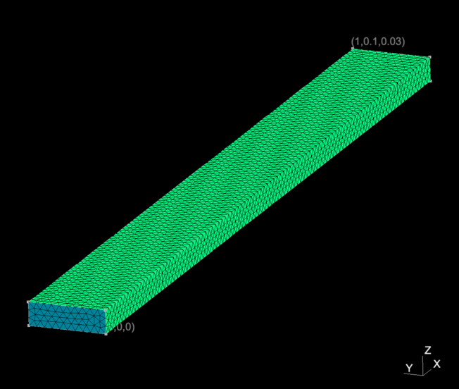
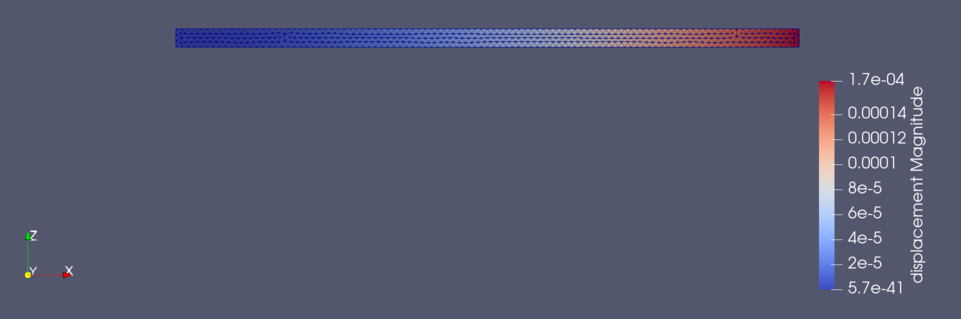
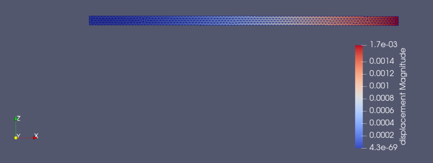
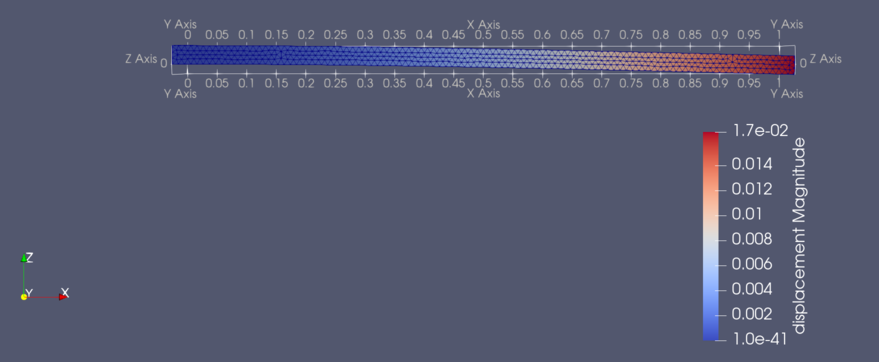

=========================================================
線形応力解析 ( Stress Analysis )
=========================================================

線形応力解析の例を以下に示す．

* 線形問題なので、外力がかかった際の変位を、構造物の変形を考えずにどの程度曲がるか( 十分小さくないと線形近似が破綻する )を計算している．
* 非線形問題では、変形により負荷のかかり方も異なってくることが考慮に入る．

問題設定
=========================================================

問題としては、以下に示すような片持ち梁にかかる応力変形を計算する．

* 手前側の側面を固定とし、奥側の面を -z方向に 1 (tF) で引っ張ることを考える (境界条件)．
* 構造物は、ヤング率 200 (GPa)、ポアソン比 0.3 の材質( 構造鉄を意識 )からなるとする(材料条件)．

片持ち梁を生成する gmsh-API python プログラム
=========================================================

gmsh-API pythonを利用した片持ち梁モデルの生成プログラム．
自分で作成した箱生成用関数を内部で利用している．
中身については、 gmsh もしくは github で解説されているはず．たぶん．

.. code-block::
   :caption: モデル生成

   $ python beam.py
   $ ElmerGrid 14 2 model.msh

変換中の数字は、( 14 : gmshの.mshファイル、 2 : ElmerMeshファイル4つを含んだディレクトリ )である．同ディレクトリに model というディレクトリができて、その中に model.header / model.element / model.node / model.boundary が生成されているはず．

.. literalinclude:: ../code/beam.py
   :language: python
   :caption: 片持ち梁生成用プログラム( beam.py )
   :linenos:

* 201 / 202 : 手前、及び、奥側のSurface
* 301 : 梁のVolume

  
             
線形応力解析用のElmer入力ファイル ( .sif ファイル)
=========================================================

以下にElmer入力ファイルのサンプルを示す．

.. literalinclude:: ../code/elastic_linear.sif
   :caption: Elmer 線形応力解析 ( elastic_linear.sif )
   :emphasize-lines: 54
   :linenos:

* 最も重要な箇所は Equation Section の "Stress Analysis = True" の指定
             
             
線形応力解析の結果
=========================================================

解析実行と結果の表示は以下の通り．

.. code-block::
   :caption: 解析実行と結果の表示
   :linenos:
   
   $ ElmerSolver elastic_linear.sif
   $ paraview model/elastic_linear_t0001.vtu

結果は次のようになった．

1 (m) の梁に対して、 0.17 (mm) 程度曲がっているらしい．x正方向に進むほどより大きな変位がある．カラーバー上では正値となっているのは、絶対値をとっているからであって、本来はz方向負側に曲がるはずである．曲がっているのか、よく見えないので、加える外力を増やしてみる．試しに 10 倍の 10 (tF) をかけてみる．結果は次のようになった．

カラーバーが示す変位量が10倍の 1.7 (mm) になった．ちょっとぐらい曲がっているのだろうか．変位しているのかが、まだはっきりとはわからないので、さらに10倍の 100 (tF) をかけてみる．結果は次のようになった．

また10倍の変位量となり、17 (mm) 曲がることがわかった．
根性がひねくれている人でも曲がっていることがはっきりわかるように軸をつけている．
ここでは、 1 (m) の片持ち梁に 100 (tF) かけた構造鉄の変位量が 17 (mm) であるという答えを得たが、 17 (mm) は線形解析にとって無視できない変位量かもしれない．線形解析の適用範囲から逸脱し、この値が正しくない可能性があることを付記しておく．
