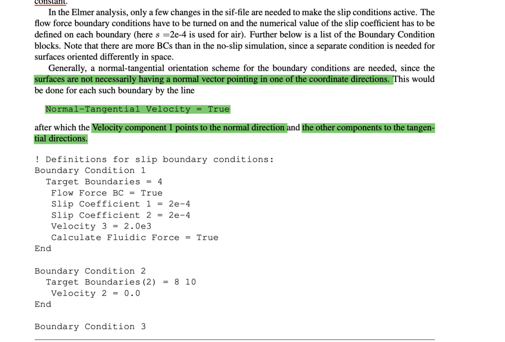

##############################################################
Section: "Boundary Condition" について
##############################################################

=========================================================
Normal Tangential Velocity について
=========================================================

* 境界面に対して直行分解した成分で境界条件を指定できる． Normal-Tangential Coordinateで表現される． ::

    Normal-Tangential Velocity = True

* 以降、ベクトルの各成分は、以下表の対応となる．

|

.. csv-table:: **Normal-Tangential Velocityのベクトル対応**
   :header: "Vector Component", "Description"
   :widths: 50, 50
   :width:  800px
   
   "velocity 1", "normal：法線ベクトル ( 境界に対して垂直な成分 )"
   "velocity 2", "tangential1：面を貼る接ベクトル１ （任意に取れるため区別しない？）"
   "velocity 3", "tangential2：面を貼る接ベクトル２ （任意に取れるため区別しない？）"
   
|

* 以下に記載がある．

|
            
.. note::

   わかっていないこと
   
   * Tangential 方向のベクトル（境界面内ベクトル）のとり方．
   * **Navier-Stokes方程式** 以外での適用可能性． ( Velocity以外は Velocity以外を３句目で指定？  )

=========================================================
Reference
=========================================================

* Normal-Tangential Velocity ( Elmer-nonGUI Tutorial: http://www.nic.funet.fi/index/elmer/doc/ElmerTutorials-nonGUI.pdf p.13 )
