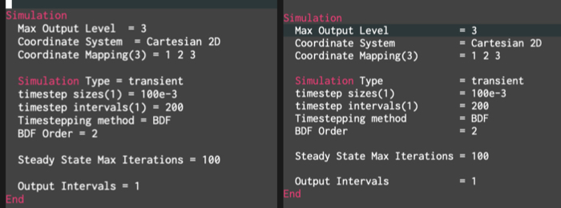

##############################################################
関数・コマンド (1) - align-regexp ： 整列コマンド -
##############################################################

=========================================================
align-regexp コマンドについて
=========================================================

* 記号の自動整列： emacs標準 (  :blue:`align-regexp`  )．
* 引数 ( 対象の記号 ) として、"=" を渡せば、 複数行で "="  が並ぶように整列．

|

=========================================================
タブ → 空白への設定変更
=========================================================

* デフォルトはタブで整列する．
* 空白が良い場合は、以下のコマンドを指定．

::
   
   (defadvice align-regexp (around align-regexp-with-spaces)
     "Never use tabs for alignment."
     (let ((indent-tabs-mode nil))
       ad-do-it)) 
   (ad-activate 'align-regexp)
   (global-set-key "\C-xt" 'align-regexp)

