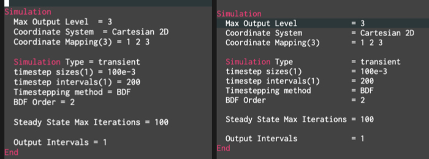

##############################################################
文章の整列について
##############################################################

=========================================================
algin_regexp コマンドについて
=========================================================

* 記号の整列を自動で行ってくれる機能がemacsには標準でついている ( **align-regexp** )．
* 引数(対象の記号)として、"=" を渡せば、 複数行で "="  が並ぶように整列してくれる．

=========================================================
空白への設定変更について
=========================================================

* デフォルトはタブを使用する．
* 空白が良い場合は、以下のコマンドを指定．  ::

    (defadvice align-regexp (around align-regexp-with-spaces)
      "Never use tabs for alignment."
      (let ((indent-tabs-mode nil))
        ad-do-it)) 
    (ad-activate 'align-regexp)
    (global-set-key "\C-xt" 'align-regexp)

* 空白が使用されるはず．
