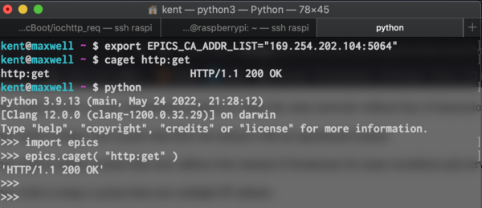

##############################################################
基本動作例１： Googleにtelnet接続するEPICS制御
##############################################################

=========================================================
検証目標
=========================================================

* IOCを構築．
* IOCの動作検証．
* IOCとOPI間で通信する．

  
  ( IOC:Input/Output Controller, OPI:OPerational Interface )

=========================================================
前提条件
=========================================================

* IOCとして **"RaspberryPi"** 、OPIとして、手元PCのmacOSを使用する．
* RaspberryPi-mac間はLANケーブルで接続し、RaspberryPiはインターネットへ接続できる．(同一LAN内.)
* 接続先は、適当なサーバ：www.google.com:80 (80はHTML通信用のウェルノウンポート) とし、HTTPリクエストする．
* 制御モジュールとして、 **"StremDevice"** を使用する．
* IOC(RaspberryPi)に、epics-base, Asyn, StreamDevice はインストール済み
* OPI(macOS)からは,  pythonコンソールから **"pyEpics"** (pipからインストール可能)を利用する．
* EPICS_BASEは、"$HOME/epics/epics-base", サポートモジュールは、"$HOME/epics/support/"にインストールされており、 Appの作成場所は, "$HOME/epics/app/"とする．

  
=========================================================
IOC構築
=========================================================

---------------------------------------------------------
IOC構築の手順
---------------------------------------------------------
                      
* IOC-App(アプリ)構築の基本手順は、以下である．

  1. **ベースアプリ** を作成する．
  2. **configure/RELEASE** にコンパイルに必要な情報(EPICS_BASEのパス/モジュールのパス)を記載する．
  3. **"xxxApp"** ディレクトリに、データベース及び使用するモジュールの情報を記載する．
  4. StreamDeviceなどモジュールを利用する際は、モジュールに応じた設定ファイル（例えばStreamDeviceの場合、 **protocols** ディレクトリに **xxx.proto** ） を作成する．
  5. **iocBoot** ディレクトリの **ioc_xxx**内にあるIOC初期化スクリプト **"st.cmd"** を編集し、実行可能とする．
  6. アプリのベースディレクトリ（$(TOP)としてMakefile中に記載されている）にて、 $ make 、したのちに、sudo 権限付きで IOC初期化スクリプト "st.cmd" を実行する

以下、上記手順について詳述する．

---------------------------------------------------------
1. ベースアプリの作成
---------------------------------------------------------

* makeBaseApp.plを用いたベースアプリの作成 ::

    $ mkdir -p ~/epics/app/http_req
    $ cd  ~/epics/app/http_req
    $ makeBaseApp.pl -t ioc http_req
    $ makeBaseApp.pl -i -t ioc http_req

    
* 1回目のmakeBaseApp.plで作成されるファイル・ディレクトリは以下．

  + Makefile
  + configure
  + http_reqApp

* 2回目のmakeBaseApp.plで作成されるファイル・ディレクトリは以下．

  + iocBoot

* ディレクトリツリーは以下．

  .. image:: ../image/DirectoryTree_makeBaseApp.png
             :width:  600px
             :align:  center

---------------------------------------------------------
2. 共通コンパイル設定事項の編集 ( configure/RELEASE )
---------------------------------------------------------

* configure/RELEASEに、共通のコンパイル設定（モジュールの場所等、）を例えば以下のように記載する． ::

    ASYN   = /home/epics/epics/support/asyn
    STREAM = /home/epics/epics/support/StreamDevice

    
---------------------------------------------------------
3. データベースファイルとコンパイルの準備
---------------------------------------------------------

* データベース及び使用するモジュールの情報を記載し、~/epics/app/http_req/http_reqApp/Db/http_req.dbを作成する． ::

    $ nano ~/epics/app/http_req/http_reqApp/Db/http_req.db
    ( 以下を保存 )
    record( stringin, "http:get" )
    {
    field( DESC, "getbitstream" )
    field( DTYP, "stream" )
    field( INP , "@http_req.proto getVal web")
    }

* データベースのコンパイル対象として、上記の"http_req.db"を追加． ::

    $ nano ~/epics/app/http_req/http_reqApp/Db/Makefile
    ( 以下を追記 )
    DB += http_req.db

* その他モジュールを利用する場合は、IOCの通信コードのコンパイルに使用するモジュール情報を、 "http_reqApp/src/Makefile" に記載し、コンパイルできるようにする． ::

    $ nano ~/epics/app/http_req/http_reqApp/src/Makefile
    ( 以下を追記 )
    http_req_DBD  += stream.dbd
    http_req_DBD  += asyn.dbd
    http_req_DBD  += drvAsynIPPort.dbd

    http_req_LIBS += stream
    http_req_LIBS += asyn
    

---------------------------------------------------------
4. StreamDeviceの設定ファイル ( "protocol" )の作成
---------------------------------------------------------

* アプリのベースディレクトリ ( ~/epics/app/http_req/ )にディレクトリ "protocols"を作成し、StreamDeviceの入出力情報を記載する． ::

    $ mkdir $HOME/epics/app/http_req/protocols
    $ nano http_req.proto
    
    (以下を記入)
    Terminator = CR LF;
    getVal {
    out "GET / HTTP/1.1\nHost: www.google.co.jp\n";
    in "%39c";
    ExtraInput = Ignore;
    }

    
---------------------------------------------------------
5. IOC 初期化スクリプト "st.cmd" の編集
---------------------------------------------------------

* IOC初期化スクリプト ( iocBoot/iochttp_req/st.cmd ) に、以下の情報を記載する．

  + StreamDeviceを使用する場合、protocolsディレクトリの位置を記載する．
  + 初期化時にロードするデータベースファイルを記載する．
  + ethernetケーブルなどの、ハードウェアを使用する場合は、設定を記載する．

* ここでは、以下を記載する． ::

    epicsEnvSet( "STREAM_PROTOCOL_PATH", ".:../../protocols" )
    dbLoadRecords( "db/http_req.db", "user=epics" )
    drvAsynIPPortConfigure "web", "www.google.co.jp:80",0,0,0

* スクリプトに実行権限を与えておく． ::

    $ chmod u+x $HOME/epics/app/http_req/iocBoot/iochttp_req/st.cmd

    
---------------------------------------------------------
6. make 及び、初期化スクリプト "st.cmd" の実行
---------------------------------------------------------

* ベースディレクトリにて make する． ::

    $ cd $HOME/epics/app/http_req/
    $ make distclean
    $ make

* 初期化スクリプトを実行する． ::

    $ cd $HOME/epics/app/http_req/iocBoot/iochttp_req/
    $ sudo ./st.cmd

  
=========================================================
IOCの動作状況の確認
=========================================================

---------------------------------------------------------
EPICSコンソール上での確認
---------------------------------------------------------

* EPICSコンソールへエラーなく遷移していることを確認．
* 以下を実行． ::

    epics> dbpf http:get 0
    epics> dbgf http:get

* 戻り値は、 ::

    DBF_STRING:         "HTTP/1.1 200 OK"

    
---------------------------------------------------------
ローカルからのCA
---------------------------------------------------------

* epics-baseがインストールされているIOC/OPIでは、PV(Process Variable)にCA(Channel Access)が可能
* 別コンソールを立ち上げて、以下コマンドを実行 ::

    epics@raspberrypi: ~ $ caget http:get
    http:get  HTTP/1.1 200 OK

---------------------------------------------------------
OPI（手元macOS）からのCA
---------------------------------------------------------

* 同一ネットワークにLAN接続してある OPI(手元PC:macOS)からCA可能．
* 以下、IPアドレス/ポート番号の設定を環境変数にセット． ::

    $ export EPICS_CA_ADDR_LIST="169.254.202.104:5064"

    
    ( e.g.1 $ export EPICS_CA_ADDR_LIST="1.2.3.255 8.9.10.255" etc. )
    or
    ( e.g.2 $ export EPICS_CA_ADDR_LIST="1.1.1.1" and,  )
    (       $ export EPICS_CA_SERVER_PORT=5064 etc.     )

* コンソールからCA． ::

    $ caget http:get

* pyEpicsからCA． ::

    $ python3
    >>> import epics
    >>> epics.caget( "http:get" )
    'HTTP/1.1 200 OK'

    

* OPIからIOCを介して、制御( HTTPリクエスト ) を実施することができた．

=========================================================
参考URL
=========================================================

* 参考ノート： "https://note.com/dev_associate/n/nfa4605c70f60", "https://note.com/dev_associate/n/nd886d700b10a"
* OPI/IOC通信時のポート番号、IPアドレスの設定 ( https://epics.anl.gov/EpicsDocumentation/AppDevManuals/ChannelAccess/cadoc_4.htm )
  
