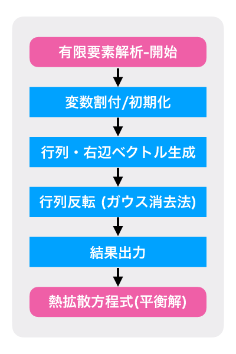
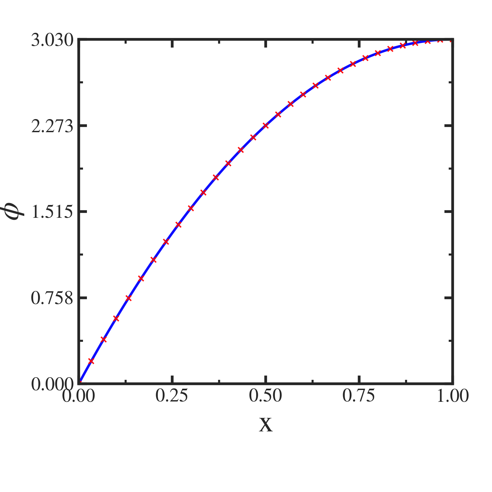

########################################################################
1次元熱拡散方程式の平衡解に対する有限要素法解析(コーディング編)
########################################################################

=========================================================
実際に１次元熱拡散方程式の定常解を解いてみる
=========================================================

前節では，１次元熱拡散方程式の定常解を数値的に解くために，有限要素法における定式化を行った．
本節では，実際にコーディングを施し，解析を行ってみる．

主なプログラムの流れ，及び，メインプログラムは以下となる．

           
.. literalinclude:: ../code/1DHeatFEM/main.f90
   :language: fortran

定常問題の有限要素解析は，連立方程式 :math:`Ax=b` に帰着する．
プログラムも行列・左辺生成→行列反転が基本となる．

以後，各サブルーチンについてみていく．

=========================================================
変数割付・初期化
=========================================================

単純にallocate文によって変数を割付けし，ゼロクリアによる初期化を行う準備部分のサブリーチンとしている．変数を節点数分だけ用意しているので，問題領域を有限要素へ分割しているプログラム領域に相当するとも考えることができる．

.. literalinclude:: ../code/1DHeatFEM/initiatorMod.f90
   :language: fortran

=========================================================
行列・右辺ベクトル生成
=========================================================

ここでは主に次の２つの操作を行う．

(1) 基礎方程式系からのK-Matrix, F-Vectorの生成
(2) 境界条件の適用

(1)有限要素法で解析したい基礎方程式系及び入力情報は，行列(K-Matrix)及び右辺ベクトル(F-Vector)として記述される．ここでは，K-Matrix及びF-Vectorをプログラム上に表現することで問題を記述する．
(2)また，境界条件を適用することでK-Matrix, F-Vectorに変更を加える．
解析したい方程式系や境界条件によってK-Matrix, F-Vectorが左右されるため，これら２つの工程が有限要素法における問題定義を行うプログラム領域となる．

実際に，それぞれの要素について，matrixを計算してみる．
ここでは，例として，節点数5の系について考えてみる．

1次線要素に関するk-Matrix :math:`\{k\}^{e}` ，及び，f-Vector の面積分成分 :math:`\{f_S\}^{e}` ，体積分成分 :math:`\{f_V\}^{e}` は前項で導出しているため，各要素が満たすべき方程式は次のように表される．

(e)=1 に対して

.. math::
   \dfrac{ \lambda A }{ L }
   \begin{bmatrix} 1 & -1 \\ -1 & 1 \end{bmatrix}
   \begin{bmatrix} \phi_1 \\ \phi_2 \end{bmatrix}
   =
   \dfrac{ \hat{Q} A L }{ 2 }
   \begin{bmatrix}      1 \\      1 \end{bmatrix}
   
(e)=2 に対して

.. math::
   \dfrac{ \lambda A }{ L }
   \begin{bmatrix} 1 & -1 \\ -1 & 1 \end{bmatrix}
   \begin{bmatrix} \phi_2 \\ \phi_3 \end{bmatrix}
   =
   \dfrac{ \hat{Q} A L }{ 2 }
   \begin{bmatrix}      1 \\      1 \end{bmatrix}
   
(e)=3 に対して

.. math::
   \dfrac{ \lambda A }{ L }
   \begin{bmatrix} 1 & -1 \\ -1 & 1 \end{bmatrix}
   \begin{bmatrix} \phi_3 \\ \phi_4 \end{bmatrix}
   =
   \dfrac{ \hat{Q} A L }{ 2 }
   \begin{bmatrix}      1 \\      1 \end{bmatrix}

(e)=4 に対して

.. math::
   \dfrac{ \lambda A }{ L }
   \begin{bmatrix} 1 & -1 \\ -1 & 1 \end{bmatrix}
   \begin{bmatrix} \phi_4 \\ \phi_5 \end{bmatrix}
   =
   \dfrac{ \hat{Q} A L }{ 2 }
   \begin{bmatrix}      1 \\      1 \end{bmatrix} - qA
   \begin{bmatrix}      0 \\      1 \end{bmatrix}

   
これらは各要素に関係する接点の情報のみを含んだ方程式から成り立っている．
上記方程式をまとめることによって，接点温度の情報を総括したGlobal Vector :math:`\Phi` の形で書くと，

.. math::
   \dfrac{ \lambda A }{ L }
   \begin{bmatrix}
    1 & -1 &  0 &  0 &  0 \\
   -1 &  2 & -1 &  0 &  0 \\
    0 & -1 &  2 & -1 &  0 \\
    0 &  0 & -1 &  2 & -1 \\
    0 &  0 &  0 & -1 &  1
   \end{bmatrix}
   \begin{bmatrix}
   \phi_1 \\ \phi_2 \\ \phi_3 \\ \phi_4 \\ \phi_5
   \end{bmatrix}
   =
   \dfrac{\hat{Q}AL}{2}
   \begin{bmatrix}
   1 \\ 2 \\ 2 \\ 2 \\ 1
   \end{bmatrix}
   -
   qA
   \begin{bmatrix}
   0 \\ 0 \\ 0 \\ 0 \\ 1
   \end{bmatrix}

このうち，右辺第二項は面積分した熱流束の流入量を表し，自由境界条件を適用している．
一方で，左端において， *Dirichlet* 境界条件が課されており， :math:`T(x=x_{Min})=0` である． これは，陽に境界条件として K-Matrix, F-vectorに盛り込む必要がある．結局，

.. math::
   \dfrac{ \lambda A }{ L }
   \begin{bmatrix}
    1 &  0 &  0 &  0 &  0 \\
   -1 &  2 & -1 &  0 &  0 \\
    0 & -1 &  2 & -1 &  0 \\
    0 &  0 & -1 &  2 & -1 \\
    0 &  0 &  0 & -1 &  1
   \end{bmatrix}
   \begin{bmatrix}
   \phi_1 \\ \phi_2 \\ \phi_3 \\ \phi_4 \\ \phi_5
   \end{bmatrix}
   =
   \begin{bmatrix}
   0 \\ \hat{Q}AL \\ \hat{Q}AL \\ \hat{Q}AL \\ \dfrac{\hat{Q}AL }{2}-qA
   \end{bmatrix}

.. literalinclude:: ../code/1DHeatFEM/genMatrixMod.f90
   :language: fortran

              
=========================================================
行列反転
=========================================================

行列と右辺ベクトルが設定されれば，あとは解くだけである．
有限要素解析として定式化された熱拡散方程式の定常解は，連立方程式 :math:`Ax=b` における行列反転 :math:`x=A^{-1}b` によって得られる．ここでは行列反転の手法として簡便に *Gauss* の消去法を用いる．大学教養レベルの線形代数の基本的な知識で理解でき，そのままコーディングするだけで行列反転が行える． *Gauss* の消去法のアルゴリズムは以下，及び，別記事に記載しておく．

.. literalinclude:: ../code/1DHeatFEM/matrixInvMod.f90
   :language: fortran

=========================================================
結果出力 & プロット例
=========================================================

結果の出力ルーチンの一例を示しておく．
出力形式は好みであるが，今回の例では1次元問題であり，解として得られる情報も節点温度のみであるため，テキストデータとして出力している．

.. literalinclude:: ../code/1DHeatFEM/ioutilityMod.f90
   :language: fortran

作成した有限要素法サンプルの実行結果を以下に示す．
[0,1.0]の区間を31分割の有限要素法で得られた節点温度をグラフ中，赤色十字(+)マークでプロットしている．対して，前述した解析解

.. math::
   T = - \dfrac{ \dot{Q} }{ \lambda } [ x ( \dfrac{1}{2} x - x_{max} ) ]   

から得られる値を青実線で示している．
有限要素法による解が解析解の良い近似になっていることがわかる．
ここまでが，1次元有限要素解析の定式化・コーディング・実行結果である．

