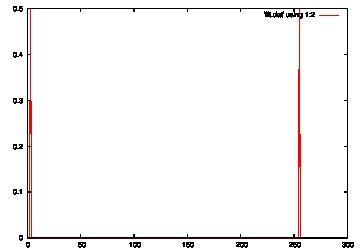

=========================================================
fftw3の使い方について
=========================================================

留意点
=========================================================

使用時に留意するのは3つ

* include ファイルの言及
* コンパイルオプションの指定
* ファイル中のsubroutine呼び出し

include ファイルの言及
--------------------------
fortran ファイル中に以下を言及

.. code-block:: fortran

   include 'fftw3'

   
コンパイルオプション
---------------------

.. code-block::

   gfortran test.f90 -I/usr/local/include -lfftw3

   
が必要．-Iオプションはincludeファイルの存在場所を指定する．-lfftw3はライブラリの指定を行っている．

subroutine 呼び出し(fftw3の使い方)
----------------------------------------

.. code-block:: fortran

   integer, parameter :: N=256
   integer(8) :: plan
   complex(kind(0d0)) :: y(N), fft(N)
   
   call dfftw_plan_dft_1d( plan, N, y, fft, FFTW_FORWARD, FFTW_ESTIMATE )
   call dfftw_execute_dft( plan, y, fft )
   call dfftw_destroy_plan( plan )

   
よくわからんのはFFTW_FORWARDとFFTW_ESTIMATEだけど，これは特に何か変数を用意する必要はなさそうで，指定すれば事足りるみたい．

使うべき関数の注意点
=========================================================

fftw3には複数のsubroutineが含まれているけど，そのうち，幾つかは危険な香りがするみたい．例えば，fftw3のreferenceには次のような文言がある．

 call dfftw_execute(plan)

::
   
   However, we have had reports that this causes problems with some recent optimizing Fortran compilers. The problem is, because the input/output arrays are not passed as explicit arguments to dfftw_execute, the semantics of Fortran (unlike C) allow the compiler to assume that the input/output arrays are not changed by dfftw_execute. As a consequence, certain compilers end up optimizing out or repositioning the call to dfftw_execute, assuming incorrectly that it does nothing. 

   dfftw_execute(plan)ではなく，別の，それぞれ用途にフィットした関数を使うのがよろしいようです．

   You must use the correct type of execute function, matching the way the plan was created. Complex DFT plans should use dfftw_execute_dft, Real-input (r2c) DFT plans should use use dfftw_execute_dft_r2c, and real-output (c2r) DFT plans should use dfftw_execute_dft_c2r. The various r2r plans should use dfftw_execute_r2r. 

   
複素Fourier変換(最もgeneral)が欲しければ，

.. code-block:: fortran

   call dfftw_execute_dft( plan, in, out )

   
を使いましょう．

fftw3 in fortran の作法
=========================================================

* planにはinteger(8) を使いましょう．

  
.. code-block:: fortran

   integer(8) :: plan

   
   
ref. 8.1 Fortran-interface routines( http://www.fftw.org/doc/Fortran_002dinterface-routines.html#Fortran_002dinterface-routines )

  
fortran fftw3のサンプル
=========================================================

抜粋 :
 In Fortran, you would use the following to accomplish the same thing: 

.. code-block:: fortran

   double complex in, out
   dimension in(N), out(N)
   integer*8 plan
     
   call dfftw_plan_dft_1d(plan,N,in,out,FFTW_FORWARD,FFTW_ESTIMATE)
   call dfftw_execute_dft(plan, in, out)
   call dfftw_destroy_plan(plan)

To transform a three-dimensional array in-place .... In Fortran, you would use this instead:

.. code-block:: fortran

   double complex arr
   dimension arr(L,M,N)
   integer*8 plan
   
   call dfftw_plan_dft_3d(plan, L,M,N, arr,arr &
		& ,FFTW_FORWARD, FFTW_ESTIMATE)
   call dfftw_execute_dft(plan, arr, arr)
   call dfftw_destroy_plan(plan)
 
  
Note that we pass the array dimensions in the “natural” order in both C and Fortran. 

fortranでの"natural"な配列の渡し方 == (L,M,N)で良いみたい．

自作サンプル結果
=========================================================

正弦波(モード数=2)の波を入力してFFTする．

.. literalinclude:: ../fortran_sample/fftw3_test.f90
   :language: fortran
   :linenos:
   :emphasize-lines: 13,23,39-41

結果は以下．

multi-threaded での注意点もあるみたいだ．

