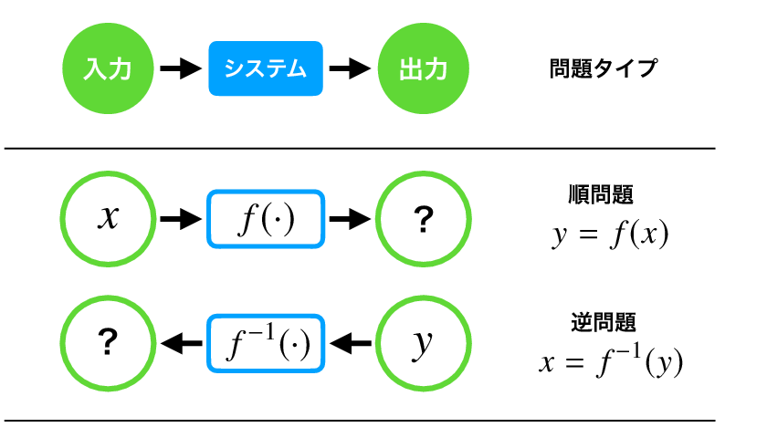
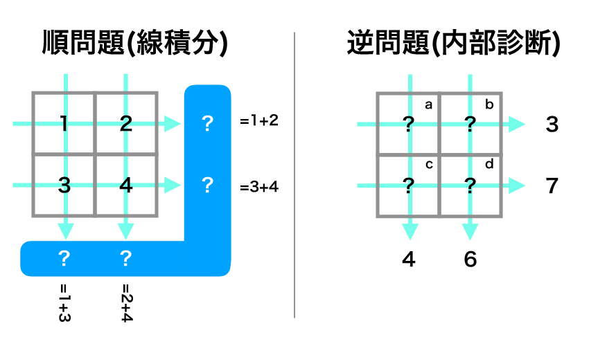
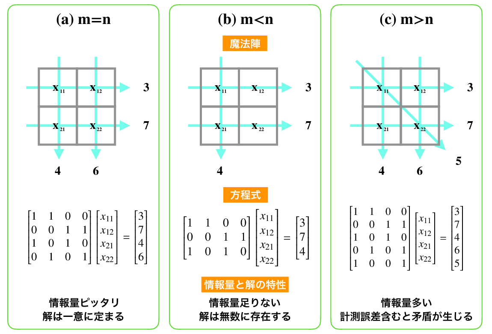

##############################################################
逆問題とは
##############################################################

=========================================================
逆問題の定義とアイデア
=========================================================

逆問題とは，「あるシステムにおいて，入力から出力を得る問題」とは『逆』に，「あるシステムから得られた出力から入力を同定・類推する問題」である．アイデアは以下に示してある通りである．超音波診断やX線CTだとかスイカをゴツゴツ叩いて中身が熟しているかを調べる等，計測やデータ量と密接な関係をもつ．出力された結果から入力がどんなものかを想像するので，探偵の推理みたいなもの．

           
=========================================================
逆問題の基本例：算術魔法陣
=========================================================

魔法陣といえば，中に入っている間，魔法攻撃力や自然治癒力が増強する効果が得られるなど，ファンタジックなものか，精霊を呼び出す，超常現象を引き起こす等，スピリチュアルなものをイメージする人が多いかもしれない．いかんせん厨二くさいが，ここで取り扱う魔法陣は胸踊らない百ます計算的なあれなので，算術魔法陣と呼ぶ．
図のようにマス目を作って中に数字を書き込む．横一直線もしくは縦一直線の和をとった値が計算できる(このある種の線積分は順問題)．各セル内の数字が不明なとき，各線上の合計値からセル内の数字を当てることを考えるのが算術魔法陣問題である．これは，順問題である各線上の足し算（線積分）の逆問題と言え，最も単純な逆問題例として以後取り上げる．

算術魔法陣を解いてみる．
各線積分は方程式を一つずつつくるから，各要素を :math:`(a,b,c,d)` と表せば，

.. math::
   \begin{cases}
   a + b = 3 & \\
   c + d = 7 & \\
   a + c = 4 & \\
   b + d = 6 & \\
   \end{cases}
   
という連立方程式が成り立つ．行列を用いて表現しておくと，
   
.. math::
   \begin{bmatrix}
   1 & 1 & 0 & 0 \\
   0 & 0 & 1 & 1 \\
   1 & 0 & 1 & 0 \\
   0 & 1 & 0 & 1
   \end{bmatrix}
   \begin{bmatrix}
   a \\ b \\ c \\ d
   \end{bmatrix}
   =
   \begin{bmatrix}
   3 \\ 7 \\ 4 \\ 6
   \end{bmatrix}

であり，逆行列 :math:`A^{-1}` を計算してやれば，算術魔法陣の解の組み， :math:`(a,b,c,d)` が求まる．
つまり，(線形な問題として定式化できる)逆問題は，n個の変数に関する線形連立方程式として表現でき，逆問題を解くことは逆行列を求めて方程式を解く操作(**行列反転**： :math:`x=A^{-1}b` )に相当する．

=========================================================
計測と行列のランク
=========================================================

逆問題には，「答えが一意に定まるとき」も「答えがいくらでも取れるとき」もある．
これを算術魔法陣の例で確認する．
上述の算術魔法陣問題は，未知のセル変数4つに対して，4本の線積分を定義することで方程式を閉じさせていた( :math:`m=n` )．
４本ではなく，５本であればどうであろうか？３本であればどうであろうか？

線積分値をとることは現実では計測に相当する，例えば「ある角度からトンカチでスイカを叩いてみる」だとか「X線をある角度から通してみる」とかである．計測が充分にとれないことは現実世界では頻繁に生じる( :math:`m<n` )．逆に計測データには誤差が含まれているから，多めにデータをとって最も尤もらしい(モットモ，モットモラシイ：最尤)解を得たい場合もある( :math:`m>n` )．

(a)の場合，行列は正方行列 :math:`m=n` であるから，係数行列 :math:`A` がフルランク( :math:`rank(A)=n` )で正則な行列である場合，逆行列 :math:`A^{-1}` が存在するので，算術魔法陣は解を与えることになる．
一方，(b)は未知変数4つに対して3つの式からなる :math:`3\times4` 行列であるため，解は一意に決定しない(解は空間上の点ではなく線や平面など無数に存在する)．
(c)では解を一つ得るには十分な情報量が既に存在しており，他の :math:`m-n` 行の情報は余分な情報となりうる．
この算術魔法陣の計測のように，理想的な計測（線積分）が得られれば良いのであるが，現実的には計器の誤差や熱雑音等で測定値と真値は常に異なりうる．
方程式同士は矛盾しあい，全ての条件を同時に満たすことができなくなる．
このように，逆問題の場合は，必ずしもピッタリの情報量を扱う（ :math:`m=n` 正方行列で書ける ）問題ばかりではなく，現実的には情報量の過不足が生じうる．このような場合でも逆問題の解は存在する（類推しうる）のだから，これを求める手法を今後の焦点に当てる．
