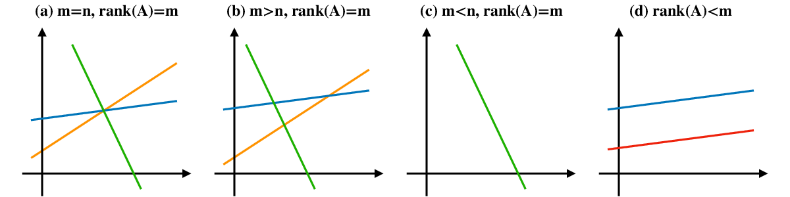
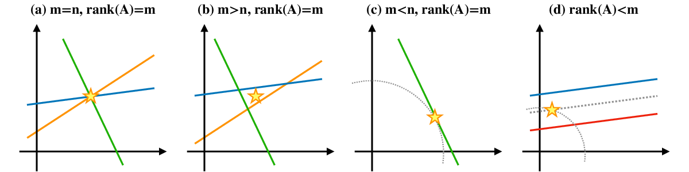

##############################################################
一般逆行列について
##############################################################

=========================================================
線型連立方程式における解の種類：逆行列の存在
=========================================================

線型連立方程式

.. math::
   Ax = b

に対して，解 :math:`x` を求める手法には，Cramerの公式や余因子や掃出法等，複数存在する．逆行列を求めることにより，

.. math::
   x = A^{-1} b

から解を得ることができる． :math:`Ax=b` と表記される全ての場合で，解が存在する訳ではない．
行列 :math:`A` の形状 ( :math:`m \times n` )，及び，階数( :math:`rank(A)` ) によってこれらの振る舞いは変化し，逆行列の存在が左右される．

行列の形状，階数によって，以下の4つに分類される．

(a) 行列 :math:`A` は :math:`m \times m (m=n)` 正方行列で， :math:`rank(A)=m` （フルランク）である．
(b) 行列 :math:`A` は :math:`m \times n (m>n)` 縦長行列で， :math:`rank(A)=m` （フルランク）である．   
(c) 行列 :math:`A` は :math:`m \times n (m<n)` 横長行列で， :math:`rank(A)=m` （フルランク）である．
(d) フルランクでない．( 行列 :math:`A` の階数が :math:`rank(A)<m` )

これらの解は次のように表現される．

(a) 逆行列 :math:`A^{-1}` を求めることができ，一意に解が決定される．(決定系)
(b) 全ての解を無矛盾に満たす解が存在しない．(優決定系・不能)
(c) 方程式が不足しているため，解が一意に定まらない(劣決定系・不定)
(d) 方程式に重複(矛盾)が存在する．重複を除けば(a),(b),(c)のどれかに帰着する．

   

ここでは(a)以外は解を一意に決定できない．これら方程式の解を得る( 存在しないものもあるが，極力合理的に解らしきものを採用する )戦略は次である．

(a) 逆行列 :math:`A^{-1}` を求めて， :math:`b` にかけ， :math:`x=A^{-1}b` を求める． ( **決定解** )
(b) 全方程式から平均的に近い解(最小二乗解)を求める． ( **最小二乗解** )
(c) 全解候補のうち，もっともノルムの小さいものを求める．( **最小ノルム解** )
(d) 全方程式からの「二乗誤差最小」でかつ「ノルムがもっとも小さいもの」を選ぶ．((b)と(c)を両方満たす解)

   
これをイメージとして表すと，
   

解はそれぞれ，

(a) 逆行列から決定解を得る．
    
.. math::
   x=A^{-1}b

   
(b) 最小二乗解を得る．
条件式は，
    
.. math::
   x^* = argmin \dfrac{1}{2} ||Ax-b||^2

この式は :math:`f(x)=||Ax-b||^2` とした際の :math:`\partial f(x) / \partial x = 0` であるから， 
   
.. math::
   \dfrac{\partial ||Ax-b||^2}{\partial x} = 0 \\
   A^{T} A x^* - A^{T} b = 0 \\
   x^* = ( A^{T} A )^{-1} A^{T} b

行列( :math:`A^{T} A` )は正則なnxn対称行列で， :math:`A^{T} A x = A^{T} b` は正規方程式と呼ばれる．

(c) 最小ノルム解
条件式は，
    
.. math::
   x^* = argmin \dfrac{1}{2} ||x||^2 s.t. Ax = bw

Lagrangeの未定乗数を用いてとけば，

.. math::
   L = ( \dfrac{1}{2} ||x||^2 ) + \lambda ( Ax = bw )

.. math::
   \dfrac{ \partial L }{ \partial x       } = x - A^{T} \lambda = 0 \\
   \dfrac{ \partial L }{ \partial \lambda } = - A x + b = 0 \\

.. math::
   \begin{bmatrix}
   x^* \\ \lambda
   \end{bmatrix}
   =
   \begin{bmatrix}
   A^{T} ( A A^{T} )^{-1} b \\ ( A A^{T} )^{-1} b
   \end{bmatrix}

   
(d) A = BC

.. math::
   A^{-} = C^{T} ( C C^{T} )^{-1} ( B^{T} B )^{-1} B^{T}

   
.. note::
   参考文献( 元ネタというか，ほぼこのスライドのまとめ )

   * https://www.slideshare.net/wosugi/ss-79624897

