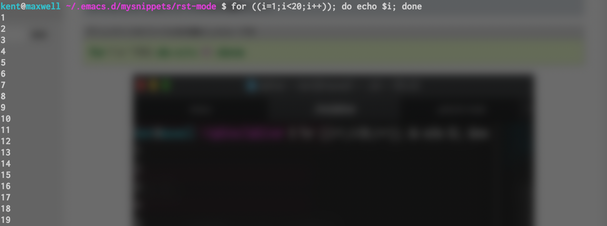

##############################################################
for 文について ( shell script / Linux 上での 反復処理 )
##############################################################

=========================================================
反復処理について ( for 文 )
=========================================================

* shell上( or, shellscript )で反復処理したいとき、for文が使える

  
---------------------------------------------------------
shell script 内で
---------------------------------------------------------
  
.. code-block:: shell
   :caption: shell script での複数行で実行

   for ((i=1;i<20;i++))
   do
             echo $i
   done

---------------------------------------------------------
ターミナルからワンライナーで
---------------------------------------------------------

.. code-block:: shell
   :caption: for 文 ワンライナー

   for ((i=1;i<20;i++)); do echo $i; done

   

   
---------------------------------------------------------
ディレクトリのファイルを対象にして
---------------------------------------------------------

.. code-block:: shell
   :caption: ディレクトリのファイルを対象にしたループ分

   for f in *.f90; do echo $f; done

