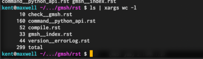

##############################################################
ファイル内の語句をすべて置換する方法
##############################################################

=========================================================
複数のファイルを対象
=========================================================

以下、コマンドを実効 ::

  $ grep -l '置換対象の文字列' ./* | xargs sed -i.bak -e 's/置換対象の文字列/置換後の文字列/g'

例えば、hoge -> fuga へ置換 ::

  $ grep -l 'hoge' ./* | xargs sed -i.bak -e 's/hoge/fuga/g'

=========================================================
xargs の意味
=========================================================

* xargs はパイプを使って、前の命令の返り値を使って、命令を実行できる ::

  $ ls | xargs wc -l

  
=========================================================
Reference
=========================================================

* ( https://qiita.com/kkyouhei/items/b4ff839a2f36ba194df3 )
