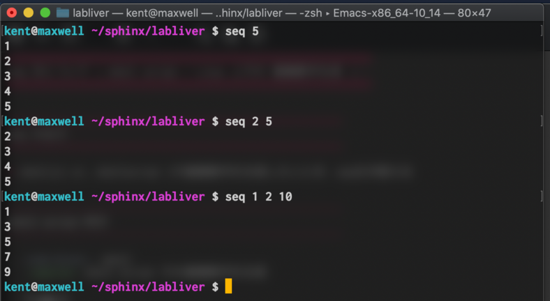
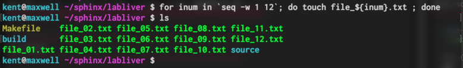

##############################################################
seq 文について ( shell script / Linux 上での 連番数字生成 )
##############################################################

=========================================================
seq の出力
=========================================================

* shell上( or, shellscript )で連番数字を生成したいとき、seq文が使える

  
---------------------------------------------------------
shell （ターミナル）から
---------------------------------------------------------
  
.. code-block:: shell
   :caption: shell script での連番数字を生成

   $ seq 5
   $ seq 2 5
   $ seq 1 2 10

   

---------------------------------------------------------
for 文と一緒に
---------------------------------------------------------
  
.. code-block:: shell
   :caption: for と seq

   $ for inum in `seq -w 1 12`; do touch file_${inum}.txt ; done

