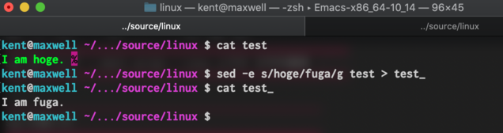

##############################################################
sed 文について ( shell script / Linux 上での 文字列置換 など )
##############################################################

=========================================================
sed でできることの例
=========================================================

* ファイル内の文字列を置換したいとき
* ファイル中の特定行を出力したいとき
* ファイル中の先頭に文字列を追記したいとき

|

=========================================================
文字列置換
=========================================================
  
---------------------------------------------------------
shell （ターミナル）から文字列の置換
---------------------------------------------------------
  
.. code-block:: shell

   $ sed -e s/hoge/fuga/g test > test_

   

---------------------------------------------------------
for, seq 文と一緒に使って、ファイルの修正
---------------------------------------------------------
  
.. code-block:: shell

   $ for i in `seq -w 1 12`; do sed -e s/01/${i} ems_pst_01.inp > ems_pst_${i}.inp ; done

|

=========================================================
特定行の出力
=========================================================

---------------------------------------------------------
sed -n コマンドを使用
---------------------------------------------------------

.. code-block:: shell

   $ sed -n "45,50p" source.txt

|

=========================================================
各行の先頭に文字列を追加する
=========================================================

---------------------------------------------------------
e.g.1) sed "s/^/xxx /g" filename を使用
---------------------------------------------------------

.. code-block:: shell

   $ sed "s/^/xxx /g" result.dat

---------------------------------------------------------
e.g.2) for と sed を使用
---------------------------------------------------------

.. code-block:: shell

   $ rm result.dat; touch result.dat
   $ for ik in `seq -w 01 09`; do sed -n "1,10p" input_${ik}.dat | sed "s/^/${ik} /g" >> result.dat
