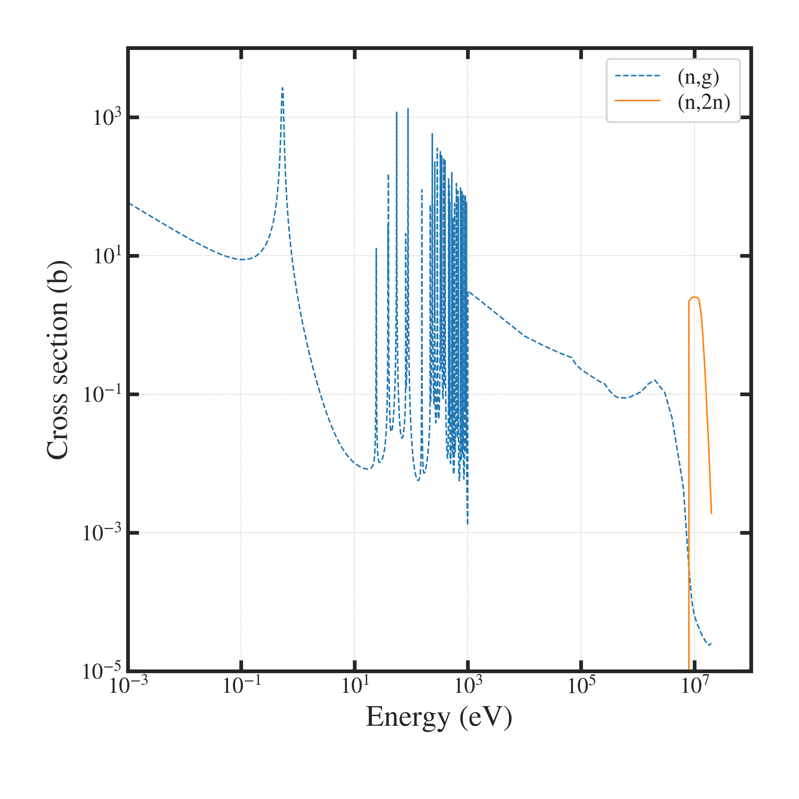

##############################################################
評価済み各データライブラリ（ENDF）について
##############################################################

=========================================================
ENDFとは
=========================================================

* ENDFは、"Evaluated Nuclear Data File" の略称で、核物理学のデータベース．
* 核断面積、反応断面積、放射性崩壊データなどが記載されている．
* 核反応計算、原子力工学、放射線治療、放射線防護、RI製造などの種々な用途分野で利用されている．
* ENDFフォーマットは、アメリカ国立標準技術研究所（NIST）などが開発・管理．

=========================================================
Plotting Tool for ENDF
=========================================================

* JAEAが公開している便利なツール
* 使用方法[1] 参照

---------------------------------------------------------
ざっくりとした使用方法
---------------------------------------------------------

1. 核種を指定
2. MT：核反応、を指定
3. "Draw Graph"ボタンを押す
4. Plot Dataのリンク先から数値データをダウンロードできる．

---------------------------------------------------------
使用例
---------------------------------------------------------

.. literalinclude:: pyt/plot__ENDF.py
   		    :language: python

=========================================================
参考文献
=========================================================

[1] https://wwwndc.jaea.go.jp/tools/index_J.html
