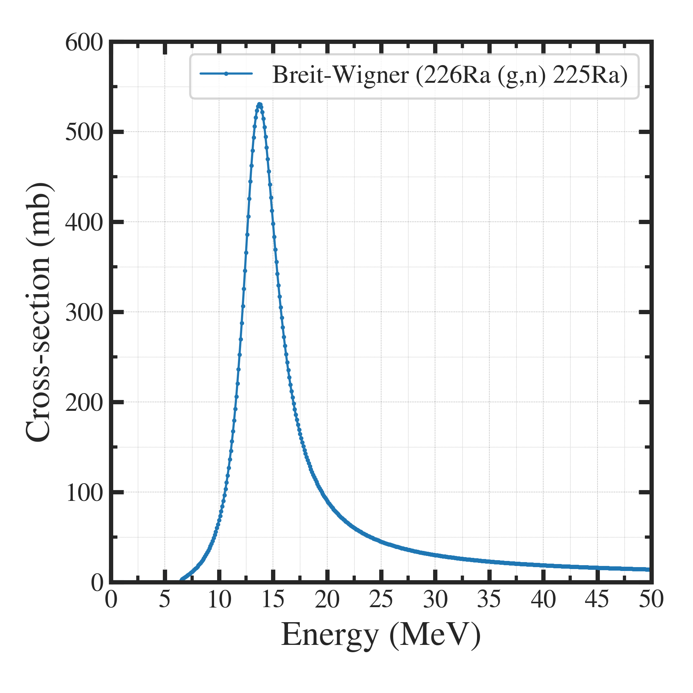

##############################################################
巨大双極子共鳴 と Breit-Wigner の式
##############################################################

=========================================================
巨大双極子共鳴  ( Giant Dipole Resonance ) とは
=========================================================

* 巨大双極子共鳴（Giant Dipole Resonance, GDR）は、原子核が外部からの電磁放射に対して特有の共鳴応答を示す現象
* GDRの発生は、原子核内の陽子と中性子が  :blue:`双極子モーメントを有する` ことに起因．
* 核内粒子の双極子モーメントにより、特定のエネルギー (e.g. 10-20MeVなど)の電磁波（光子：X線, γ線）が入射すると、原子核は電磁波によって強く振動・吸収され、強い  :blue:`吸収共鳴` を示す．
* GDRで吸収したエネルギーは、原子核のエネルギー準位を励起し、吸収放射線のエネルギーに対応するγ線、中性子などを放出する（＝ :red:`光核反応` ）．
* GDRの理解は核構造研究に不可欠であり、高エネルギー物理学や天体物理学で重要な役割を果たす．
  
|

=========================================================
Breit-Wignerの式
=========================================================

*  :blue:`Breit-Wignerの式` は、核物理学や素粒子物理学における共鳴現象の記述に使用される式．
* 特に、共鳴状態にある粒子や原子核の反応断面積  :math:`\sigma(E)`  のモデル化に使用する．

|

---------------------------------------------------------
Breit-Wigner Formula  ( 基本式 )
---------------------------------------------------------

.. math::

   \sigma(E) = \dfrac{\sigma_0}{\pi} \dfrac{ (\Gamma/2)^2 }{ (E-E_r)^2 + (\Gamma/2)^2 }

   
* 前半部は振幅、後半部は共鳴を示す表式となっている．
* 記号は下に記している．

|

---------------------------------------------------------
Modified Breit-Wigner Formula  ( (g,n) ) [1]
---------------------------------------------------------

.. math::

   \sigma(E) = \sigma_r \dfrac{ (\Gamma/2)^2 }{ (E-E_r)^2 + (\Gamma/2)^2 }
   \left( \dfrac{E}{E_r} \right) \sqrt{ \dfrac{E-E_t}{E_r-E_t} }

   
* 前から、振幅、共鳴部、閾値部と読めて、基本式の表式に対し閾値部が追加されている．
  
|

---------------------------------------------------------
式中の記号
---------------------------------------------------------

.. csv-table:: **Breit-Wignerの式**
   :header: "Notation", "Description", "unit", "ref. val. (@ Ra-226 (g,n) Ra-225)"
   :widths: 10, 20, 10, 20
   :width:  800px
   
   "\sigma_0", "Maximum cross-section @ resonance", "cm2, m2, mb", "521 (mb)"
   "E_r", "Resonance Energy", "MeV", "13.45"
   "E_t", "Threshold Energy", "MeV", "6.4"
   "\Gamma", "Resonance width", "MeV", "3.97"

|

---------------------------------------------------------
グラフ
---------------------------------------------------------

---------------------------------------------------------
図示プログラム
---------------------------------------------------------

.. literalinclude:: pyt/cs__BreitWigner_Ra226_gn_Ra225.py
   		    :language: python

=========================================================
Reference
=========================================================

* [1] Paul D. VanSant, "Medical Isotope Production of Actinium-225 By Linear Accelerator Photon Irradiation of Radium-226", Thesis for Virginia Polytechnic Institute and State University, 2013.

