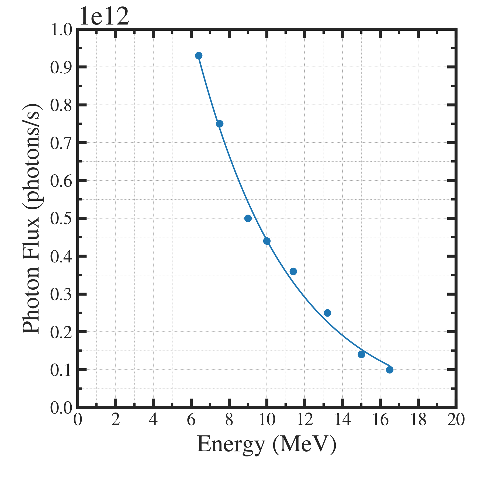
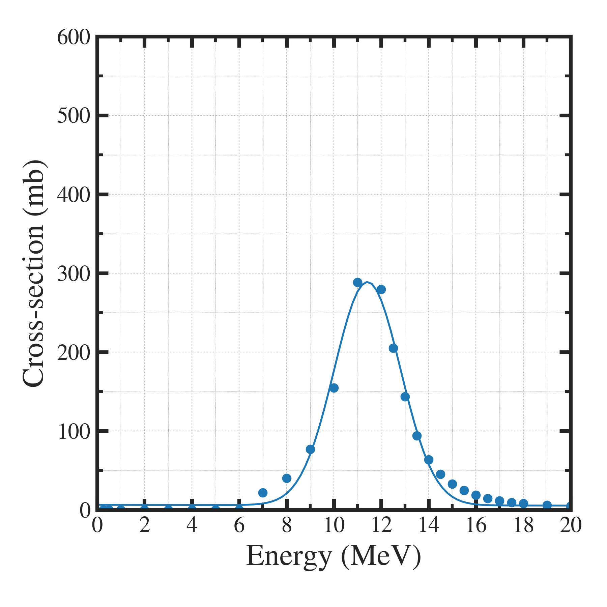

##############################################################
RI製造量計算 (1)
##############################################################

=========================================================
RI製造量計算の前提
=========================================================

* 加速器で発生させたガンマ線を用いて(γ,n)反応（光核反応）を生じさせて核変換させる．
* 代表的な反応は、Mo-100 (γ,n) Mo-99 や、Ra-226 (γ,n) Ra-225など．

=========================================================
基本式
=========================================================

.. math::

   Y = \int_{E_l}^{E_u} N \phi (E) \sigma (E) t dE

   
.. csv-table::
   :header: "notation", "description", "unit"
   :widths: 10, 20, 10
   :width:  800px
   
   "Y", "単位時間あたり生成原子数", "atoms/s"
   "E", "エネルギー", "MeV"
   ":math:`E_l, E_u`", "積分エネルギー範囲（エネルギー下限値・上限値）", "MeV"
   "N", "単位体積あたり原子数", "atoms/cm3"
   ":math:`\phi(E)`", "光子フラックス", "photons/s"
   ":math:`\sigma(E)`", "光核反応断面積", "mb (10^-27 cm2)"
   "t", "試料長さ", "cm"

.. note::
   
   厳密には、 :blue:`Φ(E)dE` が単位 photons/s であり、Φ(E) は  :blue:`photons/MeV/s` である．
   ここでは、全体のフラックス数から規格化するため、dE での積分は合計値をとる操作とすればよい．

   
|

=========================================================
各項の評価方法
=========================================================

|

---------------------------------------------------------
エネルギー範囲 ( El, Eu )
---------------------------------------------------------

* 下限値は、 :blue:`光核反応の閾値`
* 上限値は、 :blue:`加速器のビームエネルギー`

  + e.g.) ビームエネルギー 18MeV のLINACを使用した Ra226 (g,n) Ra225 反応の場合、  :blue:`6.4 - 18 (MeV)`

  
|
    
---------------------------------------------------------
ターゲット原子数 (N)
---------------------------------------------------------

* Avogadro数 :math:`N_A=6.02 \times 10^{23}` (atoms/mol), 質量密度 :math:`\rho` (g/cm3) , モル質量 M (g/mol) から、単位体積あたりの原子数Nを求めることができる．

.. math::

   N = N_A \rho / M \ \  (atoms/cm^3)

* (e.g.1) Ra-226 の場合、

.. math::

   N = ( 6.02 \times 10^{23} ) \times 5.0 / ( 226.0 ) = 1.3 \times 10^{22}

* (e.g.2) Ra-226 Cl2 の場合、

.. math::

   N = ( 6.02 \times 10^{23} ) \times 4.9 / ( 297.0 ) = 1.0 \times 10^{22}

|

---------------------------------------------------------
光子フラックス ( Φ(E) )
---------------------------------------------------------

1. 実測値、モデル等（given data）
2. モンテカルロ計算 ( Geant4, PHITS, etc. )

|

---------------------------------------------------------
光核反応断面積 （σ(E)）
---------------------------------------------------------

* 光核反応断面積データライブラリ ( TENDL etc. )

  + 別ページに理論光核反応断面積の記述あり．

|

---------------------------------------------------------
試料厚み (t)
---------------------------------------------------------

* (e.g.1) 単位長さあたり で考える．
* (e.g.2) ターゲット材料の放射能 (Bq) から厚みへ換算．
  
| 

=========================================================
光子フラックスデータ
=========================================================

---------------------------------------------------------
データ
---------------------------------------------------------

.. csv-table:: **光子フラックス (引用文献[1]より抽出)**
   :header: "Energy (MeV)", "Photon Flux (photons/s)"
   :widths: 10, 10
   :width:  400px
   
   "6.4", "9.3E+11"
   "7.5", "7.5E+11"
   "9.0", "5.0E+11"
   "10.0", "4.4E+11"
   "11.4", "3.6E+11"
   "13.2", "2.5E+11"
   "15.0", "1.4E+11"
   "16.5", "1.0E+11"
   

---------------------------------------------------------
グラフ
---------------------------------------------------------

|

            
---------------------------------------------------------
フィッティング関数
---------------------------------------------------------
            
.. math::

   y = C_1 e^{ - C_2 ( x-C_3 ) } + C_4

.. csv-table:: **フィッティング結果**
   :header: "", ""
   :widths: 10, 10
   :width:  300px
   
   "c1", "1.1381e+12"
   "c2", "2.0045e-01"
   "c3", "5.4408e+00"
   "c4", "-1.4082e+10"

---------------------------------------------------------
プロットプログラム
---------------------------------------------------------

.. literalinclude:: pyt/display_pf.py
   		    :language: python

|

=========================================================
光核反応断面積データ
=========================================================

---------------------------------------------------------
光核反応断面積データ (引用文献[5]より抽出)
---------------------------------------------------------

.. literalinclude:: dat/xs__TENDL_Ra226_gn_Ra225_2021.dat
   

---------------------------------------------------------
グラフ
---------------------------------------------------------

|

            
---------------------------------------------------------
フィッティング関数
---------------------------------------------------------
            
.. math::

   y = C_1 e^{ - \dfrac{ ( x-C_3 )^2 }{C_2} } + C_4 x + C_5

.. csv-table:: **フィッティング結果**
   :header: "", ""
   :widths: 10, 10
   :width:  300px

   "c1", "2.8303e+02"
   "c2", "3.9497e+00"
   "c3", "1.1418e+01"
   "c4", "-4.9578e-02"
   "c5", "6.4297e+00"

---------------------------------------------------------
プロットプログラム
---------------------------------------------------------

.. literalinclude:: pyt/display_cs.py
   		    :language: python

|

