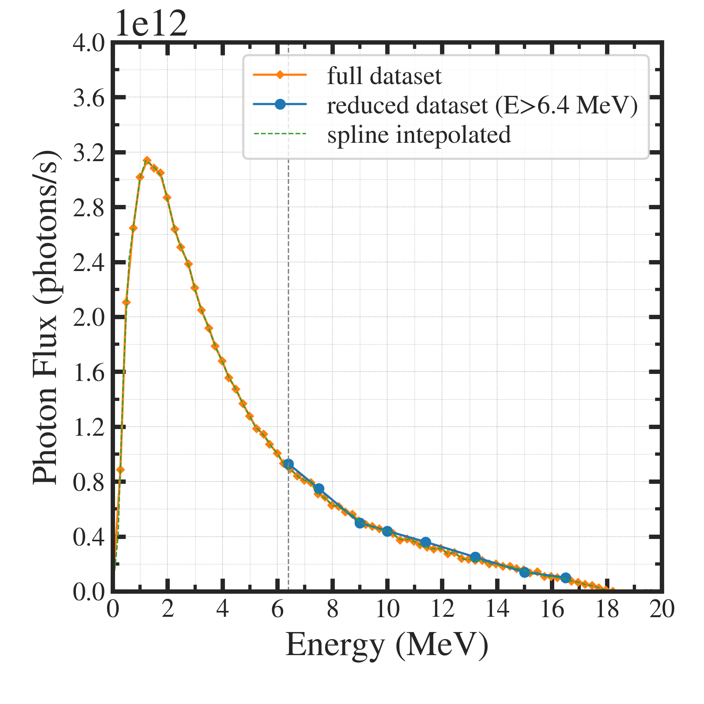
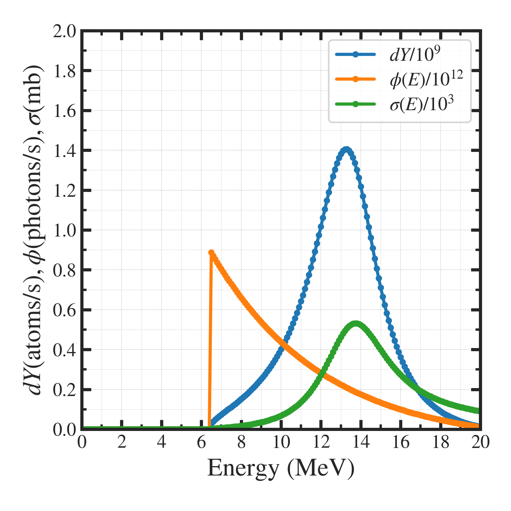

##############################################################
RI製造量計算 (2)
##############################################################

=========================================================
G.Melville[2-4]の計算のトレース 
=========================================================

* 引用文献の製造量評価のトレースを実施し、計算手法のvalidationを実施．

  + 光子フラックスについては、Varianのデータを使用 ( ↔ MonteCarlo計算 ( PHITS etc. )を使用 )
  + 反応断面積については、Breit-Wignerの式を使用  ( ↔ 数値計算断面積 ( TENDL etc. )を使用 )

    
=========================================================
製造原子数のエネルギー特性
=========================================================

基本式における被積分関数をエネルギーあたりの製造原子数の関数 dY(E) と考えて、

.. math::

   dY(E) = N t \phi(E) \sigma(E) dE

が計算できる．トータルの製造原子数は、これをエネルギー領域で積分すればよい．

すなわち

.. math::

   Y = \int_{E_{lo}}^{E_{up}} dY(E)

=========================================================
光子数の規格化
=========================================================

---------------------------------------------------------
規格化の補正係数
---------------------------------------------------------

* 光子数(photons/s)は、Φ(E)dE の単位であり、本来 Φ(E) の単位は photons/s/MeV （前項記載）．
* 引用文献における計算では、電子電流 ( 26 uA = 1.625*10^14 electrons/s ) が生成する光子数 ( 生成効率を40％として) 6.25*10^13 photons/s を用いて、エネルギースペクトルを規格化し、積分している．
* 与えたスペクトル :math:`\hat{\phi}(E)` に対して、下記の式中の補正係数 :math:`\phi_0` を求める．

.. math::

   \phi_{ph,tot} &= \dfrac{1}{E_{up}-E_{lo}} \int_{E_{lo}}^{E_{up}} \phi_0 \hat{\phi}(E) dE \\
   &= \dfrac{ \phi_0 }{E_{up}-E_{lo}} \int_{E_{lo}}^{E_{up}} \hat{\phi}(E) dE \\
   &= \phi_0 S_{\phi} \\
   &= 6.25 \times 10^{13}

* 積分範囲 0-20 MeVで計算すると、 :math:`S_{\phi}=8.05 \times 10^{11}` であるため、補正係数 :math:`\phi_0=80.7` が得られる．
* このとき、補正係数計算時のエネルギー範囲と実際の積分範囲を、同じとする必要あり．

|

---------------------------------------------------------
規格化のプログラム
---------------------------------------------------------

.. literalinclude:: pyt/normalize_pf.py
   		    :language: python

|

---------------------------------------------------------
規格化の図示
---------------------------------------------------------

|

|

=========================================================
製造量評価 
=========================================================

---------------------------------------------------------
評価結果
---------------------------------------------------------

* 以下表の通り．
* フィッティング ( spline / exponential )やパラメータ（Raの質量密度や化学形態）などで変化するため、許容できる誤差の範疇と考えている．
* validation として問題ない．

.. csv-table:: **製造量評価のvalidation**
   :header: "項目", "G.Melvilleでの記載値", "validation 計算値"
   :widths: 15, 10, 10
   :width:  800px
   
   "製造原子数率 (spline) Y", ":blue:`Y=2.8*10^10 atoms/s`", ":blue:`Y=2.73*10^10 atoms/s`"
   "製造原子数率 (exponential fit) Y", ":blue:`Y=2.8*10^10 atoms/s`", ":blue:`Y=2.63*10^10 atoms/s`"
   "dYの最大値 (spline)", "dY=1.6*10^9 atoms/s", "dY=1.55*10^9 atoms/s"
   "dYの最大値 (exponential fit)", "dY=1.6*10^9 atoms/s", "dY=1.41*10^9 atoms/s"

   
---------------------------------------------------------
グラフ ( 指数フィット版 )
---------------------------------------------------------

|

|

---------------------------------------------------------
計算プログラム
---------------------------------------------------------

.. literalinclude:: pyt/validate__Melville_RIprod.py
   		    :language: python

                               
=========================================================
Reference
=========================================================

* [1] Paul D. VanSant, "Medical Isotope Production of Actinium-225 By Linear Accelerator Photon Irradiation of Radium-226", Thesis for Virginia Polytechnic Institute and State University, 2013.
* [2] G. Melville, "Production of Ac-225 for Cancer Therapy by Photon Induced Transmutation of Ra-226," UWS, Sydney, Australia, 2007.
* [3] G. Melville, S. F. Lui and B. J. Allen, "A theoretical model for the produciton of Ac-225 for cancer therapy by photon-induced transmutation of Ra-226," Applied Radiation and Isotopes, vol. 64, no. 9, pp. 979-988, 2006.
* [4] G. Melville, H. Mariarty, P. Metcalfe, T. Knittel and B. J. Allen, "Production of Ac-225 for cancer therapy by photon-induced transmutation of Ra-226," Applied Radiation and Isotopes, vol. 65, no. 9, pp. 1014-1022, 2007.
  
