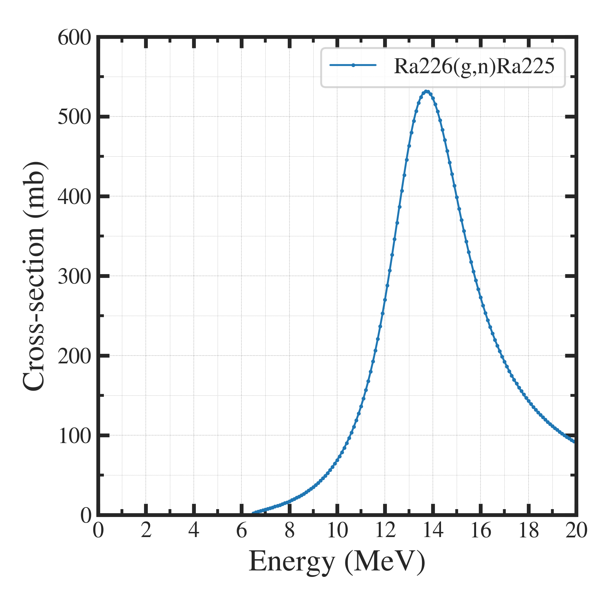
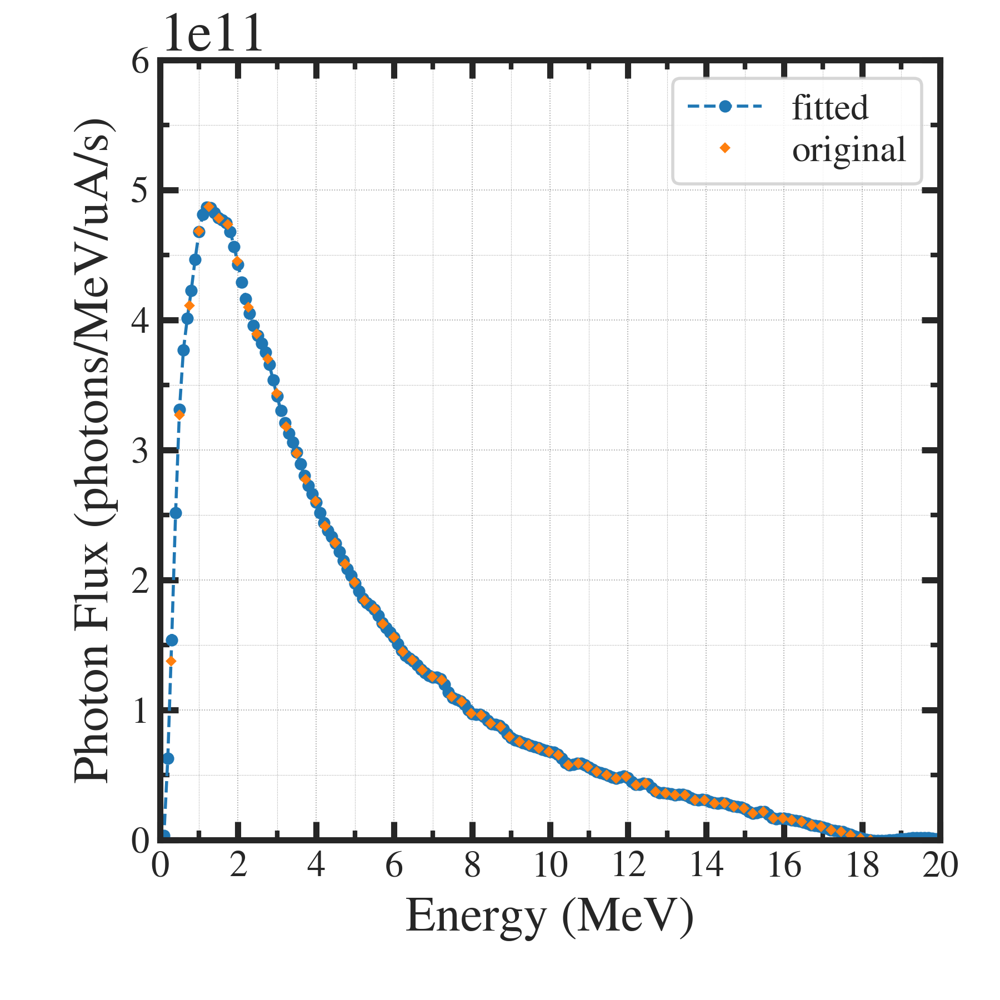

##############################################################
RI製造量計算 (3)
##############################################################

=========================================================
製造量計算コード
=========================================================

---------------------------------------------------------
動作 / How to use
---------------------------------------------------------

* パラメータ、光子フラックス、光核反応断面積を読み込み、光核反応の製造量を出力する．::

    @ [ root dir. of the codes ]
    # -- edit parameter file -- #
    $ nano dat/parameters.jsonc
    
    # -- make photon flux file -- #
    $ python pyt/rearange__VarianLinacPhi.py

    # -- calculate cross-section using Breit-Wigner Formula -- #
    $ python pyt/xs__BreitWignerFormula.py

    # -- estimate RI production -- #
    $ python pyt/estimate__RIproduction.py

  
---------------------------------------------------------
入出力
---------------------------------------------------------

* 入力ファイル

  + パラメータファイル ( dat/parameters.jsonc )
  + 光子フラックスファイル ( dat/photon_spectrum.dat etc. )
  + 光核反応断面積ファイル ( dat/xsection.dat etc.)

* 出力ファイル

  + 結果ファイル ( dat/results.dat etc. )
  + エネルギー特性ファイル ( png/estimate__RIproduction.png etc. )

    
=========================================================
コード
=========================================================

---------------------------------------------------------
github
---------------------------------------------------------

* https://github.com/wfw-pgr/RIproduction.git

                    
---------------------------------------------------------
メインコード ( estimate__RIproduction.py )
---------------------------------------------------------

.. literalinclude:: pyt/estimate__RIproduction.py
   		    :language: python

---------------------------------------------------------
光子フラックス生成コード ( rearange__VarianLinacPhi.py )
---------------------------------------------------------

.. literalinclude:: pyt/rearange__VarianLinacPhi.py
   		    :language: python

---------------------------------------------------------
反応断面積モデルコード ( xs__BreitWignerFormula.py )
---------------------------------------------------------

.. literalinclude:: pyt/xs__BreitWignerFormula.py
   		    :language: python

=========================================================
実行結果
=========================================================

* 上記３つのコードの実行で、G.Melville [2-4] の計算がトレース可能．

---------------------------------------------------------
製造量
---------------------------------------------------------

* G.Melvilleの製造量が 2.8*10^10 に対して、コードは2.63*10^10 ( 前掲：指数フィットの結果 )

.. literalinclude:: dat/results__BreitWigner_VarianLinac.dat

---------------------------------------------------------
計算経過 (断面積, 光子フラックス, 製造率エネルギー密度)
---------------------------------------------------------

断面積 σ(E)
---------------------------------------------------------

|

|

光子フラックス Φ(E)
---------------------------------------------------------

|

|

製造率エネルギー密度 dY(E)
---------------------------------------------------------

|

.. image:: png/estimate__RIproduction_Melville.png
   :width:  500px
   :align:  center

|

=========================================================
Reference
=========================================================

* [1] Paul D. VanSant, "Medical Isotope Production of Actinium-225 By Linear Accelerator Photon Irradiation of Radium-226", Thesis for Virginia Polytechnic Institute and State University, 2013.
* [2] G. Melville, "Production of Ac-225 for Cancer Therapy by Photon Induced Transmutation of Ra-226," UWS, Sydney, Australia, 2007.
* [3] G. Melville, S. F. Lui and B. J. Allen, "A theoretical model for the produciton of Ac-225 for cancer therapy by photon-induced transmutation of Ra-226," Applied Radiation and Isotopes, vol. 64, no. 9, pp. 979-988, 2006.
* [4] G. Melville, H. Mariarty, P. Metcalfe, T. Knittel and B. J. Allen, "Production of Ac-225 for cancer therapy by photon-induced transmutation of Ra-226," Applied Radiation and Isotopes, vol. 65, no. 9, pp. 1014-1022, 2007.
  

