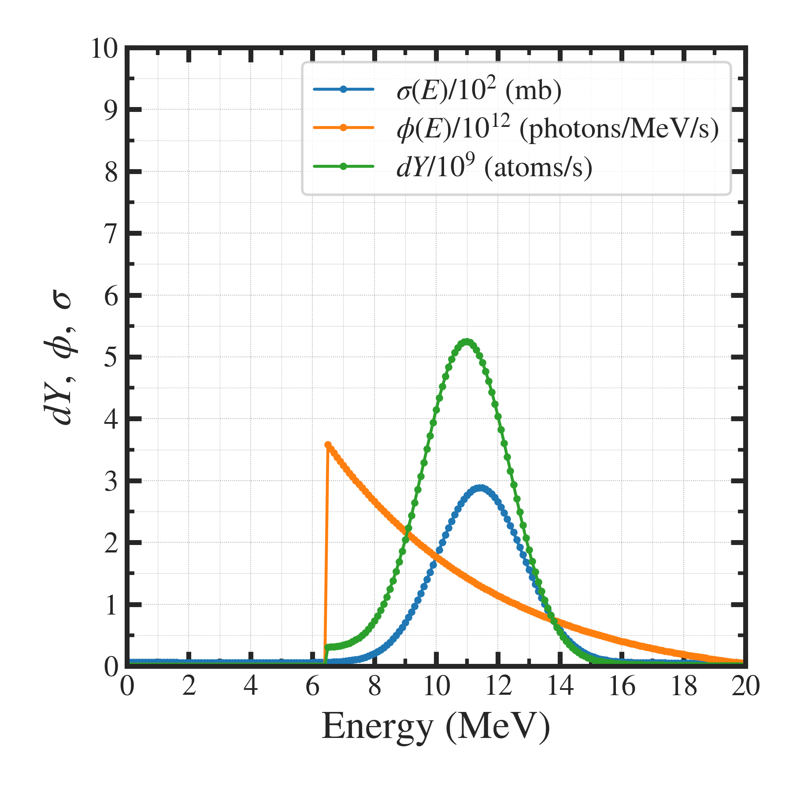

##############################################################
RI製造量計算 (4)
##############################################################

=========================================================
数値理論断面積 TENDL を使用した際の製造量
=========================================================

* 入力ファイル（断面積ファイル：xsection.filename in dat/parameters.jsonc） をTENDLの数表を指定すれば良い．
* フィットとして、gaussian を指定．

.. literalinclude:: dat/parameters__TENDL_VarianLinac.jsonc

=========================================================
評価結果
=========================================================

---------------------------------------------------------
製造量
---------------------------------------------------------

.. literalinclude:: dat/results__TENDL_VarianLinac.dat
   		    

---------------------------------------------------------
グラフ
---------------------------------------------------------

|

|
