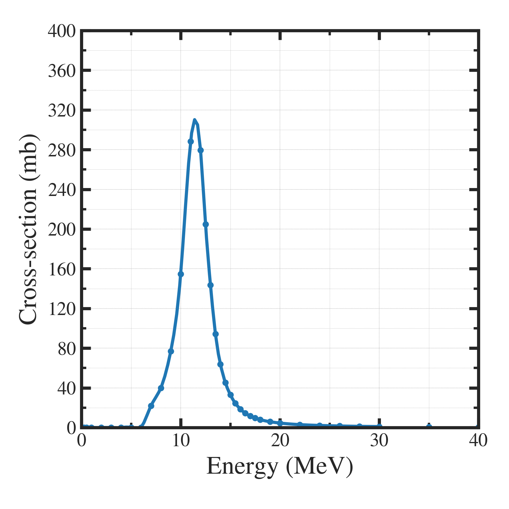

##############################################################
光核反応の反応断面積について
##############################################################

=========================================================
反応断面積データベース TENDL
=========================================================

* TENDL（TALYS-based Evaluated Nuclear Data Library）は、TALYSコードを用いた計算結果に基づく核データを提供している．
* 中性子や光子などの反応断面積や放射線束、核種の核構造データなどが収められ、核エネルギー研究や原子力工学、放射線治療など広範な応用分野で活用されている．
* URL: ( https://tendl.web.psi.ch/tendl_2021/tar.html )

=========================================================
光核反応の反応断面積
=========================================================

---------------------------------------------------------
(e.g.1)： :math:`Ra-226 ( \gamma, n ) Ra-225` (2021)
---------------------------------------------------------

|

---------------------------------------------------------
(e.g.2)： :math:`Ra-226 ( \gamma, n ) Ra-225` (2015-2023)
---------------------------------------------------------

.. note::

   年度ごとに差があるため、注意！

|

|

           
---------------------------------------------------------
プロットプログラム
---------------------------------------------------------

.. literalinclude:: pyt/plot__cross_section.py
                    :language: python

.. literalinclude:: pyt/compare__cross_section.py
                    :language: python

