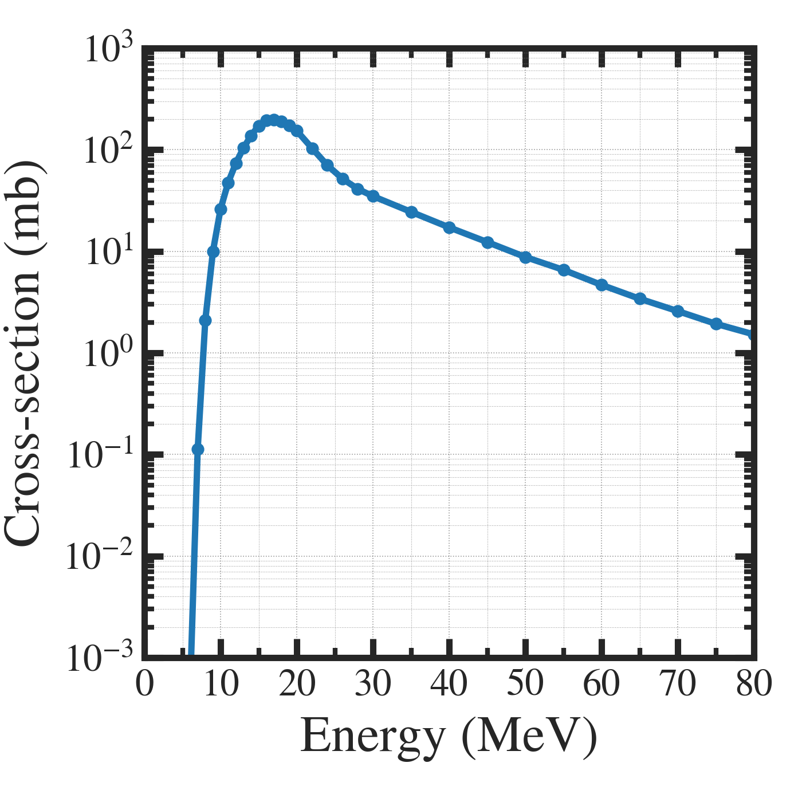
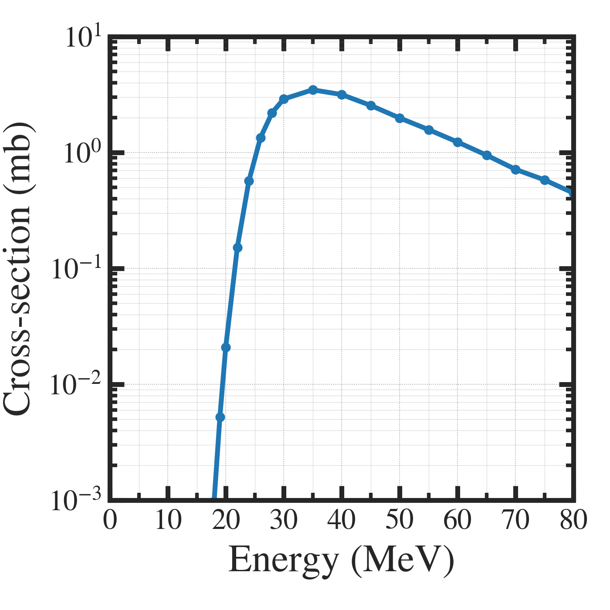
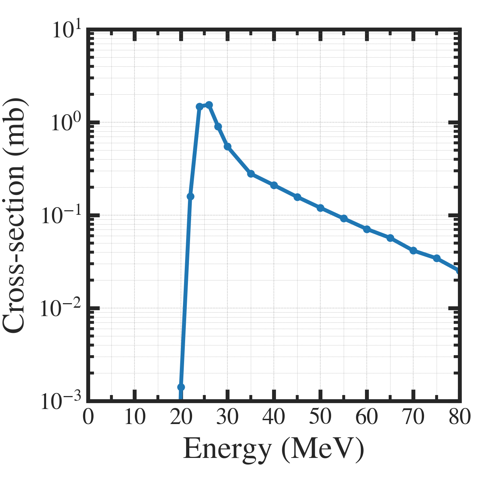

##############################################################
アルファ粒子を使用した核種製造の評価について
##############################################################

=========================================================
反応断面積
=========================================================

---------------------------------------------------------
Ni-61 (a,p) Cu-64
---------------------------------------------------------

---------------------------------------------------------
Yb-174 (a,p) Lu-177
---------------------------------------------------------

---------------------------------------------------------
Pa-231 (a,2n) Np233
---------------------------------------------------------

