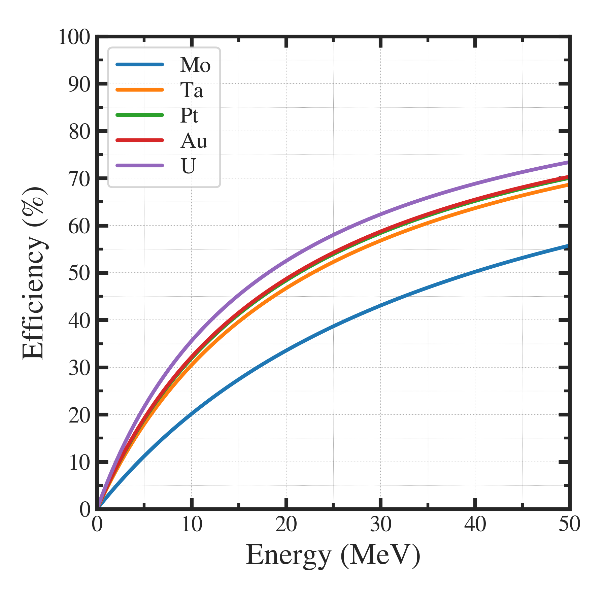

##############################################################
制動放射線の発生効率 ( Bremsstrahlung )
##############################################################

=========================================================
電子ビームを重金属ターゲットに照射した際の光子生成
=========================================================

* 電子ビーム( エネルギー Eb )を重金属ターゲット( 原子番号 Z )に照射する際に発生する光子を考える．
* 光子の生成効率 :math:`\eta` について、以下式で計算できる[1-2]

=========================================================
制動放射線の効率の式
=========================================================

.. math::

   \eta = \dfrac{ C_0 Z E_b }{ 1 + C_0 Z E_b }

ここで、 :math:`C_0=6.0\times10^{-4}` は定数、 :math:`Z` は原子番号、 :math:`E_b \textrm{(MeV)}` は、ビームエネルギー (MeV)である．

=========================================================
制動放射線の効率
=========================================================

* 高エネルギーほど、生成効率は高いが、飽和する．
* 分厚いターゲットの場合、途中で減速した電子によって、光子が生成される．
            
=========================================================
描画プログラムの例
=========================================================

---------------------------------------------------------
描画プログラム（brems_efficiency.py）
---------------------------------------------------------

.. literalinclude:: code/brems_efficiency.py
   		    :language: python

                               
---------------------------------------------------------
描画プログラム（parameters.json）
---------------------------------------------------------

.. literalinclude:: code/brems_efficiency_parameters.json
   		    :language: json
                               

=========================================================
参考文献
=========================================================

[1] Medical Isotope Production of Actinium-225 By Linear Accelerator Photon Irradiation of Radium-226 ( Master Thesis of Virginia Polytechnic Institute and State University )
[2] 
