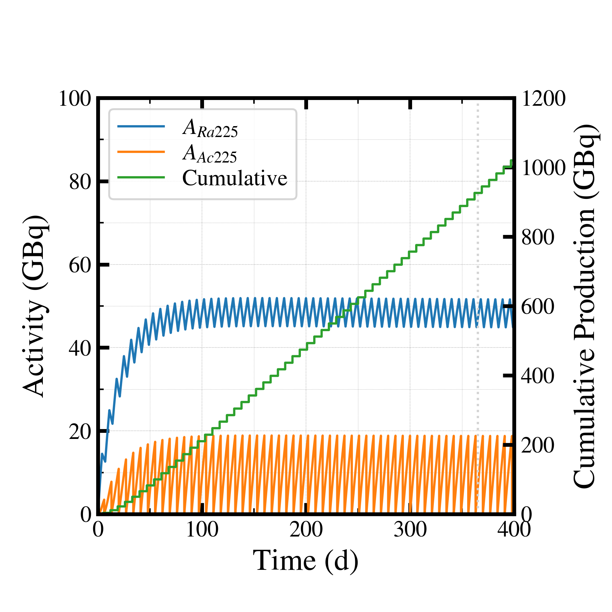
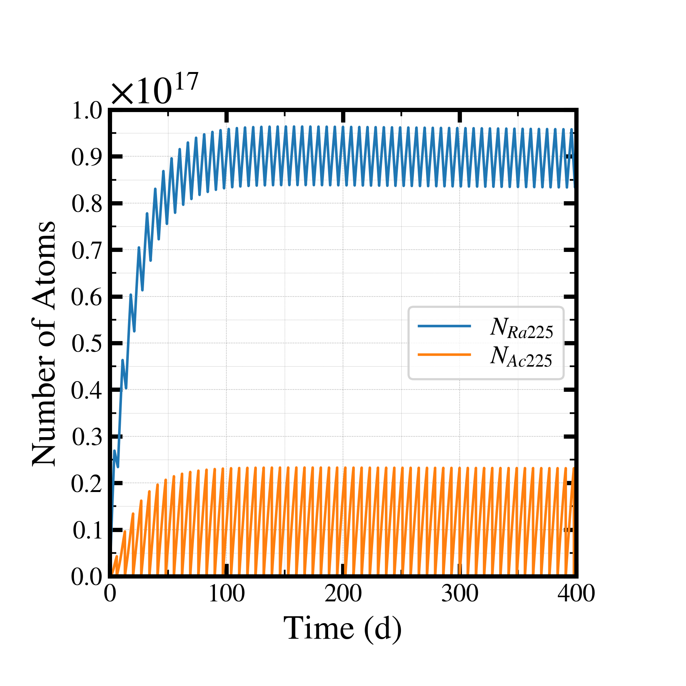
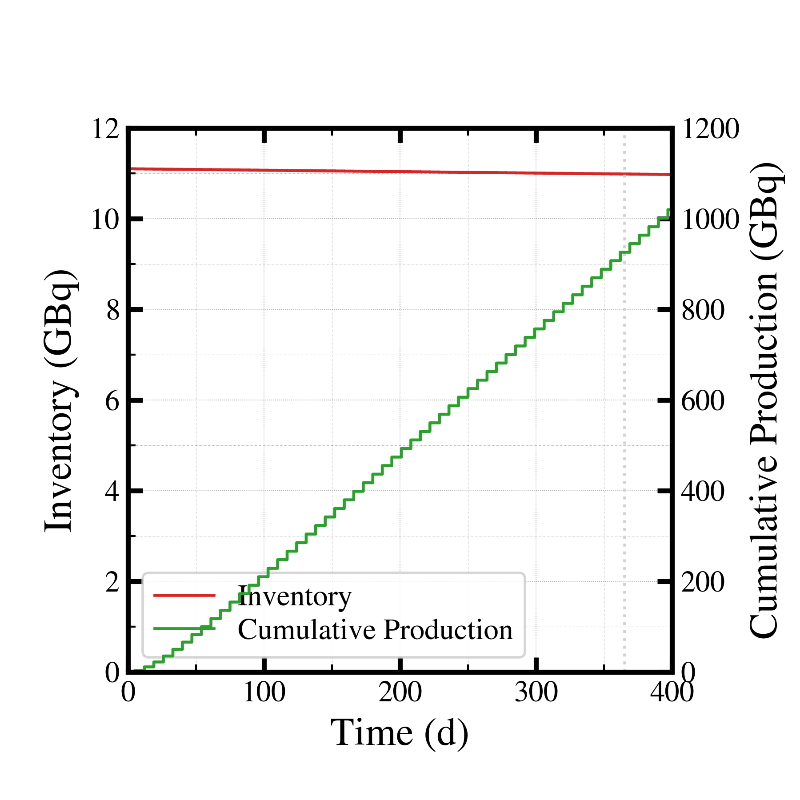

##############################################################
商用製造量計算 (1)
##############################################################

=========================================================
計算体系
=========================================================

* 通常の製造量計算だが、ビーム照射を複数回行う．
* コードは、通常使用している製造量時間発展コード．

  
---------------------------------------------------------
コード
---------------------------------------------------------

.. literalinclude:: pyt/estimate__time_vs_yield.py
   		    :language: python

---------------------------------------------------------
settings.json
---------------------------------------------------------

.. literalinclude:: dat/settings_sample.json

---------------------------------------------------------
結果 ( 製造放射能 )
---------------------------------------------------------

|

---------------------------------------------------------
結果 ( 原子数 )
---------------------------------------------------------

|

|

---------------------------------------------------------
結果 ( 累積製造量 ＆ ターゲットインベントリー )
---------------------------------------------------------

|

|
