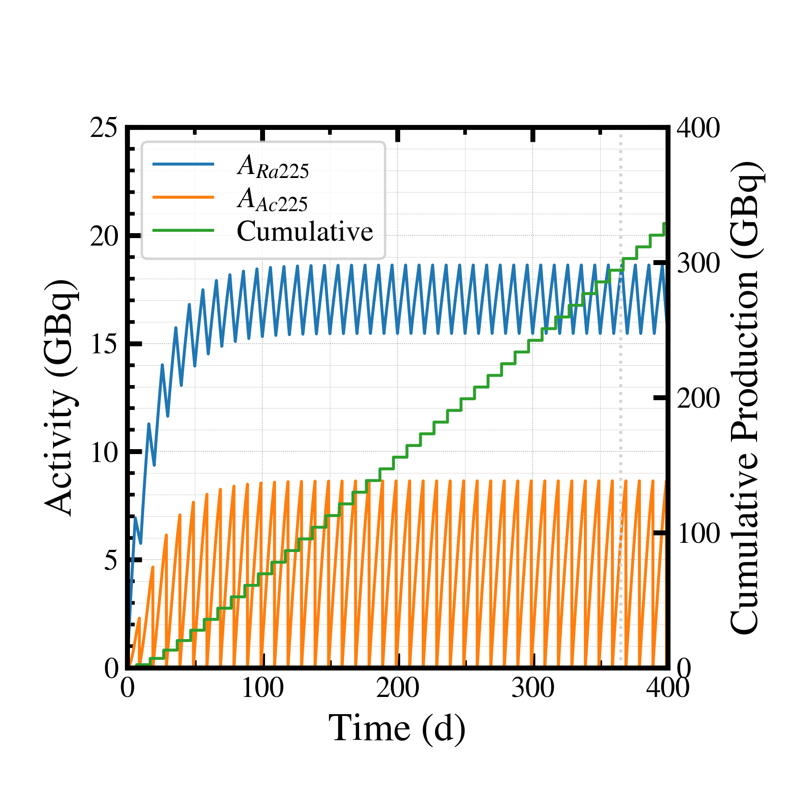
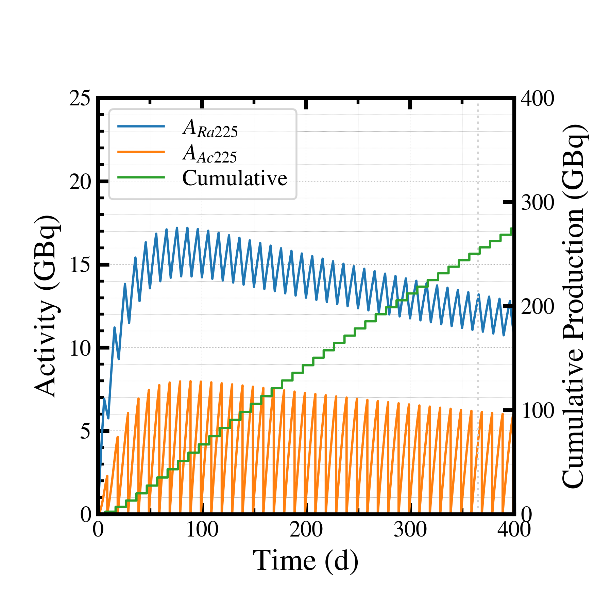
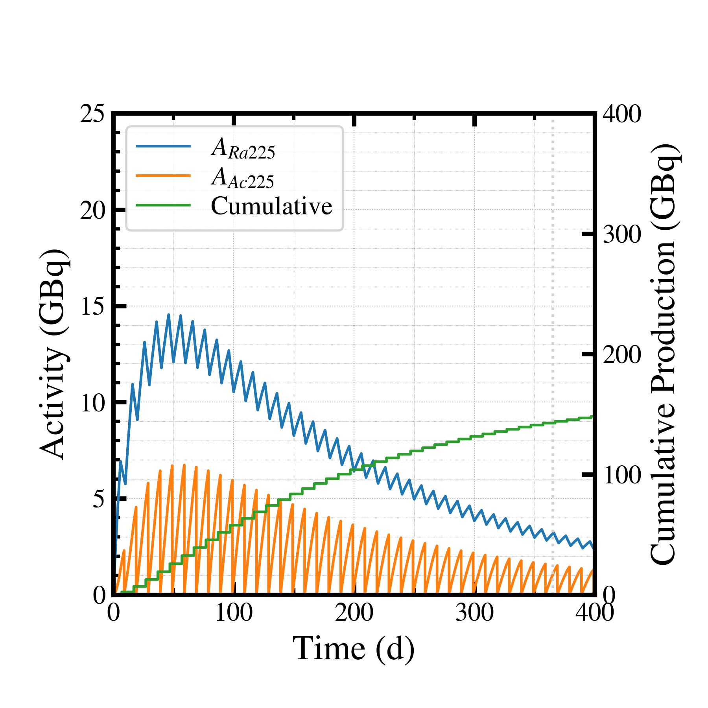

##############################################################
商用製造量計算 (2)
##############################################################

=========================================================
過去検証との一致の検証
=========================================================

---------------------------------------------------------
T.T氏計算体系
---------------------------------------------------------
  
* 300 uA
* 0.1g Ra-226
* FWHM 5mm
* 照射6d(144h), 分離精製4d(96h)
* 分離精製効率 100%(製造量) または、80% (分離後)
* Pt 10mm 計算

  
---------------------------------------------------------
T.T氏計算結果
---------------------------------------------------------

* 100% 再利用効率にて

  - 製造量 295.5 GBq/y
  - 分離量 236.4 GBq/y

* 99% 再利用効率にて

  - 製造量 251.5 GBq/y
  - 分離量 201.2 GBq/y

* 95% 再利用効率にて

  - 製造量 143.4 GBq/y
  - 分離量 114.7 GBq/y

---------------------------------------------------------
settings_validation.json
---------------------------------------------------------

.. literalinclude:: dat/settings_validation.json

---------------------------------------------------------
回収率 100 % にて
---------------------------------------------------------

|

* 製造量 @365 day = 294.1 GBq ( T.T. = 295.5 GBq )

---------------------------------------------------------
回収率 99 % にて
---------------------------------------------------------

|

* 製造量 @365 day = 250.2 GBq ( T.T. = 251.5  GBq )

---------------------------------------------------------
回収率 95 % にて
---------------------------------------------------------

|

* 製造量 @365 day = 142.5 GBq ( T.T. = 143.4  GBq )

---------------------------------------------------------
比較
---------------------------------------------------------

.. csv-table:: 
   :header: "Recycle Rate (%)", "T.T. Calculation (GBq/y)", "N.K. Calculation (GBq/y)"
   :widths: 10, 10, 10
   :width:  500px
   
   "100", "295.5", "294.1"
   "99", "251.5", "250.2"
   "95", "143.4", "142.5"
   
* 違いは、分離精製のタイミング（４日のうち、いつ分離精製とするか）や、製造シミュレーション等だと考えられ、negligible small な一致が得られた．
