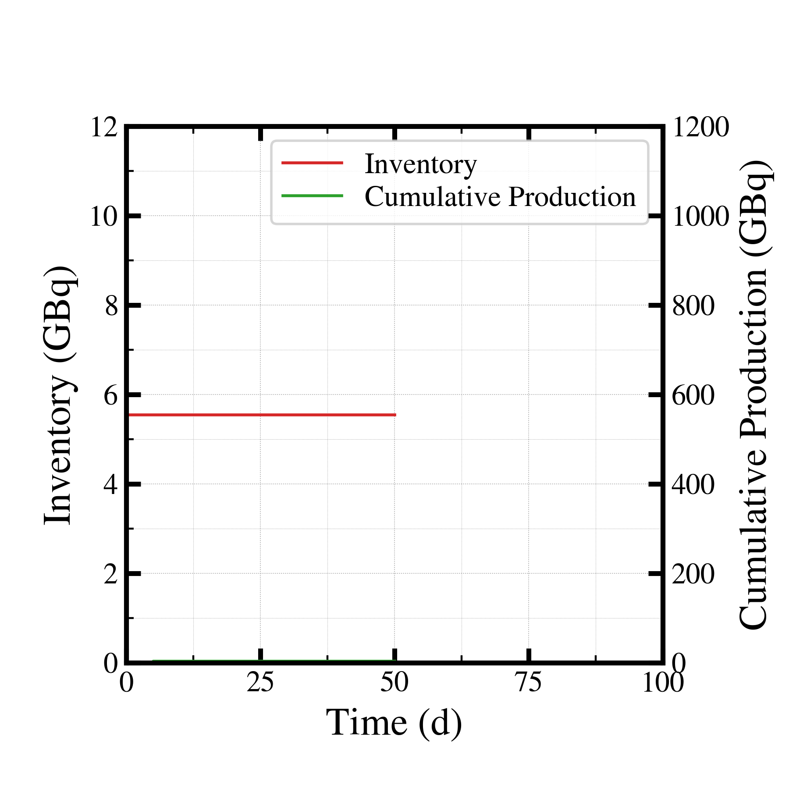
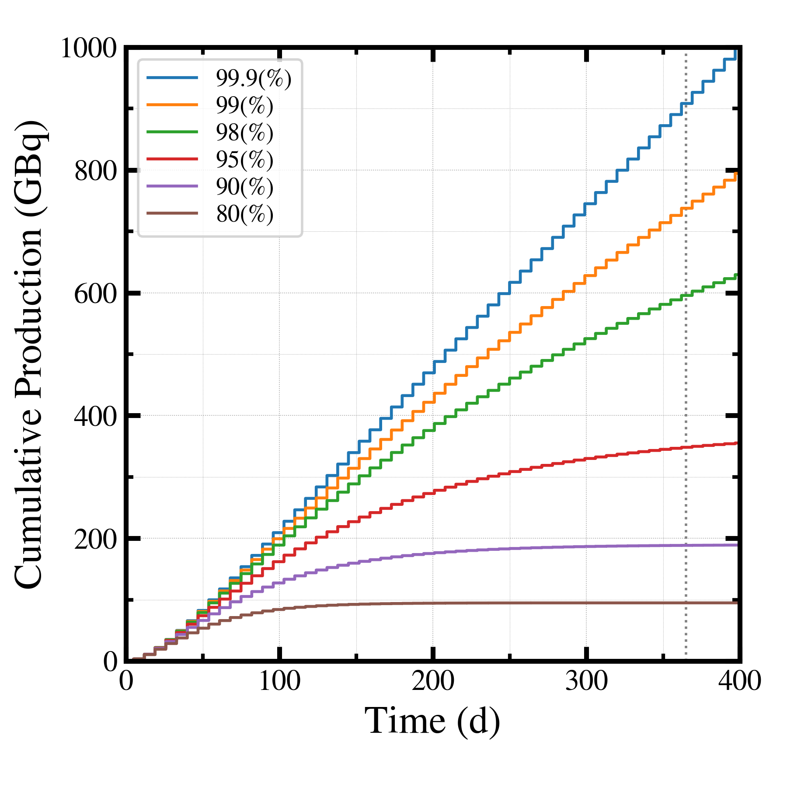
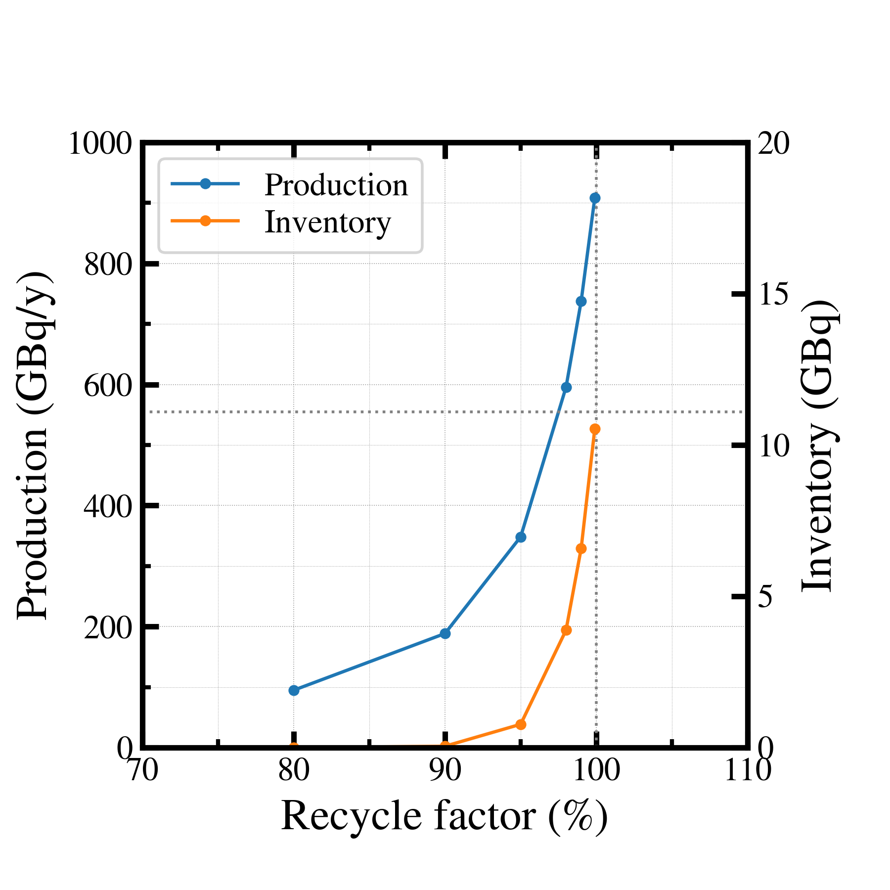

##############################################################
商用製造量計算 (3)
##############################################################

=========================================================
回収効率特性の検討
=========================================================

* 照射スケジュールは４日照射、３日化学処理（減衰待機１日、分離精製１日、試料作製１日：ビームOFF）とする．
* 試料補充はなし．
* 理論回収効率限界は、99.995 (%)

---------------------------------------------------------
コード
---------------------------------------------------------

.. literalinclude:: pyt/plot__recycleScan.py
                    :language: python

=========================================================
検討結果
=========================================================

---------------------------------------------------------
Raインベントリーの経時変化
---------------------------------------------------------

|

|

---------------------------------------------------------
回収率ごとの年間製造量の経時変化
---------------------------------------------------------

|

|

---------------------------------------------------------
回収率 v.s. 年間製造量
---------------------------------------------------------

|

|

