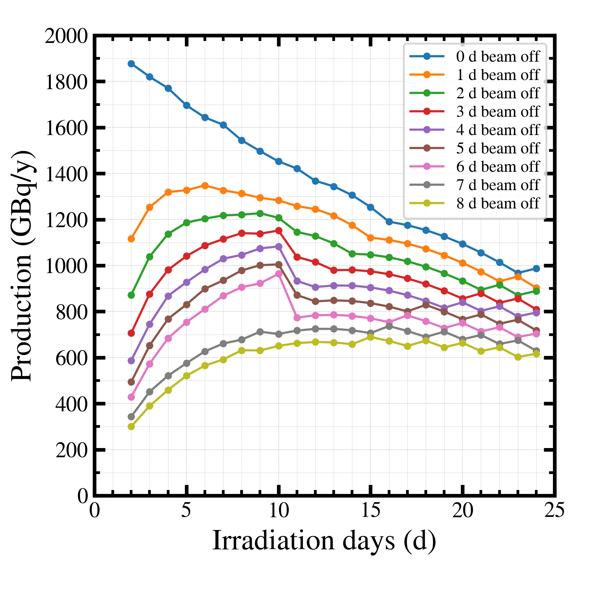
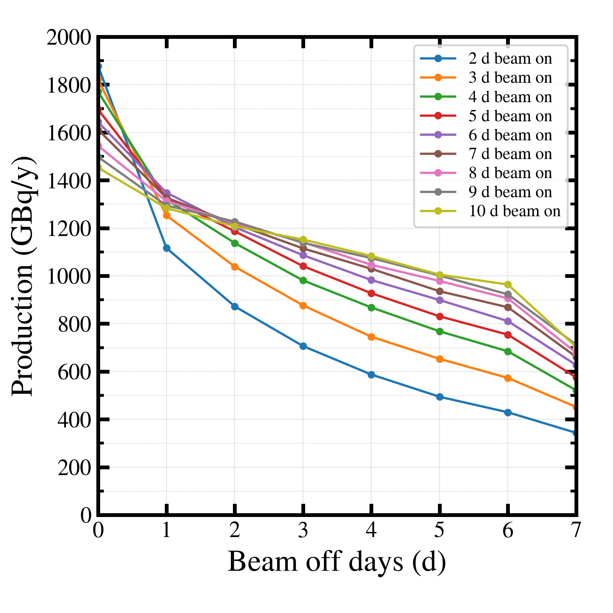

##############################################################
商用製造量計算 (4) 
##############################################################

=========================================================
製造量スケジュール（ビーム照射時間）の影響
=========================================================

* 製造量スケジュールによる依存性を調べる．
* 製造量スケジュールは、ビーム照射時間とビームオフ時間により定まる．

  + ビームオン時間スキャン
  + ビームオフ時間スキャン

---------------------------------------------------------
コード
---------------------------------------------------------

.. literalinclude:: pyt/plot__scheduleScan.py
   		    :language: python

                               
=========================================================
検討結果
=========================================================

---------------------------------------------------------
ビームオン時間スキャン
---------------------------------------------------------

|

|

* ビームオフ時間に応じて、最大となる年間製造量が存在する．
  
  + 短すぎるビームオン時間：加速器の稼働率がわるい
  + 長すぎるビームオン時間：放射減衰での損失が生じる
    
* ビームオフが短いほど、短いビームオン時間で、製造量が最大になる．

  + 加速器の稼働率を十分高く取れるので、減衰ロスを減らすことに注力すれば良い．
  
* ビームオフが長いほど、長いビームオン時間としなければ、製造量が大きくならない．

  + 加速器の稼働率を高くすることが重要．ある程度のビームオン時間を取らなければ、製造量の確保が難しい．

* ギザギザの部分が存在するのは、365日時点を切り取っているが、これが分離精製の前後かどうか、などで、離散的なトビが生じうるためか．

  + 可能であれば、10年ぐらい計算して、10年で平均を取る方が綺麗にできるか．

* 同じビームオフ時間であれば、製造量が最大値を取るよりも、製造量が最大より 5 %減だが、加速器運転時間が数日短い、ほうが得（グラフの左端側をとるのがベター）．

  + 例えば製造量95%区間を定めて、その左端（加速器運転時間が短い方をとる、などがベターか．）

* ビームオフ時間0日（一瞬で分離生成できて、ずっとビームを撃ち続けられるシステムあり）の場合、１セットのビームオン時間（＝取り出しインターバル）が短いほうが、得．

  
---------------------------------------------------------
ビームオフ時間スキャン
---------------------------------------------------------

|

|

* ビームオフ時間の増加につれて、製造量は低下する．

  + 製造量を取りたければ、ビームオフ時間の低下が重要．

* ビームオフ時間ごとに、最適なビームオン時間がある．（以下、ざっくり、同程度は短いビームオン時間を優先）

  + （ビームオフ時間, ビームオン時間） ＝（0日, 2日）
  + （ビームオフ時間, ビームオン時間） ＝（1日, 4日）
  + （ビームオフ時間, ビームオン時間） ＝（2日, 5日）
  + （ビームオフ時間, ビームオン時間） ＝（3日, 7日）
  + （ビームオフ時間, ビームオン時間） ＝（4日, 8日）
  + （ビームオフ時間, ビームオン時間） ＝（5日, 8日）
  + （ビームオフ時間, ビームオン時間） ＝（6日, 10日）

* フロンティア曲線がひける．
  
