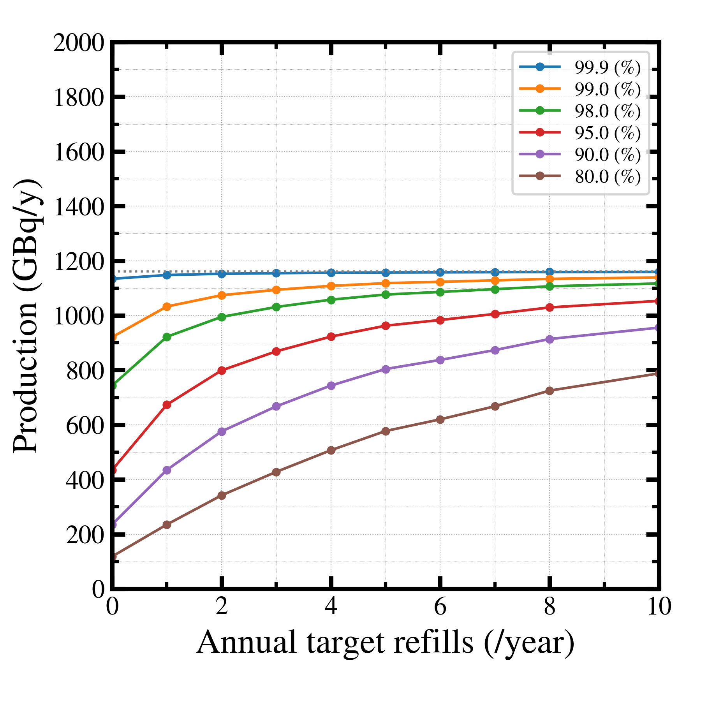
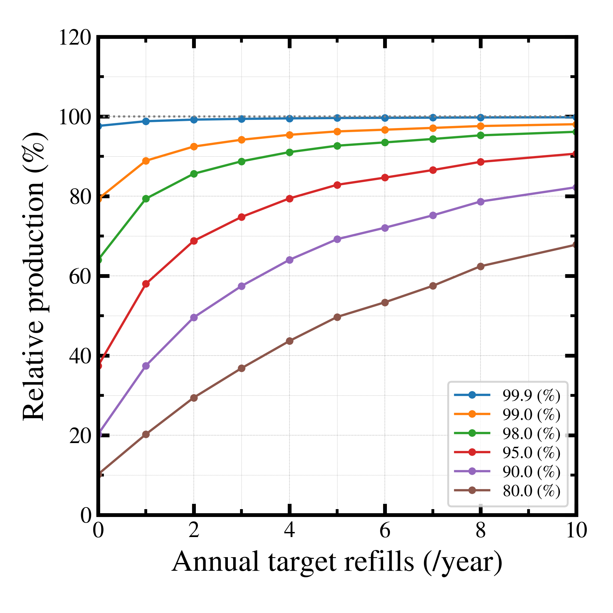

##############################################################
商用製造量計算 (5) 
##############################################################

=========================================================
原料Ra-226の補充について
=========================================================

* 機能追加

  + 繰り返し機能 "series.iterate" の追加
  + 補充動作 "refill" ( in schedule )の追加

* 繰り返し機能

  + "series.iterate" 回、"series"に登録されている分を繰り返す．

* 補充動作

  + true で、remainingを例えば1.0に戻す．
  + スケジュールシリーズ内では、refill.timing = [ "beggining", "end" ] でタイミング変更可能
  + refill.factor = 1.2 etc. で補充量修正可能　（デフォルトは初期値と同じ＝1.0）
  + "refill.regular" スイッチもあり．こちらは、スケジュール毎でなく、インターバル "refill.regular.interval"毎に、補充動作を行う．補充量は、"refill.regular.factor"で増減可能．デフォルトは1.0.

    
=========================================================
補充スキャン
=========================================================

* 例として、補充頻度を変更した場合にどの程度、製造量が改善するかを確認する．
* スケジュールとして、(on,off)=(5,2) とし、回収率 99.9%, 99%, 95% の各パラメータについて、補充頻度を年N回するかによって、製造量がどのように変化するかを考える．

---------------------------------------------------------
スキャンスクリプト
---------------------------------------------------------

.. literalinclude:: go/go_refillScan.sh
   		    :language: bash

---------------------------------------------------------
プロットスクリプト
---------------------------------------------------------

.. literalinclude:: pyt/plot__refillScan.py
   		    :language: python

=========================================================
検証結果
=========================================================

---------------------------------------------------------
年間補充回数 v.s. 製造量
---------------------------------------------------------

|

|

---------------------------------------------------------
年間補充回数 v.s. 製造量減少率
---------------------------------------------------------

|

|

* 回収率が低いほど、多く補充しなければ、製造量が低下する．
* 99.9 % はほぼ、製造量が低下しない．年間に１回も補充しなくてもよい．
* 年間の補充回数を上げていけば、回収率が低くても、年間製造量を70% 以上に上げることは可能．
* 製造量減少率を90 %以下に抑えるためには、

  + 99%で、年1-2回
  + 98%で、年3-4回
  + 95%で、年10回

  程度の補充が必要．

  
