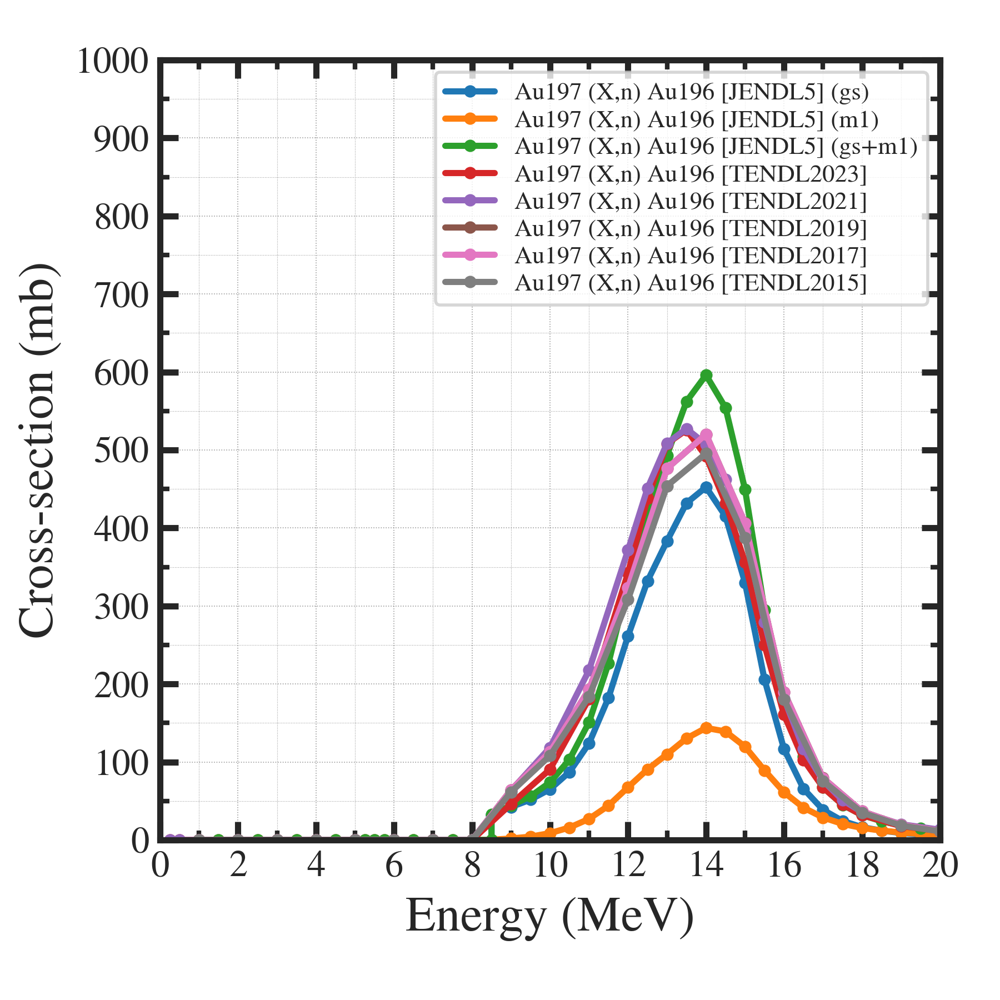

##############################################################
反応断面積の図示コードの使用方法
##############################################################

=========================================================
コード・使い方
=========================================================

---------------------------------------------------------
使い方
---------------------------------------------------------

* xs/ ディレクトリに反応断面積を置く

  - 1行目 エネルギー (default MeV)
  - 2行目 反応断面積 (default mb)
    
* dat/xs_list.jsonを編集

  - general.fileMode == json で、xs_list.json 内に書かれたファイル、ラベルをもとにプロット
  - general.fileMode == glob で、general.xsdir 内のファイルをプロット．
  - general.usekeys で反応断面積を選択．
  - 反応断面積は、"xs." で始まるキーの辞書で設定、下記を指定．

    + filename
    + label
    + source

      
---------------------------------------------------------
xs_list.json
---------------------------------------------------------

.. literalinclude:: dat/xs_list.json

---------------------------------------------------------
display__xsection.py
---------------------------------------------------------

.. literalinclude:: pyt/display__xsection.py
   		    :language: python

---------------------------------------------------------
出力サンプル
---------------------------------------------------------

