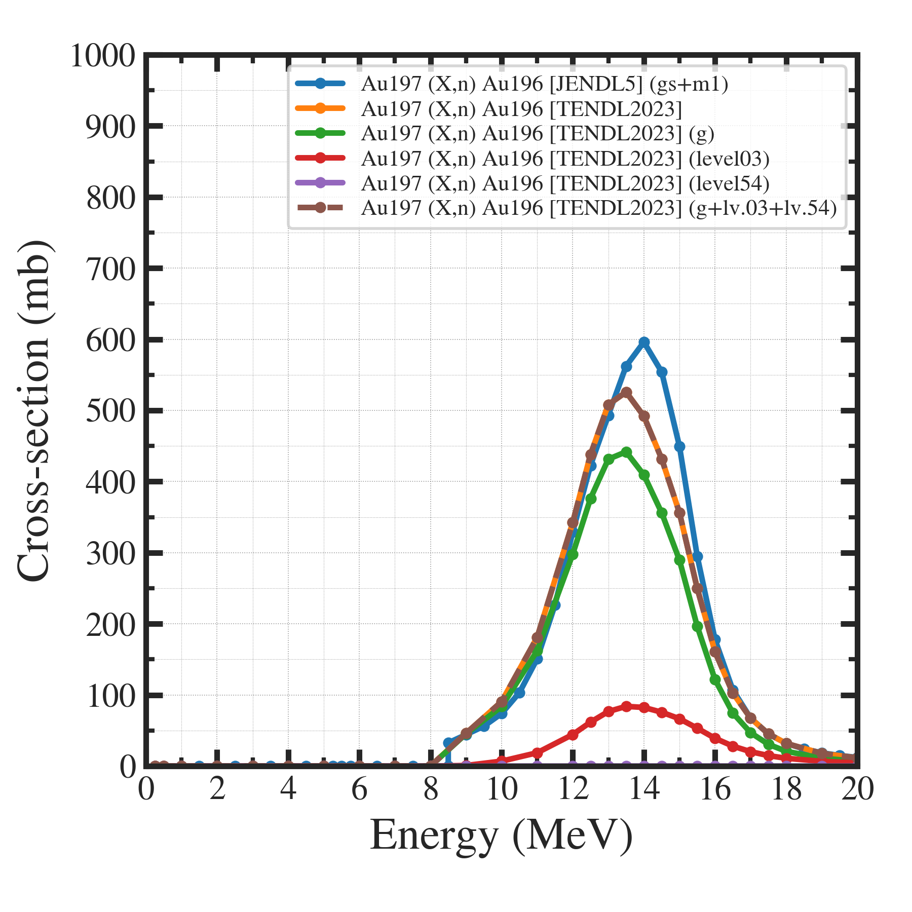
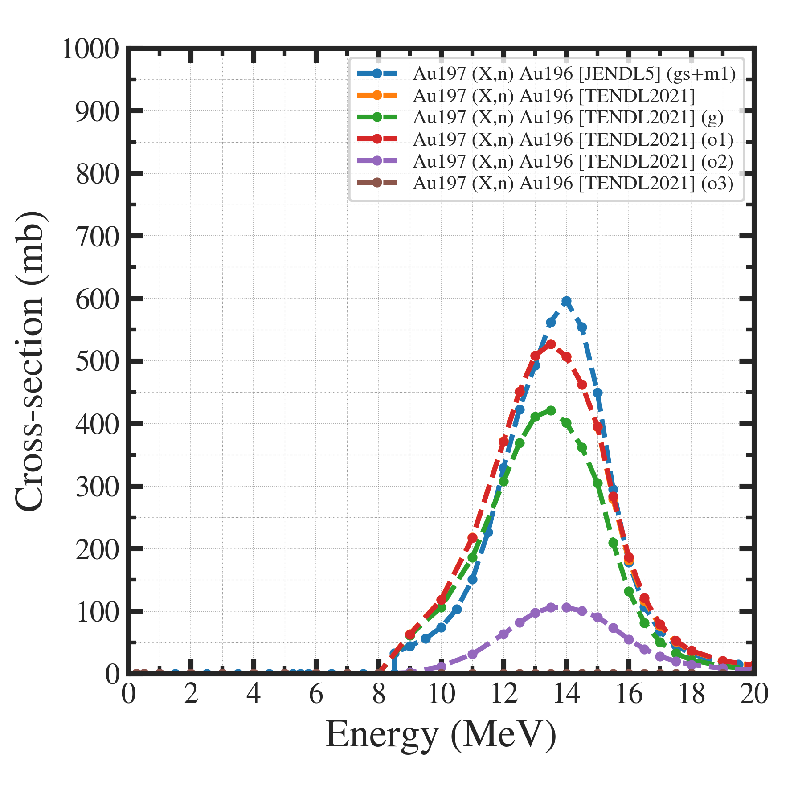
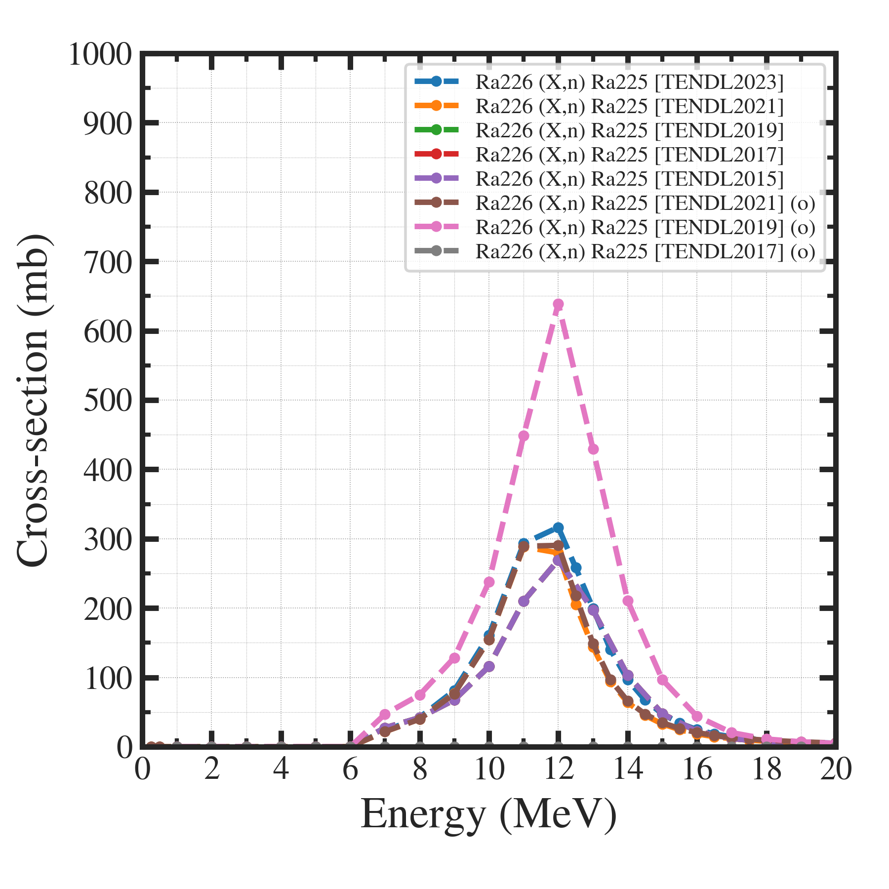
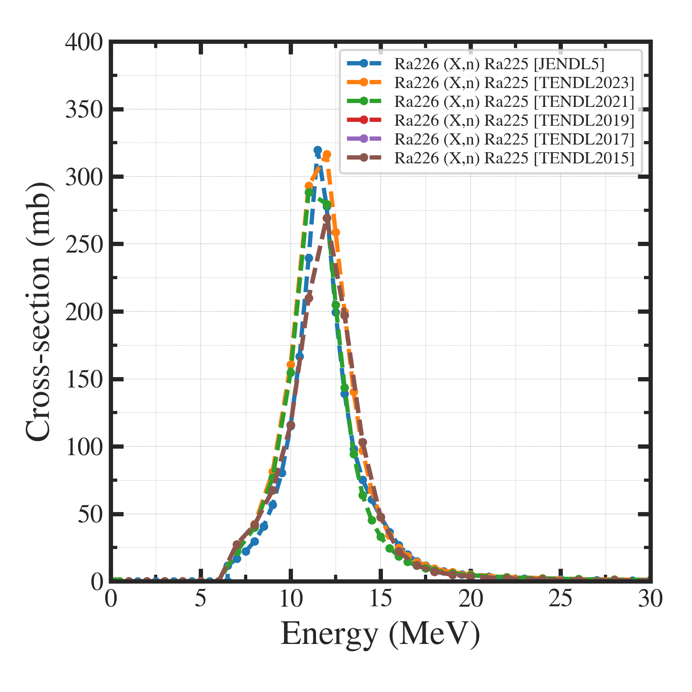

##############################################################
反応断面積のプロット
##############################################################

=========================================================
Au-197 (X,n) Au-196
=========================================================

---------------------------------------------------------
プロット
---------------------------------------------------------

|

.. image:: png/xsections_Au197_gn_Au196.png
   :width:  600px
   :align:  center

            
---------------------------------------------------------
コメント
---------------------------------------------------------

* JENDL5 に関して、  :blue:`gs (Ground State)` と、 :blue:`m1 (meta stable 1)` があって、要注意．

  - RI製造実験で、反応断面積を比較すると、  :red:`JENDL5の gs+m1` が最も一致する．
  -  :red:`実験反応断面積` で、  :blue:`すべての経路を考慮した反応断面積` をつかうべき．

|

=========================================================
Au-197 (X,n) Au-196 (TENDL2023の比較)
=========================================================

---------------------------------------------------------
プロット
---------------------------------------------------------

|

            
---------------------------------------------------------
コメント
---------------------------------------------------------

* 数値反応断面積 (TENDL) の o 、その他の理解

  - (無印) = (g) + (level03) + (level54) 
  - つまり、  :red:`(無印)がTotalであり、これを製造量計算に使用するべき` ．

* 実験反応断面積 (JENDL5) があるのであれば、これを使用すべき．
  

|

=========================================================
Au-197 (X,n) Au-196 (TENDL2021の比較)
=========================================================

---------------------------------------------------------
プロット
---------------------------------------------------------

|

            
---------------------------------------------------------
コメント
---------------------------------------------------------

* (無印) = (o1)

  - 無印と、o1がほぼ一致．
    - 逆に、 (g) (Ground State??) などを含めてしまうと、無印を超えてしまうため、  :blue:`2023と同様に無印がTotal、というわけではなさそう．`  
  - 理解しきれていない．

* (無印)を使う、でよいか．

|

  
=========================================================
Ra-226 (X,n) Ra-225
=========================================================

---------------------------------------------------------
プロット
---------------------------------------------------------

|

---------------------------------------------------------
代表プロットのみ
---------------------------------------------------------

|

            
---------------------------------------------------------
コメント
---------------------------------------------------------

* (o) の意味はよくわからない．

  - (g) がGround State, (m) がmeta stable, (o) がortho （ortho / meta / para ?）
  - TENDL サイトに記載はみられない．
